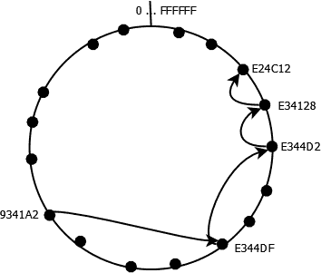

# 五、对等网络

**对等**（**P2P**计算机网络是指其节点经常同时充当服务器和客户端的体系结构。P2P 系统的主要目标是消除对单独服务器管理系统的需要。随着节点以不可预测的方式加入和离开网络，P2P 网络的配置将动态变化。节点在处理速度、带宽支持和存储能力等因素方面可能有所不同。“对等”一词意味着节点之间的平等程度。

P2P 网络有多种定义和解释。它们可以被描述为一个分散的、不断变化的、自我调节的体系结构。服务器倾向于提供服务，而客户端则请求服务。P2P 节点通常同时执行这两种操作。纯 P2P 网络不会将节点指定为客户端或服务器。事实上，这些网络非常罕见。大多数 P2P 网络都依赖于一个中心设施，如 DNS 服务器来提供支持。

某些网络可能是客户端/服务器体系结构和更纯粹的 P2P 体系结构的混合体，在 P2P 体系结构中，没有特定节点充当“主”服务器。例如，文件共享 P2P 可以使用网络节点下载文件，而服务器可以提供额外的支持信息。

P2P 可以通过几种方式进行分类。我们将使用两种常见的分类类别，它们有助于理解 P2P 网络的本质。一种分类基于如何执行**索引**（查找节点的过程）：

*   **集中式**：这是指中央服务器跟踪数据在对等方之间的位置
*   **本地**：这是每个对等方跟踪自己数据的
*   **分布式**：此为多个对等方维护数据引用时

混合 P2P 网络使用集中索引方案。纯 P2P 网络使用本地或分布式索引。

算法用于确定信息在系统中的位置。系统是分散的，没有执行算法的覆盖服务器。该算法支持自组织系统，在添加和删除节点时动态重新配置自身。此外，随着网络成员资格的变化，这些系统将理想地平衡负载和资源。

在本章中，我们将介绍：

*   P2P 概念和术语
*   对 P2P 网络的 Java 支持
*   分布式哈希表的性质
*   FreePastry 如何支持 P2P 应用程序

### 注

P2P 应用程序为传统的客户端/服务器体系结构提供了灵活的替代方案。

# P2P 功能/特点

理解 P2P 网络的一种方法是检查其特征。这些措施包括：

*   为系统贡献资源的节点，包括：

    *   数据存储
    *   计算资源

*   它们为一组服务提供支持
*   它们具有很强的可扩展性和容错性
*   它们支持资源的负载平衡
*   他们可能支持有限匿名

P2P 系统的本质是用户可能无法访问特定节点以使用服务或资源。由于节点随机加入和离开系统，特定节点可能不可用。该算法将确定系统如何响应请求。

P2P 系统的基本功能包括：

*   网络中对等方的注册
*   对等点发现确定哪个对等点具有感兴趣的信息的过程
*   在对等点之间发送消息

并非所有对等方都执行所有这些功能。

P2P 系统的资源是使用**全局唯一标识符**（**GUID**）来识别的，该标识符通常是使用安全哈希函数生成的，我们将在 DHT 组件中进行检查。GUID 不应为人类可读的。这是一个随机生成的值，几乎没有冲突的机会。

P2P 的节点采用**路由****覆盖**s 组织。它是一种类型的**中间件**，将请求路由到适当的节点。覆盖是指位于物理网络之上的网络，由使用 IP 地址的资源标识。我们可以设想一个由一系列基于 IP 的节点组成的网络。但是，覆盖是这些节点的子集，通常集中在单个任务上。

路由覆盖将考虑用户和资源之间的节点数量以及连接带宽等因素，以确定哪个节点应满足请求。通常，一个资源可能会在多个节点上被复制甚至拆分。路由覆盖将尝试提供到资源的最佳路径。

当节点加入和离开系统时，路由覆盖需要考虑这些更改。当节点加入系统时，可能会要求它承担一些责任。当一个节点离开时，系统的其他部分可能需要承担一些离开节点的责任。

在本章中，我们将解释各种概念，这些概念通常作为系统的一部分嵌入。我们将简要概述不同的 P2P 应用程序，然后讨论 Java 对该体系结构的支持。演示了分布式哈希表的使用，并对 FreePastry 进行了深入研究，这将深入了解有多少 P2P 框架可以工作。

如果适用，我们将说明如何手动实现其中一些概念。虽然使用系统不需要这些实现，但它们将提供对这些基本概念的更深入的理解。

# 基于 P2P 网络的应用

有许多应用程序基于 P2P 网络。它们可用于以下用途：

*   **内容分发**：这是文件共享（文件、音乐、视频、图像）
*   **分布式计算**：将一个问题划分为更小的任务，并以并行方式执行
*   **协作**：用户共同解决一个共同的问题
*   **平台**：这些是构建 P2P 应用程序的系统，如 JXTA 和 Pastry

分布式计算利用大量小型计算机的能力来执行任务。适用于这种方法的问题需要将它们分解为更小的单元，然后在多台机器上并行执行。然后，需要将这些较小任务的结果进行组合以产生最终结果。

P2P 网络支持多种应用，如：

*   **Skype**：这是一个视频会议应用程序
*   **Freecast**：这是点对点流媒体音频节目
*   **BitTorrent**：这是一个流行的点对点文件共享系统
*   **Tor**：该程序屏蔽用户身份
*   **海软**：用于预录电视节目的发行
*   **哇**：使用 P2P 进行游戏更新
*   **雅西**：这是一个搜索引擎和网络爬虫
*   **Octoshape**：支持直播电视

关于 P2P 应用程序的良好概述，请参见[http://p2peducation.pbworks.com/w/page/8897427/FrontPage](http://p2peducation.pbworks.com/w/page/8897427/FrontPage) 。

# 对 P2P 应用的 Java 支持

Java 支持除了在前面章节中详细介绍的低级套接字支持之外，还包括各种框架。这些协议的范围从众所周知的框架（如 JXTA）到功能有限的小型协议。这些框架为更专业的应用程序提供了基础。

下表列出了其中几个框架：

<colgroup><col style="text-align: left"> <col style="text-align: left"></colgroup> 
| 

P2P 框架

 | 

统一资源定位地址

 |
| --- | --- |
| TomP2P | [http://tomp2p.net/](http://tomp2p.net/) |
| JXTA | [https://jxta.kenai.com/](https://jxta.kenai.com/) |
| 蜂巢 | [https://github.com/Hive2Hive/Hive2Hive](https://github.com/Hive2Hive/Hive2Hive) |
| jnmp2p | [https://code.google.com/p/jnmp2p/](https://code.google.com/p/jnmp2p/) |
| FlexGP | [http://flexgp.github.io/flexgp/javalibrary.html](http://flexgp.github.io/flexgp/javalibrary.html) |
| 杰迈 | [http://sourceforge.net/projects/jmaay/](http://sourceforge.net/projects/jmaay/) |
| P2P-MPI | [http://grid.u-strasbg.fr/p2pmpi/](http://grid.u-strasbg.fr/p2pmpi/) |
| 油酥面团 | [http://www.freepastry.org/](http://www.freepastry.org/) |

这些框架使用一种算法在对等点之间路由消息。哈希表通常构成这些框架的基础，如下所述。

# 分布式哈希表

**分布式哈希表**（**DHT**使用密钥/值对定位网络中的资源。此映射功能分布在对等节点上，使其分布。这种架构允许 P2P 网络轻松扩展到大量节点，并处理随机加入和离开网络的对等点。DHT 是支持核心 P2P 服务的基础。许多应用程序使用 DHT，包括 BitTorrent、Freenet 和 YaCy。

下图演示了将键映射到值的过程。密钥通常是一个包含资源标识的字符串，如书籍名称；该值是一个生成的数字，用于表示资源。该号码可用于定位网络中的资源，并可对应于节点的标识符。


P2P 网络已经使用了一段时间。这些网络的演变反映在资源的映射方式上，以 Napster、Gnutella 和 Freenet 为代表：

*   Napster（[https://en.wikipedia.org/wiki/Napster](https://en.wikipedia.org/wiki/Napster) 是第一个大规模 P2P 内容交付系统。它使用服务器跟踪网络中的节点。节点保存了实际数据。当客户端需要该数据时，服务器将查找保存该数据的当前节点集，该节点的位置将发送回客户端。然后，客户端将与保存数据的节点联系。这使得针对它的攻击变得容易，并最终通过诉讼导致它的消亡。
*   Gnutella（[https://web.archive.org/web/20080525005017](https://web.archive.org/web/20080525005017) 、[http://www.gnutella.com/](http://www.gnutella.com/) 不使用中央服务器，而是向网络中的每个节点广播。这导致网络上充斥着大量的信息，这种方法在以后的版本中进行了修改。
*   自由网（[https://freenetproject.org/](https://freenetproject.org/) 采用基于密钥的启发式路由方案，重点关注审查和匿名问题。然而，DHS 使用了一种更结构化的基于密钥的路由方法，结果如下：

    *   去中心化
    *   容错
    *   可伸缩性
    *   效率

但是，DHT 不支持精确匹配搜索。如果需要这种类型的搜索，则必须添加它。

## DHT 组件

**键空间**是一组 160 位字符串（键），用于识别元素。**密钥空间划分**是在网络节点之间对密钥空间进行分割的过程。覆盖网络连接节点。

一种常用的散列算法是**安全散列算法**（**SHA-1**）（[https://en.wikipedia.org/wiki/SHA-1](https://en.wikipedia.org/wiki/SHA-1) ）。SHA-1 由 NSA 设计，生成一个 160 位的散列值，称为消息摘要。大多数 P2P 不要求开发人员显式执行哈希函数。然而，看看它是如何做到的是很有启发性的。下面是一个使用 Java 创建摘要的示例。

`MessageDigest`类的`getInstance`方法接受指定要使用的算法的字符串，并返回`MessageDigest`实例。它的`update`方法需要一个包含哈希键的字节数组。在本例中，使用了一个字符串。`digest`方法返回包含哈希值的字节数组。然后，字节数组显示为十六进制数：

```java
        String message = "String to be hashed";
        try {
            MessageDigest messageDigest = 
                MessageDigest.getInstance("SHA-1");
            messageDigest.update(message.getBytes());
            byte[] digest = messageDigest.digest();

            StringBuffer buffer = new StringBuffer();
            for (byte element : digest) {
                buffer.append(Integer
                    .toString((element & 0xff) + 0x100, 16)
                    .substring(1));
            }
            System.out.println("Hex format : " + 
                buffer.toString());

        } catch (NoSuchAlgorithmException ex) {
            // Handle exceptions
        }
```

执行此序列将产生以下输出：

**十六进制格式：434d902b6098ac050e4ed79b83ad93155b161d72**

要存储数据，例如文件，我们可以使用文件名创建密钥。然后使用 put 类型函数存储数据：

```java
put(key, data) 
```

要检索与键对应的数据，请使用 get type 函数：

```java
data = get(key)
```

覆盖中的每个节点要么包含由键表示的数据，要么是靠近包含数据的节点的节点。路由算法确定在到达包含数据的节点的途中要访问的下一个节点。

## DHT 实现

DHTs 有几种 Java 实现，如下表所示：

<colgroup><col style="text-align: left"> <col style="text-align: left"></colgroup> 
| 

实施

 | 

统一资源定位地址

 |
| --- | --- |
| openkad | [https://code.google.com/p/openkad/](https://code.google.com/p/openkad/) |
| 开放和弦 | [http://open-chord.sourceforge.net/](http://open-chord.sourceforge.net/) |
| TomP2P | [http://tomp2p.net/](http://tomp2p.net/) |
| JDHT | [http://dks.sics.se/jdht/](http://dks.sics.se/jdht/) |

我们将使用**Java 分布式哈希表**（**JDHT**来说明 DHT 的使用。

## 使用 JDHT

为了使用 JDHT，您需要下表中列出的 JAR 文件。`dks.jar`文件是使用的主要 jar 文件。但是，其他两个 JAR 文件由 JDHT 使用。该`dks.jar`文件的备选来源如下：

<colgroup><col style="text-align: left"> <col style="text-align: left"></colgroup> 
| 

罐子

 | 

地点

 |
| --- | --- |
| `dks.jar` | 

*   [http://dks.sics.se/jdht/](http://dks.sics.se/jdht/)
*   [https://www.ac.upc.edu/projects/cms/browser/cms/trunk/lib/dks.jar?rev=2](https://www.ac.upc.edu/projects/cms/browser/cms/trunk/lib/dks.jar?rev=2)

 |
| `xercesImpl.jar` | [http://www.java2s.com/Code/Jar/x/DownloadxercesImpljar.htm](http://www.java2s.com/Code/Jar/x/DownloadxercesImpljar.htm) |
| Apache log4j 1.2.17 | [https://logging.apache.org/log4j/1.2/download.html](https://logging.apache.org/log4j/1.2/download.html) |

下面的例子是根据网站上的例子改编的。首先，我们创建一个`JDHT`实例。JDHT 使用端口`4440`作为默认端口。在这个实例中，我们可以使用它的`put`方法向表中添加一个键/值对：

```java
    try {
        JDHT DHTExample = new JDHT();
        DHTExample.put("Java SE API", 
           "http://docs.oracle.com/javase/8/docs/api/");
        ...
    } catch (IOException ex) {
        // Handle exceptions
    }
```

为了让客户端连接到此实例，我们需要获取对此节点的引用。这是通过如下所示实现的：

```java
    System.out.println(((JDHT) DHTExample).getReference());
```

以下代码将保持程序运行，直到用户终止它。然后使用`close`方法关闭表格：

```java
    Scanner scanner = new Scanner(System.in);
    System.out.println("Press Enter to terminate application: ");
    scanner.next();
    DHTExample.close();
```

执行该程序时，您将获得类似以下内容的输出：

**dksref://192.168.1.9:4440/0/2179157225/0/1952355557247862269**

**按 Enter 键终止申请：**

客户端应用程序描述如下。使用不同的端口创建新的 JDHT 实例。第二个参数是对第一个应用程序的引用。您需要复制引用并将其粘贴到客户端。每次执行第一个应用程序时，将生成不同的引用：

```java
    try {
        JDHT myDHT = new JDHT(5550, "dksref://192.168.1.9:4440" 
            + "/0/2179157225/0/1952355557247862269");
        ...
    } catch (IOException | DKSTooManyRestartJoins | 
             DKSIdentifierAlreadyTaken | DKSRefNoResponse ex) {
        // Handle exceptions
    }
```

接下来，我们使用`get`方法来检索与键关联的值。然后显示该值并关闭应用程序：

```java
    String value = (String) myDHT.get("Java SE API");
    System.out.println(value);
    myDHT.close();
```

结果如下：

**http://docs.oracle.com/javase/8/docs/api/**

这个简单的演示演示了分布式哈希表的基础知识。

# 使用免费糕点

糕点（[http://www.freepastry.org/](http://www.freepastry.org/) 是一个 P2P 路由覆盖系统。免费糕点（[http://www.freepastry.org/FreePastry/](http://www.freepastry.org/FreePastry/) 是糕点的开源实现，非常简单，我们可以用它来说明 P2P 系统的许多功能。Pastry 将通过*O（logn）*步骤中的*n*节点网络路由消息。也就是说，给定一个节点网络，它最多需要*n*步中的 log base 2 才能到达该节点。这是一种有效的路由方法。然而，虽然可能只需要遍历三个节点即可到达资源，但可能需要相当多的 IP 跃点才能到达资源。

糕点在路由过程中使用了**叶集合**的概念。每个节点都有一个叶集。叶集是数值上最接近此节点的节点的 GUID 和 IP 地址的集合。节点在逻辑上排列成一个圆圈，如下所示。

在下图中，每个点代表一个带有标识符的节点。这里使用的地址范围从`0`到`FFFFFF`。实际地址范围从`0`到`2128`。如果表示请求的消息起源于地址`9341A2`并且需要发送到地址`E24C12`，则覆盖路由器可以基于数字地址通过中间节点路由消息，如箭头所示：



其他应用程序建立在 FreePastry 之上，包括：

*   **抄写员**：这是一个支持发布者/订阅者范式的组通信和事件通知系统
*   **过去**：这是一个档案存储实用系统
*   **SplitStream**：该程序支持内容流式传输和分发
*   **粘贴**：这是备份系统

这些应用程序中的每一个都使用一个 API 来支持它们的使用。

## 免费糕点示范

为了演示 FreePastry 如何支持 P2P 应用程序，我们将基于[中的 FreePastry 教程创建一个应用程序 https://trac.freepastry.org/wiki/FreePastryTutorial](https://trac.freepastry.org/wiki/FreePastryTutorial) 。在本演示中，我们将创建两个节点，并演示它们如何发送和接收消息。演示使用三个类：

*   `FreePastryExample`：用于引导网络
*   `FreePastryApplication`：执行节点的功能
*   `PastryMessage`：节点间发送的消息

让我们从引导应用程序开始。

### 理解 FreePastryExample 类

有几种成分用于免费糕点应用。这些措施包括：

*   **环境**：这个类代表应用程序的环境
*   **绑定端口**：表示应用程序将绑定到的本地端口
*   **引导端口**：用于节点`InetAddress`的引导端口
*   **引导地址**：引导节点的 IP 地址

下面定义`FreePastryExample`类。它包含一个主方法和一个构造函数：

```java
public class FreePastryExample {
    ...
}
```

我们将从`main`方法开始。首先创建`Environment`类的一个实例。此类保存节点的参数设置。接下来，NAT 搜索策略设置为从不，这允许我们在本地 LAN 中轻松使用该程序：

```java
    public static void main(String[] args) throws Exception {
        Environment environment = new Environment();
        environment.getParameters()
            .setString("nat_search_policy", "never");
        ...
    }
```

端口和`InetSocketAddress`实例已初始化。这次我们将在将两个端口设置为相同的编号。我们使用 IP 地址`192.168.1.14`来实例化`InetAddress`对象。您将需要使用计算机的地址。这是一个本地局域网地址。不要使用`127.0.0.1`，因为它不会正常工作。使用`InetAddress`对象和`bootPort`值创建`InetSocketAddress`实例。所有这些都放在一个 try 块中以处理异常：

```java
    try {
        int bindPort = 9001;
        int bootPort = 9001;
        InetAddress bootInetAddress = 
            InetAddress.getByName("192.168.1.14"); 
        InetSocketAddress bootAddress = 
                new InetSocketAddress(bootInetAddress, bootPort);
        System.out.println("InetAddress: " + bootInetAddress);
        ...
    } catch (Exception e) {
        // Handle exceptions
    }
```

最后一个任务是通过调用构造函数来创建`FreePastryExample`类的实例：

```java
    FreePastryExample freePastryExample = 
        new FreePastryExample(bindPort, bootAddress, environment);
```

构造函数将创建并启动节点的应用程序。要实现这一点，我们需要创建一个`PastryNode`实例并将应用程序附加到它。要创建节点，我们将使用工厂。

每个节点都需要一个唯一的 ID，`RandomNodeIdFactory`类根据当前环境生成一个 ID。将此对象与绑定端口和环境一起使用，将创建一个`SocketPastryNodeFactory`的实例。通过此工厂调用`newNode`方法来创建我们的`PastryNode`实例：

```java
    public FreePastryExample(int bindPort, 
            InetSocketAddress bootAddress, 
            Environment environment) throws Exception {
        NodeIdFactory nidFactory = 
            new RandomNodeIdFactory(environment);
        PastryNodeFactory factory = 
            new SocketPastryNodeFactory(
                nidFactory, bindPort, environment);
        PastryNode node = factory.newNode();
        ...
    }
```

接下来，创建`FreePastryApplication`类的一个实例，并使用`boot`方法启动节点：

```java
    FreePastryApplication application = 
        new FreePastryApplication(node);
    node.boot(bootAddress);
    ...
```

节点的 ID 随后显示，如下一个代码序列所示。由于网络中将有多个节点，我们暂停 10 秒，以允许其他节点启动。我们使用免费糕点计时器来实现此延迟。创建一个随机节点 ID，调用应用程序的`routeMessage`消息向该节点发送消息：

```java
    System.out.println("Node " + node.getId().toString() + " created");
    environment.getTimeSource().sleep(10000);
    Id randomId = nidFactory.generateNodeId();
    application.routeMessage (randomId);
```

在执行程序之前，我们需要开发应用程序类。

### 了解 FreePastryApplication 类

`FreePastryApplication`类实现`Application`接口，实现节点的功能。构造函数创建并注册一个`Endpoint`实例，并初始化一条消息。节点使用`Endpoint`实例发送消息。类和构造函数如下所示：

```java
public class FreePastryApplication implements Application {
    protected Endpoint endpoint;
    private final String message;
    private final String instance = " Instance ID";

    public FreePastryApplication(Node node) {
        this.endpoint = node.buildEndpoint(this, instance);
        this.message = "Hello there! from Instance: "
                + instance + " Sent at: [" + getCurrentTime() 
                + "]";
        this.endpoint.register();
    }

    ...
}
```

编译此代码时，您可能会收到“在构造函数中泄漏此内容”警告。这是由于引用构造函数的对象作为参数传递给使用`this`关键字的`buildEndpoint`方法。这可能是一种不好的做法，因为对象在传递时可能尚未完全构造。另一个线程可能会在对象准备就绪之前尝试对其执行某些操作。如果将其传递给执行公共初始化的包私有方法，则问题就不那么严重了。在这种情况下，不太可能造成问题。

`Application`接口要求实现三种方式：

*   `deliver`：收到消息时调用
*   `forward`：用于转发消息
*   `update`：通知应用程序某个节点加入或离开了一组本地节点

我们只对该应用的`deliver`方法感兴趣。此外，我们将在应用程序中添加`getCurrentTime`和`routeMessage`方法。我们将使用`getCurrentTime`方法显示消息发送和到达的时间。`routeMessage`方法将向另一个节点发送消息。

`getCurrentTime`方法如下。它使用`EndPoint`对象访问节点的环境，然后访问时间：

```java
    private long getCurrentTime() {
        return this.endpoint
                .getEnvironment()
                .getTimeSource()
                .currentTimeMillis();
    }
```

`routeMessage`方法被传递目标节点的标识符。消息文本的构造添加了结束点和时间信息。使用端点标识符和消息文本创建一个`PastryMessage`实例。然后调用`route`方法发送此消息：

```java
    public void routeMessage(Id id) {
        System.out.println(
                "Message Sent\n\tCurrent Node: " +
                   this.endpoint.getId()
                + "\n\tDestination: " + id
                + "\n\tTime: " + getCurrentTime());
        Message msg = new PastryMessage(endpoint.getId(), 
            id, message);
        endpoint.route(id, msg, null);
    }
```

当节点接收到消息时，调用`deliver`方法。此方法的实现如下所示。显示终点标识符、消息和到达时间。这将帮助我们了解信息的发送和接收方式：

```java
    public void deliver(Id id, Message message) {
        System.out.println("Message Received\n\tCurrent Node: " 
            + this.endpoint.getId() + "\n\tMessage: " 
            + message + "\n\tTime: " + getCurrentTime());
    }
```

`PastryMessage`类实现`Message`接口，如下所示。构造函数接受目标、源和消息：

```java
public class PastryMessage implements Message {
  private final Id from;
  private final Id to;
  private final String messageBody;

  public PastryMessage(Id from, Id to, String messageBody) {
    this.from = from;
    this.to = to;
    this.messageBody = messageBody;
  }

    ...
}
```

`Message`接口拥有一个需要重写的`getPriority`方法。这里，我们返回一个低优先级，以便它不会干扰底层 P2P 维护流量：

```java
  public int getPriority() {
    return Message.LOW_PRIORITY;
  }
```

重写`toString`方法以提供消息的更详细描述：

```java
  public String toString() {
    return "From: " + this.from 
            + " To: " + this.to 
            + " [" + this.messageBody + "]";
  }
```

现在，我们准备执行这个示例。执行`FreePastryExample`类。初始输出将包括以下输出。显示缩写的节点标识符，在本例中为`<0xB36864..>`。您获得的标识符将不同：

**InetAddress:/192.168.1.14 节点<0xB36864。。>创建**

在此之后，暂停消息被发送，随后由当前节点接收。此消息是在`FreePastryExample`类中使用此处重复的代码创建的，以方便您使用：

```java
    Id randomId = nidFactory.generateNodeId();
    application.routeMessage(randomId);
```

使用了随机标识符，因为我们没有要向其发送消息的特定节点。发送消息时，将生成以下输出。此运行的随机标识符为`<0x83C7CD..>`：

**已发送消息**

**当前节点：<0xB36864。。>**

**目的地：<0x83C7CD。。>**

**时间：1441844742906**

**收到信息**

**当前节点：<0xB36864。。>**

**消息来源：<0xB36864。。>至：<0x83C7CD。。>【您好！来自实例：实例 ID 发送地址：[1441844732905]】**

**时间：1441844742915**

发送和接收消息之间的时间最短。如果一组较大的节点组成 P2P 网络，则会出现更大的延迟。

在以前的输出中，节点地址被截断。我们可以使用`toStringFull`方法获取完整地址，如图所示：

```java
    System.out.println("Node " + node.getId().toStringFull() 
       + " created");
```

这将产生与以下类似的输出：

**节点 B36864DE0C4F9E9C1572CBCCC095D585EA943B4 已创建**

我们没有为我们的邮件提供特定的地址。相反，我们随机生成地址。此应用程序演示了 FreePastry 应用程序的基本元素。附加层用于促进节点之间的通信，例如 Scribe 提供的发布者/提供者范例支持。

我们可以使用相同的程序启动第二个节点，但是我们需要使用不同的绑定端口来避免绑定冲突。任何一个节点发送的消息不一定会被另一个节点接收。这是 FreePastry 生成的路由的结果。

### 向特定节点发送消息

要直接向节点发送消息，我们需要它的标识符。要获取远程节点的标识符，我们需要使用叶集。此集合并非严格意义上的集合，因为对于小型网络（如我们正在使用的网络），同一节点可能会出现两次。

`LeafSet`类表示此集合，并具有一个`get`方法，该方法将为每个节点返回一个`NodeHandle`实例。如果我们有这个节点句柄，我们可以向节点发送消息。

为了演示这种方法，将以下方法添加到`FreePastryApplication`类中。这与`routeMessage`方法类似，但它使用节点句柄作为`route`方法的参数：

```java
    public void routeMessageDirect(NodeHandle nh) {
        System.out.println("Message Sent Direct\n\tCurrent Node: "
                + this.endpoint.getId() + " Destination: " + nh
                + "\n\tTime: " + getCurrentTime());
        Message msg = 
            new PastryMessage(endpoint.getId(), nh.getId(),
                "DIRECT-" + message);
        endpoint.route(null, msg, nh);
    }
```

将以下代码序列添加到`FreePastryExample`构造函数的末尾。或者，注释掉前面使用`routeMessage`方法的代码。首先，我们暂停 10 秒以允许其他节点加入网络：

```java
    environment.getTimeSource().sleep(10000);

```

接下来，我们创建一个`LeafSet`类的实例。`getUniqueSet`方法返回叶集合，不包括当前节点。for each 语句随后将使用`routeMessageDirect`变量将消息发送到集合的节点：

```java
    LeafSet leafSet = node.getLeafSet();
    Collection<NodeHandle> collection = leafSet.getUniqueSet();
    for (NodeHandle nodeHandle : collection) {
        application.routeMessageDirect(nodeHandle);
        environment.getTimeSource().sleep(1000);
    }

```

使用绑定端口`9001`启动`FreePastryExample`类。然后，将绑定端口更改为`9002`并再次启动类。几秒钟后，您将看到类似于以下内容的输出。第一组输出对应于应用程序的第一个实例，而第二组输出对应于第二个实例。每个实例将向另一个实例发送一条消息。注意发送和接收消息时使用的时间戳：

```java
InetAddress: /192.168.1.9
Node <0xA5BFDA..> created
Message Sent Direct
 Current Node: <0xA5BFDA..> Destination: [SNH: <0x2C6D18..>//192.168.1.9:9002]
 Time: 1441849240310
Message Received
 Current Node: <0xA5BFDA..>
 Message: From: <0x2C6D18..> To: <0xA5BFDA..> [DIRECT-Hello there! from Instance: Instance ID Sent at: [1441849224879]]
 Time: 1441849245038

InetAddress: /192.168.1.9
Node <0x2C6D18..> created
Message Received
 Current Node: <0x2C6D18..>
 Message: From: <0xA5BFDA..> To: <0x2C6D18..> [DIRECT-Hello there! from Instance: Instance ID Sent at: [1441849220308]]
 Time: 1441849240349
Message Sent Direct
 Current Node: <0x2C6D18..> Destination: [SNH: <0xA5BFDA..>//192.168.1.9:9001]
 Time: 1441849245020

```

免费糕点比我们在这里所能说明的要多得多。然而，这些示例提供了 P2P 应用程序开发的本质。其他 P2P 框架也以类似的方式工作。

# 总结

在本章中，我们探讨了 P2P 网络的性质和用途。该体系结构将所有节点视为平等的，避免使用中央服务器。节点使用覆盖网络进行映射，覆盖网络可以有效地在 IP 地址空间中创建节点子网络。这些节点的能力会有所不同，并且会以随机方式加入和离开网络。

我们了解了分布式哈希表如何支持识别和定位网络中的节点。路由算法使用此表通过在节点之间发送消息来满足请求。我们演示了 Java 分布式哈希表来说明 DHTs 的使用。

有几种基于 Java 的开放源码 P2P 框架可用。我们使用 FreePastry 来演示 P2P 网络是如何工作的。具体来说，我们向您展示了节点如何加入网络以及节点之间如何发送消息。这使我们更好地理解了这些框架的功能。

在下一章中，我们将研究 UDP 协议的性质以及它如何支持多播。