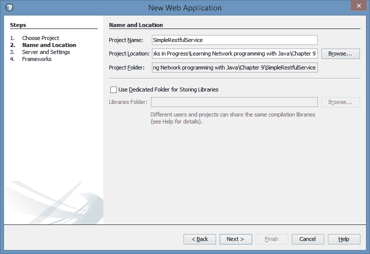
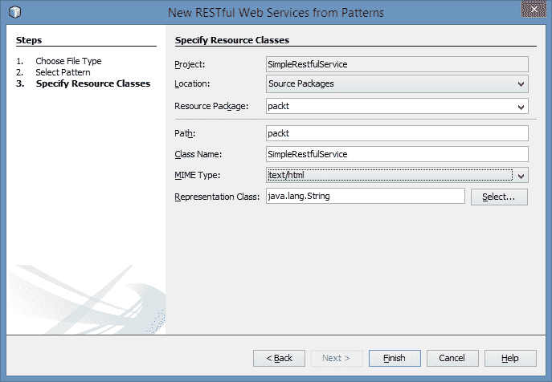
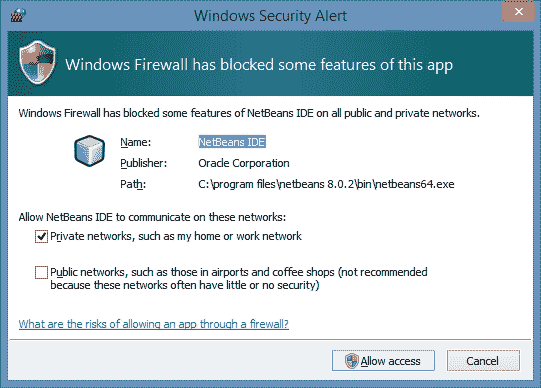
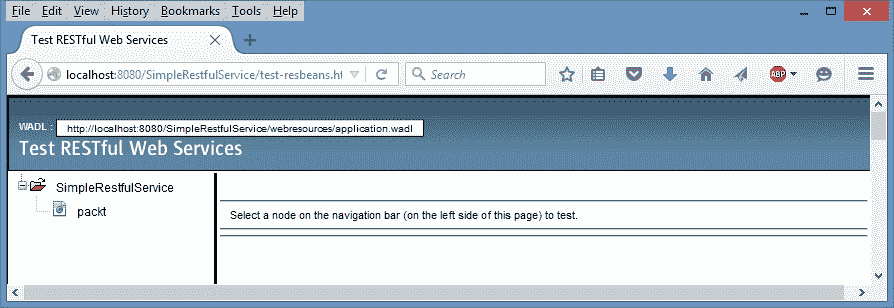

# 第 9 章网络互操作性

网络互操作性是指在实现技术上不同的系统能够可靠、准确地交换信息。这意味着，基础硬件、操作系统和实现语言等因素在不同平台之间可能有所不同，但它们不会对这些系统的通信能力产生不利影响。

有几个因素会影响互操作性。这些问题从低级问题（如基本数据类型使用的字节顺序）到高级技术（如在很大程度上隐藏了大部分实现细节的 web 服务）。在本章中，我们将探讨其中的许多因素。

我们首先讨论用于支持基本数据类型的字节顺序。这是数据传输的基础。不同的字节顺序将导致信息解释方式的显著差异。

接下来，我们将讨论 Java 应用程序如何与用不同语言编写的应用程序交互。这些语言可能是基于 JVM 的语言，也可能是与 Java 完全不同的语言。

基本的网络通信结构是套接字。此实体通常在 TCP/IP 环境中运行。我们将演示 Java 套接字如何与用不同语言编写的套接字交互，特别是 C#。

对互操作性最重要的支持是以 web 服务为代表的通信标准。这些应用程序支持使用标准化中间件的不同系统之间的通信。这些中间件实现隐藏了许多通信细节。

我们将研究以下互操作性主题：

*   Java 如何处理字节顺序
*   与其他语言的接口
*   与套接字通信
*   使用中间件实现互操作性

因此，让我们从讨论字节顺序以及它如何影响互操作性开始。

# Java 中的字节顺序

有两种字节顺序：**大端字节**和**小端字节**。这些术语指将一个多字节量存储在内存中的顺序。为了说明这一点，请考虑如何将整数存储在内存中。由于整数由 4 个字节组成，这些字节被分配到内存的 4 字节区域。但是，这些字节可以以不同的方式存储。大端号将最高有效字节放在第一位，而小端号将最低有效字节放在第一位。

考虑下面的声明和初始化一个整数：

```java
        int number = 0x01234567;
```

在以下示例中，假设整数已分配给地址`1000`，则使用 big-endian 显示四个字节的内存：

<colgroup><col style="text-align: left"> <col style="text-align: left"></colgroup> 
| 

住址

 | 

字节

 |
| --- | --- |
| 1000 | 01 |
| 1001 | 23 |
| 1002 | 45 |
| 1003 | 67 |

下表显示了如何使用 little endian 存储整数：

<colgroup><col style="text-align: left"> <col style="text-align: left"></colgroup> 
| 

住址

 | 

字节

 |
| --- | --- |
| 1000 | 67 |
| 1001 | 45 |
| 1002 | 23 |
| 1003 | 01 |

端度因机器而异，具体方式如下：

*   基于 Intel 的处理器使用 little endian
*   ARM 处理器可以使用小端或大端
*   摩托罗拉 68K 处理器使用 big-endian
*   摩托罗拉 PowerPC 使用 big-endian
*   Sun SPARK 处理器使用 big-endian

发送数据（如 ASCII 字符串）不是问题，因为这些字节是按连续顺序存储的。对于其他数据类型，如浮动和长数据，这可能是一个问题。

如果我们需要知道当前机器支持哪种表示，`java.nio`包中的`ByteOder`类可以确定当前字节顺序。下面的语句将显示当前平台的结束状态：

```java
        System.out.println(ByteOrder.nativeOrder());
```

对于 Windows 平台，它将显示以下内容：

**小丁**

`DataOutputStream`类的方法自动使用 big-endian。`ByteBuffer`类默认也使用 big-endian。但是，如下图所示，可以指定顺序：

```java
        ByteBuffer buffer = ByteBuffer.allocate(4096);
        System.out.println(buffer.order());
        buffer.order(ByteOrder.LITTLE_ENDIAN);
        System.out.println(buffer.order());
```

这将显示以下内容：

**大恩典**

**小丁**

一旦建立，其他方法，如`slice`方法，不会更改所使用的字节顺序，如下所示：

```java
        buffer.order(ByteOrder.LITTLE_ENDIAN);
        ByteBuffer slice = buffer.slice();
        System.out.println(buffer.order());
```

输出结果如下：

**小丁**

末端通常在机器上自动处理。然而，当我们在使用不同端点的机器之间传输数据时，我们可能会遇到问题。传输的字节可能在其目的地的顺序错误。

网络通常使用 big-endian，也称为**网络字节顺序**。通过套接字发送的任何数据都应使用 big-endian。在 Java 应用程序之间发送信息时，endianness 通常不是问题。然而，当与非 Java 技术交互时，endianness 更为重要。

# 与其他语言的接口

有时，有必要访问用不同语言编写的库。虽然这不仅仅是一个网络问题，Java 在许多方面提供了支持。与其他语言的直接接口不是跨网络进行的，而是在同一台机器上进行的。我们将简要研究其中一些接口问题。

如果我们正在使用另一个 Java 库，那么我们只需要加载这些类。如果我们需要将与非 Java 语言接口，那么我们可以使用**Java 本机接口**（**JNI**API 或其他库。但是，如果这种语言是基于 JVM 的语言，那么这个过程就容易多了。

## 与基于 JVM 的语言接口

**Java 虚拟机**（**JVM**执行 Java 字节码。然而，这不是使用 JVM 的唯一语言。其他语言包括以下语言：

*   **纳肖恩**：这个使用 JavaScript
*   **Clojure**：这是一种 Lisp 方言
*   **Groovy**：这是一种脚本语言
*   **Scala**：这个结合了面向对象和函数式编程方法
*   **JRuby**：这是 Ruby 的 Java 实现
*   **Jthon**：这是 Python 的 Java 实现
*   **Jacl**：这是 Tcl 的 Java 实现
*   **TuProlog**：这个是 Prolog 基于 Java 的实现

更完整的基于 JVM 的语言列表可以在[中找到 https://en.wikipedia.org/wiki/List_of_JVM_languages](https://en.wikipedia.org/wiki/List_of_JVM_languages) 。使用相同的 JVM 库将促进代码和库的共享。通常，不仅可以使用以不同基于 JVM 的语言开发的库，还可以从以不同语言开发的类派生。

许多语言已经移植到 JVM，因为使用 JVM 比为不同平台创建多个编译器或解释器更容易。例如，由于这个原因，Ruby 和 Python 有 JVM 实现。这些语言可以利用 JVM 的可移植性及其**实时**（**JIT**编译过程。除此之外，JVM 还有一个大型的经过良好测试的代码库可供构建。

Nashorn 是一个 JavaScript 引擎，它构建在 JVM 之上，并添加到 Java8 中。这使得 JavaScript 代码可以很容易地集成到 Java 应用程序中。下面的代码序列说明了这个过程。获取 JavaScript 引擎的一个实例，然后执行 JavaScript 代码：

```java
    try {
        ScriptEngine engine = 
            new ScriptEngineManager().getEngineByName("nashorn");
        engine.eval("print('Executing JavaScript code');");
    } catch (ScriptException ex) {
        // Handle exceptions
    }
```

该序列的输出如下：

**执行 JavaScript 代码**

更复杂的 JavaScript 处理是可能的。有关该技术的更多详细信息，请访问[https://docs.oracle.com/javase/8/docs/technotes/guides/scripting/nashorn/](https://docs.oracle.com/javase/8/docs/technotes/guides/scripting/nashorn/) 。

## 与非 JVM 语言的接口

通过 JNIAPI 访问不同语言中代码的一种常见技术。此 API 提供了一种访问 C/C++代码的方法。这种方法有很好的文档记录，在此不作演示。不过，有关此 API 的详细介绍，请参见[http://www.ibm.com/developerworks/java/tutorials/j-jni/j-jni.html](http://www.ibm.com/developerworks/java/tutorials/j-jni/j-jni.html) 。

可以从 Java 访问.NET 代码。一种技术使用 JNI 访问 C#。如何访问 C++、托管 C++和 C 代码是一个例子。http://www.codeproject.com/Articles/13093/C-method-calls-within-a-Java-program 。

# 通过简单插座进行通信

可以使用套接字在以不同语言编写的应用程序之间传输信息。socket 的概念不是 Java 独有的，已经在许多语言中实现。由于套接字是在 TCP/IP 级别工作的，因此它们可以不费吹灰之力地进行通信。

主要的互操作性考虑涉及传输的数据。当两种不同语言之间的数据内部表示形式显著不同时，可能会发生不兼容。这可能是由于在数据类型的内部表示方式以及特定数据类型是否存在于另一种语言中使用了 big-endian 而不是 little-endian。例如，在 C 语言中，没有明显的布尔数据类型。它使用整数表示。

在本节中，我们将用 Java 开发一个服务器，用 C#开发一个客户端。为了演示如何使用套接字，将在这两个应用程序之间传输一个字符串。我们会发现，即使是传输一个简单的数据类型，例如字符串，也可能比看起来更困难。

## Java 服务器

服务器是在`JavaSocket`类中声明的，如下所示。它看起来与本书中开发的 echo 服务器的早期版本非常相似。创建一个服务器套接字，然后阻塞，直到`accept`方法返回连接到客户端的套接字：

```java
public class JavaSocket {

    public static void main(String[] args) {
        System.out.println("Server Started");
        try (ServerSocket serverSocket = new ServerSocket(5000)) {
            Socket socket = serverSocket.accept();
            System.out.println("Client connection completed");
            ...
            socket.close();
        } catch (IOException ex) {
            // Handle exceptions
        }
        System.out.println("Server Terminated");
    }
}
```

`Scanner`类用于读取从客户端发送的消息。`PrintWriter`实例用于回复客户端：

```java
            Scanner scanner = 
                new Scanner(socket.getInputStream());
            PrintWriter pw = new PrintWriter(
                socket.getOutputStream(), true);
```

`nextLine`方法检索一条消息，该消息显示并发送回客户端：

```java
            String message = scanner.nextLine();
            System.out.println("Server received: " + message);
            pw.println(message);
            System.out.println("Server sent: " + message);
```

然后服务器将终止。

现在，让我们检查 C#应用程序。

## 客户

`CSharpClient`类实现了客户机，如下所示。C#在形式和语法上与 Java 相似，尽管类库通常不同。我们将不提供代码的详细解释，但我们将介绍应用程序的重要功能。

`using`语句对应 Java 中的 import 语句。与 Java 类似，第一个要执行的方法是`Main`方法。C#通常使用与 Java 不同的缩进样式和名称约定：

```java
using System;
using System.Net;
using System.Net.Sockets;

namespace CSharpSocket
{
    class CSharpClient
    {
        public static void Main(string[] args)
        {
            Console.WriteLine("Client Started");
            ...
        }
    }
}
```

`IPEndPoint`变量表示互联网地址，`Socket`类，正如您所期望的，表示套接字。`Connect`方法连接到服务器：

```java
            IPEndPoint serverAddress = 
               new IPEndPoint(IPAddress.Parse("127.0.0.1"), 5000);
            Socket clientSocket = 
                new Socket(AddressFamily.InterNetwork, 
                    SocketType.Stream, ProtocolType.Tcp);
            clientSocket.Connect(serverAddress);
```

`Console`类的`Write`方法在命令窗口中显示信息。在这里，系统会提示用户向服务器发送一条消息。`ReadLine`方法读取用户输入：

```java
            Console.Write("Enter message: ");
            String message = Console.ReadLine();
```

`Send`方法将数据传输到服务器。但是，它需要将数据放入字节缓冲区，如下所示。消息和附加的回车/换行字符被编码并插入缓冲区。需要附加字符，以便服务器能够正确读取字符串并知道字符串何时终止：

```java
            byte[] messageBuffer;
            messageBuffer = System.Text.Encoding.ASCII.GetBytes(
               message + "\n");
            clientSocket.Send(messageBuffer);
```

`Receive`方法读取服务器的响应。与`Send`方法类似，它需要一个字节缓冲区。此缓冲区是以 32 字节的大小创建的。这限制了消息的大小，但我们将很快讨论如何克服这一限制：

```java
            byte[] receiveBuffer = new byte[32];
            clientSocket.Receive(receiveBuffer);
```

接收缓冲区转换为字符串并显示。开始和结束括号用于清楚地描绘缓冲区：

```java
            String recievedMessage = 
               System.Text.Encoding.ASCII.GetString(
                   receiveBuffer);
            Console.WriteLine("Client received: [" + 
               recievedMessage + "]");
```

套接字关闭，应用程序终止：

```java
            clientSocket.Close();
            Console.WriteLine("Client Terminated");
```

## 正在运行的客户端/服务器

启动服务器，然后启动客户端。将提示客户端用户输入消息。输入消息。将发送消息，并在客户端窗口中显示响应。

此处显示服务器输出：

**服务器启动**

**客户端连接完成**

**服务器收到：消息**

**服务器发送：消息**

**服务器终止**

客户端显示如下：

**客户端启动**

**输入消息：消息**

**客户端收到：[消息**

 ****客户终止**

**按任意键继续。**

您会注意到收到的消息比预期的要大。这是因为客户端的接收字节缓冲区长度为 32 字节。此实现使用固定大小的缓冲区。由于服务器响应的大小可能并不总是已知的，因此缓冲区需要足够大来容纳响应。32 的大小用于限制服务器的输出。

这一限制可以通过多种方式克服。一种方法是在字符串末尾附加一个特殊字符，然后使用此标记构造响应。另一种方法首先发送响应的长度，然后发送响应。可以根据响应的长度分配接收缓冲区。

发送字符串对于传输格式化信息很有用。例如，发送的消息可能是 XML 或 JSON 文档。这将有助于传输更复杂的内容。**  **# 通过中间件实现互操作

在过去 20 年中，网络技术有了长足的发展。低级套接字支持为这些技术提供了基础。然而，它们通过多层软件对用户隐藏。这些层被称为**中间件**。

互操作性是通过中间件实现的，比如 JMI、SOAP 和 JAX WS。JavaEE 版本主要旨在支持这些中间件类型的技术。JavaEE 从**servlet**开始，这是一个用于支持网页的 Java 应用程序。它已经进化到包含**Java 服务器页面**（**JSP**），并最终到**Faclet**，这两个页面都隐藏了底层 servlet。

这些技术关注的是为用户提供服务，无论他们是浏览器中的人还是其他应用程序中的人。用户不一定知道服务是如何实现的。通信是通过许多不同的标准实现的，数据通常封装在与语言无关的 XML 文档中。因此，服务器和客户端可以用不同的语言编写，并在不同的执行环境中运行，从而促进互操作性。

虽然有许多技术可用，但有两种常用的方法：RESTful Web 服务和基于 SOAP 的 Web 服务。**代表性状态转移 Web 服务****RESTful Web 服务**使用 HTTP 和标准命令`PUT`、`POST`、`GET`、`DELETE`来支持网页和其他资源的分发。其目的是简化如何创建这些类型的服务。客户端和服务器之间的交互是无状态的。也就是说，先前处理的内容不会影响当前请求的处理方式。

**基于 SOAP 的 Web 服务**使用**简单对象访问协议**（**SOAP**）交换结构化信息。它使用应用层协议，如 HTTP 和 SMTP，并使用 XML 进行通信。我们将重点讨论 JAX-RS。

**RESTful Web 服务 Java API**（**JAX-RS**是支持 RESTful 服务开发的 API。它使用一系列注释将资源映射到 Java 实现。为了演示这项技术的工作原理，我们将使用 NetBeans 创建一个简单的 RESTful 应用程序。

## 创建 RESTful 服务

我们将首先创建服务器，然后创建一个简单的基于控制台的应用程序来访问服务器。我们将使用 NetBeans IDE 8.0.2 来开发此服务。NetBeans 可从[下载 https://netbeans.org/downloads/](https://netbeans.org/downloads/) 。选择 Java EE 版本。

安装 NetBeans 后，启动它，然后从**文件****新项目…**菜单项创建一个新项目。这将弹出**新项目**对话框，如下所示。选择**Java Web**类别和**Web 应用**项目。然后，选择**下一步**按钮：


给项目起个名字。在下图中，我们使用`SimpleRestfulService`作为其名称。选择合适的位置保存项目，然后选择**下一步**：



在**服务器和设置**步骤中，选择 GlassFish 服务器和 Java EE7 Web。GlassFish 是一个 web 服务器，我们将使用它来托管服务。**上下文路径**字段将成为传递给服务器的 URL 的一部分。再次点击**下一步**：


我们可以从三种设计模式中选择一种来创建我们的 RESTful 服务。对于本例，选择第一个**简单根资源**，然后点击**下一个**：


在**指定资源类**步骤中，完成对话框，如下图所示。资源包是 Java 类的存放位置。路径用于向用户标识资源。类名字段将是支持资源的 Java 类的名称。完成后，点击**完成**：



IDE 随后将生成文件，包括`ApplicationConfig.java`和`SimpleRestfulService.java`文件。`ApplicationConfig.java`文件用于配置服务。我们主要感兴趣的是`SimpleRestfulService.java`文件。

在`SimpleRestfulService`类中有`getHtml`方法，如下所示。其目的是生成对`GET`命令的响应。第一个注释将此方法指定为使用`HTTP GET`命令时要调用的方法。第二个注释指定此方法的预期输出为 HTML 文本。IDE 生成的 return 语句已替换为简单的 HTML 响应：

```java
    @GET
    @Produces("text/html")
    public String getHtml() {
        return 
            "<html><body><h1>Hello, World!!</body></h1></html>";
    }
```

当使用`GET`命令请求服务时，将返回 HTML 文本。所有的中间步骤，包括套接字的使用，都是隐藏的，简化了开发过程。

## 测试 RESTful 服务

我们将开发一个客户端应用程序来访问这个资源。但是，我们可以使用内置设施测试资源。要测试服务，右键单击**项目浏览器**窗口中的项目名称，然后选择**测试 RESTful Web 服务**菜单项。这将弹出以下窗口。点击**确定**：


您可能会在 Windows 上收到如下安全警报。如果出现这种情况，请选择**允许访问**按钮：



您的默认浏览器将显示测试页面，如下一步所示。选择**包**节点：



然后，资源将显示在右侧，如下所示。这允许我们选择测试方法。由于默认选择了`GET`命令，点击**测试**按钮：


然后将`GET`命令发送到服务器，并显示响应，如下所示。


可以使用 JAX_RS 执行更复杂的处理。不过，这说明了基本方法。

## 创建 RESTful 客户端

RESTful 服务可以被任意数量的用各种语言编写的应用程序调用。在这里，我们将创建一个简单的 Java 客户端来访问此服务。

创建一个新项目，并从**Web 服务**类别中选择**RESTful Java 客户端**选项，如下所示。然后点击**下一步**：


此时会出现**名称和位置**步骤对话框，如下图所示。我们需要选择 RESTful 资源。我们可以通过点击**浏览…**按钮来执行此操作：


此时会出现**可用 REST 资源**对话框，如下所示。展开我们的 RESTful 项目并选择资源，如下一个截图所示，然后点击**确定**：


完成的对话框应显示如下。点击**上的完成**：


然后生成`RestfulClient`类。我们对`getHtml`方法感兴趣，如下面的所示。这将从服务返回 HTML 文本：

```java
    public String getHtml() throws ClientErrorException {
        WebTarget resource = webTarget;
        return resource.
            request(javax.ws.rs.core.MediaType.TEXT_HTML).
            get(String.class);
    }
```

要测试应用程序，请添加以下调用`getHtml`方法的`main`met`hod：

```java
    public static void main(String[] args) {
        RestfulClient restfulClient = new RestfulClient();
        System.out.println(restfulClient.getHtml());
    }
```

确保 GlassFish 服务器正在运行，并执行该程序。输出结果如下：

**<html><body><h1>简单宁静示例</body></h1></html>**

虽然我们通常不会在控制台中显示 HTML 文本，但这说明了我们从 RESTful 服务获取信息的过程。

# 总结

在本章中，我们探讨了影响网络互操作性的许多因素。在低级别，字节顺序变得很重要。我们了解到，系统要么使用大端字节顺序，要么使用小端字节顺序。顺序可以由 Java 应用程序确定和控制。网络通信通常在传输数据时使用 big-endian。

如果我们需要与其他语言通信，我们发现基于 JVM 的语言更容易使用，因为它们共享相同的字节码库。如果我们需要使用其他语言，那么 JNI 是常用的。

套接字不是 Java 特有的概念。它通常用于 TCP/IP 环境，这意味着用一种语言编写的套接字可以轻松地与用另一种语言编写的套接字通信。我们使用 Java 服务器和 C#客户机演示了这种能力。

我们还探讨了中间件如何通过抽象许多底层通信细节来支持互操作性。通过使用 web 服务等概念，我们了解到底层套接字交互的细节是隐藏的。我们使用 JAX-RS 演示了这一点，JAX-RS 支持 RESTful 方法，其中 HTTP 命令（如 GET 和 POST）映射到特定的 Java 功能。

在企业级应用程序中，网络互操作性是一个重要的考虑因素，其中企业的功能是使用各种技术分布的。通过使用标准中间件协议和产品，可以实现这种互操作性。**