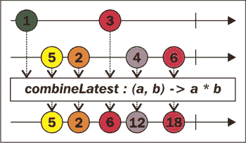
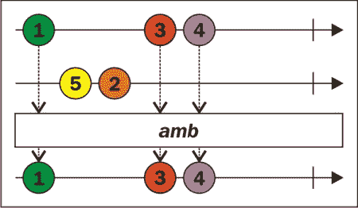

# 五、组合器、条件和错误处理

我们编写的大多数程序都处理来自不同来源的数据。这些源既可以是外部的（文件、数据库、服务器等），也可以是内部的（同一外部源的不同集合或分支）。在许多情况下，我们希望这些资源以某种方式相互依赖。定义这些依赖关系是构建程序的必要步骤。本章的目的是介绍能够做到这一点的`Observable`操作符。

我们在第一章和第二章中看到了一个组合`Observable`实例的例子。我们的“反应求和”程序有一个外部数据源用户输入，但它根据自定义格式将其分为两个内部数据源。我们看到了如何使用`filter()`运算符而不是过程`if-else`构造。后来，我们在组合器的帮助下，将这些数据流组合成一个数据流。

我们将学习如何从`Observable`实例链内部应对错误。记住，能够对失败做出反应使我们的程序具有弹性。

在本章中，我们将介绍：

*   使用`combineLatest()`、`merge()`、`concat()`、`zip()`等操作符组合`Observable`实例
*   使用条件运算符（如`takeUntil()`、`skipUntil()`和`amb()`在`Observable`实例之间创建依赖关系
*   使用`retry()`、`onErrorResumeNext()`、`onErrorReturn()`等运算符进行错误处理

# 结合可观察实例

我们首先来看一下`zip(Observable, Observable, <Observable>..., Func)`操作符，它可以使用*合并*函数*合并*两个或多个`Observable`实例。

## 拉链操作员

传递给`zip`操作符的函数的参数与传递给`zip()`方法的`Observable`实例的数量相同。当所有这些`Observable`实例发出至少一项时，将使用每个`Observable`实例首先发出的参数值调用该函数。其结果将是通过`zip()`方法创建的`Observable`实例发出的第一个项目。此`Observable`实例发出的第二项将是源`Observable`实例的第二项的组合（使用`zip()`方法的函数参数计算）。即使源`Observable`实例中的一个已发出三个或更多项，也会使用其第二个已发出项。生成的`Observable`实例总是发出与源`Observable`实例相同数量的项目，源`Observable`实例发出的项目最少，然后完成。

此行为可以在大理石图中更好地看到：


下面是一个使用`zip()`方法的非常简单的示例：

```java
Observable<Integer> zip = Observable
.zip(
 Observable.just(1, 3, 4),
 Observable.just(5, 2, 6),
 (a, b) -> a + b
);
subscribePrint(zip, "Simple zip");
```

该示例类似于大理石图，并输出相同的结果。由`zip()`方法创建的`Observable`实例发出的第一项在所有源发出至少一项时发出。这意味着，即使其中一个源发射其所有项，结果也将仅在所有其他源发射项时发射。

现在，如果您还记得[第三章](3.html "Chapter 3. Creating and Connecting Observables, Observers, and Subjects")中的`interval()`操作符*创建并连接被观察者、观察者和受试者*，它能够创建一个`Observable`实例每`<n>`毫秒发出序列号。如果您想发射一系列（比如）任意对象，该怎么办？这可以通过结合使用`zip()`方法的`interval()`和`from()`或`just()`方法来实现。让我们看一个例子：

```java
Observable<String> timedZip = Observable
.zip(
 Observable.from(Arrays.asList("Z", "I", "P", "P")),
 Observable.interval(300L, TimeUnit.MILLISECONDS),
 (value, i) -> value
);
subscribePrint(timedZip, "Timed zip");
```

这将在 300 毫秒后输出`Z`，在另一个 300 毫秒后输出`I`，在相同间隔后输出`P`，在`300`更多毫秒后输出另一个`P`。之后，`timedZip``Observable`实例将完成。这是因为通过`interval()`方法创建的源`Observable`实例每隔`300`毫秒发射一次其元素，并确定`timedZip`参数发射的速度。

`zip()`方法也有一个实例方法版本。该操作符称为`zipWith()`。这里是一个与前面的示例类似的示例，但使用了`zipWith()`运算符：

```java
Observable<String> timedZip = Observable
.from(Arrays.asList("Z", "I", "P", "P"))
.zipWith(
 Observable.interval(300L, TimeUnit.MILLISECONDS),
 (value, skip) -> value
);
subscribePrint(timedZip, "Timed zip");
```

接下来，我们将了解我们在[第 1 章](1.html "Chapter 1. An Introduction to Reactive Programming")中首次看到的*组合器*，*反应式编程简介*，同时实现*‘反应式和’*。

## 组合测试操作符

`combineLatest()`运算符与`zip()`运算符具有相同的参数和重载，但行为稍有不同。它创建的`Observable`实例在每个源中至少有一个源时发射第一个项，每个源取最后一个。之后，它创建的`Observable`实例在任何源`Observable`实例发出项目时都会发出项目。`combineLatest()`操作员发出的项目数量完全取决于发出项目的顺序，因为在每个源都有一个之前，可以从单个源发出多个项目。其大理石图如下所示：



在上图中，组合`Observable`实例发射的项目的颜色与触发其发射的项目的颜色相同。

在接下来的几个示例中，我们将使用由`interval()`和`zipWith()`方法创建的三个源`Observable`实例：

```java
Observable<String> greetings = Observable
.just("Hello", "Hi", "Howdy", "Zdravei", "Yo", "Good to see ya")
.zipWith(
  Observable.interval(1L, TimeUnit.SECONDS),
  this::onlyFirstArg
);
Observable<String> names = Observable
.just("Meddle", "Tanya", "Dali", "Joshua")
.zipWith(
  Observable.interval(1500L, TimeUnit.MILLISECONDS),
  this::onlyFirstArg
);
Observable<String> punctuation = Observable
.just(".", "?", "!", "!!!", "...")
.zipWith(
  Observable.interval(1100L, TimeUnit.MILLISECONDS),
  this::onlyFirstArg
);
```

这是用于压缩的函数：

```java
public <T, R> T onlyFirstArg(T arg1, R arg2) {
  return arg1;
}
```

这是在两次发射之间插入延迟的相同方法，如`zip()`方法一节所示。这三个`Observable`实例可用于比较不同的组合方法。包含问候语的`Observable`实例每秒钟发射一次，包含姓名的实例每秒钟半发射一次，带有标点符号的实例每 1.1 秒发射一次。

使用`combineLatest()`操作符，我们可以这样组合它们：

```java
Observable<String> combined = Observable
.combineLatest(
 greetings, names, punctuation,
 (greeting, name, puntuation) ->
 greeting + " " + name + puntuation)
;
subscribePrint(combined, "Sentences");
```

这将在句子中组合不同的源项。第一句话将在一秒半后发出，因为所有的源都必须发出一些东西，以便组合的`Observable`实例开始其排放。这句话将是`'Hello Meddle.'`。下一句话将在任何源发出某物时发出。此将在订阅后两秒发生，因为`Observable`实例每秒都会发出问候语；它将发出`'Hi'`，这将使组合的`Observable`实例发出`'Hi Meddle.'`。当 2.2 秒过去时，标点符号`Observable`实例将发出`'?'`，因此我们将有另一个句子-`'Hi Meddle?'`。这将继续进行，直到完成所有源。

当我们所依赖的任何数据源发生变化时，当我们需要计算或通知时，`combineLatest()`运算符非常有用。第二种方法更简单；它只是将其源的排放合并，*在过程中交错*它们。

## 合并运算符

当我们想要从多个源获取源作为一个流时，我们可以使用`merge()`操作符。例如，我们可以有许多`Observable`实例从不同的`log`文件发送数据。我们不在乎哪个`log`文件是当前排放的来源，我们只想查看所有日志。

`merge()`运算符的示意图非常简单：


每个项目都是在其原始的发射时间发射的，并且源不重要。使用上一节介绍的三个`Observable`实例的示例如下所示：

```java
Observable<String> merged = Observable
  .merge(greetings, names, punctuation);
subscribePrint(merged, "Words");
```

它只是发出不同的单词/标点符号。发出的第一个单词将来自问候语`Observable`实例，订阅后 1 秒（因为问候语每秒发出一次）`'Hello'`；然后在 100 毫秒后会发出`'.'`，因为标点符号`Observable`实例每 1.1 秒发出一次其项目。400 毫秒后，即订阅后一秒半，`'Meddle'`将发出。接下来是问候语`'Hi'`。排放将继续发生，直到源`Observable`实例完成，该实例花费的时间最多。

值得一提的是，如果任何一个源发出`OnError`通知，`merge Observable`实例也会发出*错误*并完成。有一种形式的`merge()`操作符延迟发出错误，直到所有无错误源`Observable`实例完成。它被称为`mergeDelayError()`。

如果我们希望将源组合在一起，使它们的项不会在时间上交错，并且第一个通过源的发射优先于下一个，我们将使用本章介绍的`concat()`操作符的最后一个组合器。

## concat 操作员

本书中的章节都在不同的档案中。我们希望将所有这些文件的内容连接到一个大文件中，代表整本书。我们可以使用前面创建的`from(Path)`方法为每个章节文件创建一个`Observable`实例，我们可以使用`concat()`操作符将这些`Observable`实例作为源，以正确的顺序连接到一个`Observable`实例中。如果我们订阅这个`Observable`实例时使用一种将所有内容写入文件的方法，那么我们最终将拥有图书文件。

请注意，`conact()`操作符不能很好地处理无限`Observable`实例。它将发出第一个的通知，但会阻止其他通知。`merge()`和`concat()`操作符的主要区别在于`merge()`同时订阅所有源`Observable`实例，而`concat()`在任何时候都只有一个订阅。

`concat()`操作员的大理石图如下所示：


下面是将前面示例中的三个`Observable`实例连接起来的示例：

```java
Observable<String> concat = Observable
  .concat(greetings, names, punctuation);
subscribePrint(concat, "Concat");
```

这将每秒一个接一个地输出所有问候语，然后每隔一秒半输出姓名，最后每隔 1.1 秒输出标点符号。在问候语和名字之间会有一秒半。

有一个操作符，类似于`concat()`操作符，称为`startWith()`。它将项前置到一个`Observable`实例，并使用一个`Iterable`实例或另一个`Observable`实例进行重载，这些重载采用 1、2、3 等等，最多九个值。使用另一个`Observable`实例的过载作为参数，我们可以模拟`concat()`操作符。以下是在以下代码中实现的上述示例：

```java
Observable<String> concat = punctuation
  .startWith(names)
 .startWith(greetings);
subscribePrint(concat, "Concatenated");
```

将问候语`Observable`实例前缀为 names one，其结果前缀为`Observable`实例的标点，创建与上例相同的级联源`Observable`实例。

### 注

本章前面和前面所有示例的源代码可在[中找到 https://github.com/meddle0x53/learning-rxjava/blob/master/src/main/java/com/packtpub/reactive/chapter05/CombiningObservables.java](https://github.com/meddle0x53/learning-rxjava/blob/master/src/main/java/com/packtpub/reactive/chapter05/CombiningObservables.java) 。

`startWith()`运算符的良好使用是与`combineLatest()`运算符一起使用时。如果您还记得我们的*无功和*示例的初始实现，您必须输入`a`和`b`值才能计算初始和。但假设我们修改总和的构造如下：

```java
Observable.combineLatest(
  a.startWith(0.0),
  b.startWith(0.0),
  (x, y) -> x + y
);
```

即使在用户输入任何内容之前，我们也会有一个初始总和`0.0`，并且在这种情况下，用户第一次输入`a`但尚未给`b`赋值，在这种情况下，我们不会看到总和。

同样，与`merge()`操作符一样，`concat()`操作符有一个实例形式`concatWith()`操作符。

在本章的这一部分，我们看到了如何组合不同的`Observable`实例。但组合并不是`Observable`实例之间的唯一交互。它们可以相互依赖，也可以相互管理。有一种方法可以让一个或多个`Observable`实例创建条件，从而改变其他`Observable`实例的行为。它是通过条件运算符实现的。

# 条件运算符

可以使一个`Observable`实例在另一个实例发射之前不会开始发射，或者只有在另一个实例不发射任何东西时才会发射。这些`Observable`实例能够在给定条件下发出项目，这些条件使用*条件*操作符应用于它们。在本节中，我们将了解 RxJava 提供的一些*条件*运算符。

## 电磁轴承操作员

`amb()`操作符具有从两个到九个源`Observable`实例或`Observable`实例的`Iterable`实例获取的重载。它首先发射源`Observable`实例的项。无论是`OnError`、`OnCompleted`通知还是数据，这都无关紧要。其图表如下所示：



这个操作符也有一个实例表单。它被称为`ambWith()`，可以在一个`Observable`实例上与另一个`Observable`实例的参数中调用。

此*条件*运算符适用于从多个相似数据源读取数据。订户不会关心数据的来源。例如，它可以用于实现简单的缓存。下面是一个如何使用它的小例子：

```java
Observable<String> words = Observable.just("Some", "Other");
Observable<Long> interval = Observable
  .interval(500L, TimeUnit.MILLISECONDS)
  .take(2);
subscribePrint(Observable.amb(words, interval), "Amb 1");
Random r = new Random();
Observable<String> source1 = Observable
  .just("data from source 1")
  .delay(r.nextInt(1000), TimeUnit.MILLISECONDS);
Observable<String> source2 = Observable
  .just("data from source 2")
  .delay(r.nextInt(1000), TimeUnit.MILLISECONDS);
subscribePrint(Observable.amb(source1, source2), "Amb 2");
```

第一个`amb()`操作符会发出*字*字`Observable`实例的项目，因为*间隔*字`Observable`实例需要等待半秒才能发出，*字*会立即开始发出。

第二个`amb Observable`实例的排放将随机决定。如果第一个源`Observable`实例在第二个源之前发射数据，则其发射将被`amb Observable`实例镜像，但如果第二个源`Observable`实例首先发射，则`amb Observable`实例将发射其数据。

## takeUntil（）、takeWhile（）、skipUntil（）和 skipWhile（）条件运算符

我们看到操作符与上一章中的类似。`take(int)`操作员只过滤前*n*项。这些操作符也会过滤项，但*基于*条件。`takeUntil()`操作符获取另一个`Observable`实例，在该另一个`Observable`实例发出之前，源的项被发出；之后，`takeUntil()`操作符创建的`Observable`实例完成。让我们看一个使用这些运算符的示例：

```java
Observable<String> words = Observable // (1)
  .just("one", "way", "or", "another", "I'll", "learn", "RxJava")
  .zipWith(
    Observable.interval(200L, TimeUnit.MILLISECONDS),
    (x, y) -> x
  );
Observable<Long> interval = Observable
  .interval(500L, TimeUnit.MILLISECONDS);
subscribePrint(words.takeUntil(interval), "takeUntil"); // (2)
subscribePrint( // (3)
  words.takeWhile(word -> word.length() > 2), "takeWhile"
);
subscribePrint(words.skipUntil(interval), "skipUntil"); // (4)
```

我们来看下面的说明：

1.  对于这些示例，我们将使用*单词*和*间隔*`Observable`实例。*单词*`Observable`实例每 200 毫秒发出个单词，*间隔* `Observable`每半秒发出一个单词。
2.  如前所述，`takeUntil()`运算符的此重载将发出单词，直到`interval Observable`发出为止。因此，`one`和`way`将被发射，因为下一个单词`or`应该在订阅后 600 毫秒发射，`interval Observable`在第 500 毫秒发射。
3.  这里，`takeWhile()`操作员在`words Observable`上设置一个条件。仅当存在包含两个以上字母的单词时，它才会发出。因为“`or'`有两个字母，所以它不会被释放，并且它后面的所有单词也会被跳过。`takeUntil()`操作符也有类似的重载，但它只发出包含少于三个字母的单词。没有`takeWhile(Observable)`操作符过载，因为它本质上是`zip()`操作符：仅当另一个操作符也发射时才发射。
4.  `skip*`运算符与`take*`运算符类似。不同之处在于，它们在满足条件之前/期间不会发射。在此示例中，跳过单词`one`和`way`，因为它们在订阅的第 500 毫秒之前发出，`interval Observable`在第 500 毫秒开始发出。单词`'or'`及其后面的所有单词都会发出。

例如，这些*条件*操作符可用于在 GUI 应用中显示加载动画。代码可以是类似的东西：

```java
loadingAnimationObservable.takeUntil(requestObservable);
```

在`loadingAnimationObservable`变量的每发射时，会向用户显示一些短暂的动画。当请求返回时，动画将不再显示。这是程序逻辑分支的另一种方式。

## defaultIfEmpty（）运算符

`defaultlfEmpty()`运算符的思想是在未知源为空时返回有用的内容。例如，如果远程源没有任何新信息，我们将使用本地存储的信息。

下面是一个简单的例子：

```java
Observable<Object> test = Observable
  .empty()
  .defaultIfEmpty(5);
subscribePrint(test, "defaultIfEmpty");
```

当然，这将输出`5`并完成。

### 注

`amb()`、`take*`、`skip*`和`defaultIfEmpty()`操作符示例的源代码可在[中找到 https://github.com/meddle0x53/learning-rxjava/blob/master/src/main/java/com/packtpub/reactive/chapter05/Conditionals.java](https://github.com/meddle0x53/learning-rxjava/blob/master/src/main/java/com/packtpub/reactive/chapter05/Conditionals.java) 。

到目前为止，我们已经对数据进行了转换、过滤和组合。但是*错误*呢？我们的应用可以随时进入错误状态。是的，我们可以订阅`Observable`实例发出的*错误*，但这将终止我们的逻辑。在`subscribe`方法中，我们在`Observable`操作链之外。如果我们想要对`Observable`实例链中的*错误*做出反应并试图阻止终止，该怎么办？有一些操作符可以帮助我们做到这一点，我们将在下一节中对它们进行研究。

# 处理错误

在 RxJava 中处理与*错误*时，您应该知道它们终止了`Observable`操作链。与普通过程代码非常相似，一旦进入 catch 块，就无法返回引发异常的代码。不过，您可以执行一些备份逻辑并使用它，而不是使程序失败。`return*`、`retry*`和`resume*`运营商做了类似的事情。

## 返回和恢复操作人员

可以使用`onErrorReturn`操作符来阻止`Subscriber`实例的`onError`被调用。相反，它将发出最后一项并完成。以下是一个例子：

```java
Observable<String> numbers = Observable
  .just("1", "2", "three", "4", "5")
  .map(Integer::parseInt)
  .onErrorReturn(e -> -1);
  subscribePrint(numbers, "Error returned");
```

`Integer::parseInt`方法将成功地将字符串`1`和`2`转换为`Integer`值，但在`three`上失败，出现`NumberFormatException`异常。此异常将传递给`onErrorReturn()`方法，该方法将返回数字-`1`。`numbers Observable`实例将发出编号-`1`并完成。所以输出为`1`、`2`、`-1`、`OnCompleted`通知。

这是很好，但有时我们希望切换到异常上的另一个可观察的操作链。为此，我们可以使用`onExceptionResumeNext()`操作符，它返回一个备份`Observable`实例，当`Exception`发生时，该实例将替换源实例。下面是为使用它而修改的代码：

```java
Observable<Integer> defaultOnError =
  Observable.just(5, 4, 3, 2, 1);
Observable<String> numbers = Observable
  .just("1", "2", "three", "4", "5")
  .map(Integer::parseInt)
  .onExceptionResumeNext(defaultOnError);
  subscribePrint(numbers, "Exception resumed");
```

现在将输出`1`、`2`、`5`、`4`、`3`、`2`、`1`、`OnCompleted`通知，因为在`'three'`上引发`Exception`后，传递给`onExceptionResumeNext()`方法的`defaultOnError Observable`实例将开始发射，替换所有`Subscriber`方法的源`Observable`实例。

还有一个`resuming()`操作符与`onExceptionResumeNext()`非常相似。它被称为`onErrorResumeNext()`。它可以替换上例中的`onExceptionResumeNext()`操作符，结果相同。不过，这两个操作符之间有两个区别。

首先，`onErrorResumeNext()`操作符有一个额外的重载，它接受 lambda 表达式，返回`Observable`实例（类似于`onErrorReturn()`方法）。其次，它会对各种错误做出反应。`onExceptionResumeNext()`方法只对`Exception`类及其子类的实例作出反应。

```java
Observable<String> numbers = Observable
  .just("1", "2", "three", "4", "5")
  .doOnNext(number -> {
    assert !number.equals("three");
  }
  .map(Integer::parseInt)
  .onErrorResumeNext(defaultOnError);
  subscribePrint(numbers, "Error resumed");
```

在这个示例中，结果将与前面的示例`(1, 2, 5, 4, 3, 2, 1, OnCompleted notification b)`中的结果相同；存在*断言错误*并不重要。但是如果我们使用了一个`onExceptionResumeNext()`操作符，错误将作为`OnError`*通知*到达`subscribePrint`方法。

本例中使用的`doOnNext()`操作符是*副作用发生器*。它不会更改所调用的`Observable`实例发出的项。它可以用于日志记录、缓存、断言或添加其他逻辑。还有`doOnError()`和`doOnCompleted()`操作员。此外，还有一个`finallyDo()`操作符，当出现错误或`Observable`实例已完成时，该操作符将执行传递给它的函数。

## 重试技术

重试是一项重要的技术。当`Observable`实例从不确定的来源（例如，远程服务器）发送数据时，一个网络问题可能会终止整个应用。在*错误*上重试可以在这种情况下节省我们的时间。

在`Observable`动作链中插入`retry()`操作符意味着，如果发生*错误*，订阅者将重新订阅源`Observable`实例，从链的开始就尝试一切。如果再次出现*错误*，则重新启动所有程序。无参数的`retry()`操作符无限次重试。有一个重载`retry(int)`方法，它获取允许的最大重试次数。

为了演示`retry()`方法，我们将使用以下特殊行为：

```java
class FooException extends RuntimeException {
  public FooException() {
    super("Foo!");
  }
}

class BooException extends RuntimeException {
  public BooException() {
    super("Boo!");
  }
}
class ErrorEmitter implements OnSubscribe<Integer> {
  private int throwAnErrorCounter = 5;
  @Override
  public void call(Subscriber<? super Integer> subscriber) {
    subscriber.onNext(1);
    subscriber.onNext(2);
    if (throwAnErrorCounter > 4) {
      throwAnErrorCounter--;
      subscriber.onError(new FooException());
      return;
    }
    if (throwAnErrorCounter > 0) {
      throwAnErrorCounter--;
      subscriber.onError(new BooException());
      return;
    }
    subscriber.onNext(3);
    subscriber.onNext(4);
    subscriber.onCompleted();
    }
  }
}
```

`ErrorEmitter`实例可以传递给`Observable.create()`方法。如果`throwAnErrorCounter`字段大于 4，则发送`FooException`异常；如果大于零，则发送`BooException`异常，如果小于或等于零，则发送一些事件并正常完成。

现在让我们看一下使用`retry()`操作符的示例：

```java
subscribePrint(Observable.create(new ErrorEmitter()).retry(), "Retry");
```

因为`throwAnErrorCounter`字段的初始值为 5，所以会重试`five`次，当计数器为零时`Observable`实例将*完成*。结果将是`1`、`2`、`1`、`2`、`1`、`2`、`1`、`2`、`1`、`2`、`1`、`2`、`3`、`4`、`OnCompleted`通知。

`retry()`运算符可用于重试设定次数（或无限期）。它甚至有一个重载，使用一个带有两个参数的函数来计算到目前为止的重试次数并导致`Throwable`实例。如果此函数返回`True`，则重新订阅`Observable`实例。这是一种编写自定义重试逻辑的方法。但是延迟重试又如何呢？例如，每秒钟重试一次？有一个特殊的运算符能够执行非常复杂的*重试逻辑*，`retryWhen()`运算符。让我们看一个使用它的示例和前面提到的`retry(predicate)`操作符：

```java
Observable<Integer> when = Observable.create(new ErrorEmitter())
  .retryWhen(attempts -> {
 return attempts.flatMap(error -> {
 if (error instanceof FooException) {
 System.err.println("Delaying...");
 return Observable.timer(1L, TimeUnit.SECONDS);
 }
 return Observable.error(error);
 });
 })
  .retry((attempts, error) -> {
 return (error instanceof BooException) && attempts < 3;
 });
subscribePrint(when, "retryWhen");
```

当`retryWhen()`操作员返回`Observable`实例，发出`OnError()`或`OnCompleted()`通知时，通知被传播，如果没有其他*重试/恢复*，则调用订阅者的`onError()`或`onCompleted()`方法。否则，订阅者将被重新订阅到可观测的源。

在本例中，如果`Exception`是`FooException`，则`retryWhen()`操作符在一秒钟后返回一个`Observable`实例。这就是我们实现延迟重试的方式。如果`Exception`不是`FooException`，则传播到下一个`retry(predicate)`操作符。它可以检查*错误*的类型和尝试次数，并决定是传播错误还是重试源。

在本例中，我们将获得一次延迟重试，三次重试`retry(predicate)`方法，在第五次尝试时，订户将收到一个`OnError`通知，但有一个`BooException`异常。

### 注

`retry`/`resume`/`return`示例的源代码可在[中找到 https://github.com/meddle0x53/learning-rxjava/blob/master/src/main/java/com/packtpub/reactive/chapter05/HandlingErrors.java](https://github.com/meddle0x53/learning-rxjava/blob/master/src/main/java/com/packtpub/reactive/chapter05/HandlingErrors.java) 。

本章的最后一节是为了一个更复杂的例子而保存的。我们将使用到目前为止的知识创建一个到远程 HTTP API 的请求，并处理结果，将其输出给用户。

# HTTP 客户端示例

让我们使用 RxJava 通过*用户名*检索用户的 GitHub 存储库信息。我们将使用之前使用的`subscribePrint()`功能将信息输出到系统输出。该程序的想法是显示用户的所有公共存储库，这些存储库不是 fork。该计划的主要部分如下所示：

```java
String username = "meddle0x53";
Observable<Map> resp = githubUserInfoRequest(client, username);
subscribePrint(
  resp
  .map(json ->
    json.get("name") + "(" + json.get("language") + ")"),
  "Json"
);
```

该程序使用我的用户（可以很容易地修改为使用作为参数传递的*用户名*来检索其公共存储库中的信息）。它打印每个存储库的名称以及其中使用的主要编程语言。存储库由传入 JSON 文件生成的`Map`实例表示，因此我们可以从中读取存储库属性。

这些 JSON`Map`实例由`githubUserInfoRequest(client, username)`方法创建的`Observable`实例发出。客户机参数是 Apache 的`HttpAsyncClient`类的一个实例。客户端能够执行异步的 HTTP 请求，另外还有一个 RxJava 模块，名为`RxApacheHttp`，它为我们提供了 RxJava 和 Apache HTTP 之间的绑定。我们将使用它来实现 HTTP 请求；你可以在[找到 https://github.com/ReactiveX/RxApacheHttp](https://github.com/ReactiveX/RxApacheHttp) 。

### 提示

还有许多额外的 RxJava 项目，位于[https://github.com/ReactiveX](https://github.com/ReactiveX) 。其中一些非常有用。例如，我们在本书中实现的大多数`from(Stream/Reader/File)`方法在`RxJavaString`模块中有更好的实现。

下一步是实施`githubUserInfoRequest(HttpAsyncClient, String)`方法：

```java
Observable<Map> githubUserInfoRequest(HttpAsyncClient client, String githubUser) {
  if (githubUser == null) { // (1)
    return Observable.<Map>error(
      new NullPointerException("Github user must not be null!")
    );
  }
  String url = "https://api.github.com/users/" + githubUser + "/repos";
  return requestJson(client, url) // (2)
  .filter(json -> json.containsKey("git_url")) // (3)
  .filter(json -> json.get("fork").equals(false));
}
```

这个方法也相当简单。

1.  首先，我们需要有一个 GitHub*用户名*来执行我们的请求，所以我们对它进行一些检查。不应该是`null`。如果是`null`，我们将返回一个*错误发出*`Observable`实例，发出一个`OnError`通知和一个`NullPointerException`异常。我们的打印订户功能将向用户显示它。
2.  为了执行实际的 HTTP 请求，我们将使用另一个带有签名`requestJson(HttpAsyncClient, String)`的方法。返回`Observable`实例，发出映射实例表示的 JSON。
3.  如果用户不是真正的 GitHub 用户，或者我们已经超过 GitHub API 限制，GitHub 将向我们发送一条 JSON 消息。这就是为什么我们需要检查我们得到的 JSON 是否包含存储库数据或其他内容。表示存储库的 JSON 有一个`git_url`键。我们使用它只过滤表示 GitHub 存储库的 JSON。
4.  We need only the non-fork repositories; that's why we filter them.

    这也是很容易理解的。到目前为止，我们在逻辑中只使用了`map()`和`filter()`运算符，没有什么特别之处。让我们看看实际的 HTTP 请求实现：

    ```java
    Observable<Map> requestJson(HttpAsyncClient client, String url) {
      Observable<String> rawResponse = ObservableHttp
     .createGet(url, client)
     .toObservable() // (1)
      .flatMap(resp -> resp.getContent() // (2)
        .map(bytes -> new String(
          bytes,  java.nio.charset.StandardCharsets.UTF_8
        ))
      )
      .retry(5) // (3)
      .cast(String.class) // (4)
      .map(String::trim)
      .doOnNext(resp -> getCache(url).clear()); // (5)
    ```

5.  `ObservableHttp`类来自`RxApacheHttp`模块。它使用 Apache`HttpClient`实例为我们执行异步 HTTP 请求。`createGet(url, client)`方法返回一个实例，该实例可以通过`toObservable()`方法转换为实际的`Observable`实例。我们在这里就是这么做的。
6.  此`Observable`实例在收到 HTTP 响应时，将作为`ObservableHttpResponse`实例发出。这个实例有一个`getContent()`方法，它返回一个`Observable<byte[]>`对象，将响应表示为一个*字节序列*。我们使用一个简单的`map()`操作符将这些*字节数组*转换为`String`对象。现在我们有一个由`String`对象表示的 JSON 响应。
7.  如果连接到 GitHub 时出现问题，我们会*重试*五次。
8.  由于 Java 的类型系统，强制转换为`String`是必要的。此外，我们使用`trim()`方法从响应中删除任何尾随/前导空格。
9.  我们清除此 URL 的缓存信息。我们使用一个从 URL 到 JSON 数据缓存的简单内存映射实例实现，以避免多次重复相同的请求。我们如何填充这个缓存？我们将很快在下面的代码中看到。让我们来看一看：
10.  响应可以是 JSON 数组或 JSON 对象；我们在这里使用`filter()`操作符来分支我们的逻辑。JSON 对象被转换为 JSON 数组，以便以后使用公共逻辑。
11.  使用`ambWith()`操作符，我们将使用从两个`Observable`实例发出数据的一个，并将结果作为 JSON 数组处理。我们将使用数组或对象 JSON，最终结果是一个`Observable`实例将 JSON 数组作为`String`对象发出。
12.  我们使用谷歌的 JSON 库将这个`String`对象转换为实际的地图实例列表。
13.  `flatMapIterable()`操作符将发出`List`实例的`Observable`实例展平为发出其内容的`Observable`实例—表示 JSON 的多个映射实例。
14.  所有这些映射实例都是通过将它们添加到内存缓存中来缓存的。
15.  使用`amb()`操作符，我们实现了回退到缓存机制。如果缓存包含数据，它将首先发出，并使用此数据。

我们有一个 HTTP 数据检索的真实示例，使用`Observable`实例实现！此请求的输出如下所示：

```java
Json : of-presentation-14(JavaScript)
Json : portable-vim(null)
Json : pro.js(JavaScript)
Json : tmangr(Ruby)
Json : todomvc-proact(JavaScript)
Json : vimconfig(VimL)
Json : vimify(Ruby)
Json ended!

```

### 注

上例的源代码可以在[找到 https://github.com/meddle0x53/learning-rxjava/blob/master/src/main/java/com/packtpub/reactive/chapter05/HttpRequestsExample.java](https://github.com/meddle0x53/learning-rxjava/blob/master/src/main/java/com/packtpub/reactive/chapter05/HttpRequestsExample.java) 。

# 总结

在本章中，我们学习了如何组合`Observable`实例，如何在它们之间创建依赖关系，以及如何对错误做出反应。正如我们在最后一个示例中所看到的，我们现在能够使用`Observable`实例及其运算符创建相当复杂的逻辑。再加上互联网上可用的 RxJava 模块，我们可以将几乎所有数据源转换为一个`Observable`实例。

下一步是掌握调度程序。他们将为我们提供处理多线程的能力，同时使用这种反应式编程方式进行编码。Java 以并发性著称；现在是时候将这种语言的这些功能添加到我们的`Observable`链中，并行地执行多个 HTTP 请求（例如）。我们将学习的另一个新东西是如何**缓冲**、**节流**和**去盎司**我们的数据，这些技术与实时数据流齐头并进。