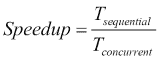
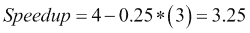

# 第一章。第一步——并发设计原则

计算机系统的用户总是在为他们的系统寻找更好的性能。他们希望获得更高质量的视频、更好的视频游戏和更快的网络速度。几年前，处理器通过提高速度为用户提供了更好的性能。但现在，处理器并没有提高速度。取而代之的是，他们增加了更多的内核，这样操作的系统一次可以执行多个任务。这被命名为**并发**。并发编程包括在计算机中同时运行多个任务或进程的所有工具和技术，在这些任务或进程之间进行通信和同步，而不会造成数据丢失或不一致。在本章中，我们将介绍以下主题：

*   基本并发概念
*   并发应用程序中可能存在的问题
*   并行算法的一种设计方法
*   Java 并发 API
*   Java 内存模型
*   并发设计模式
*   设计并发算法的技巧和技巧

# 基本并发概念

首先，让我们介绍并发的基本概念。您必须理解这些概念，才能理解本书的其余部分。

## 并发与并行

并发和并行是非常相似的概念。不同的作者对这些概念给出了不同的定义。最普遍接受的定义是，当您在一个处理器中有多个任务且具有一个内核时，操作系统的任务调度器会快速地从一个任务切换到另一个任务，因此所有任务似乎同时运行。当您在不同的计算机、处理器或处理器内的内核中同时运行多个任务时，相同的定义也谈到并行性。

另一个定义讨论了当系统上同时运行多个任务（不同任务）时的并发性。当同一任务的不同实例同时在数据集的不同部分上运行时，还有一个定义讨论并行性。

我们包含的最后一个定义讨论了在系统中同时运行多个任务时的并行性，并讨论了并发性，以解释程序员必须与任务同步的不同技术和机制以及他们对共享资源的访问。

正如您所看到的，这两个概念非常相似，并且随着多核处理器的发展，这种相似性有所增加。

## 同步

在并发中，我们可以将**同步**定义为协调两个或多个任务以获得期望的结果。我们有两种同步：

*   **控制同步**：例如一个任务依赖于另一个任务的结束时，第二个任务在第一个任务完成之前不能启动
*   **数据访问同步**：当两个或多个任务可以访问一个共享变量，并且在任何给定时间只有一个任务可以访问该变量时

与同步密切相关的概念是**临界段**。关键部分是一段代码，由于任务可以访问共享资源，因此在任何给定时间只能由任务执行。**互斥**是用于保证此需求的机制，可以通过不同的方式实现。

请记住，同步可以帮助您避免并发任务中可能出现的一些错误（本章后面将介绍这些错误），但它会给算法带来一些开销。您必须非常仔细地计算任务的数量，在并行算法中，这些任务可以独立执行，而无需相互通信。这是您的并发算法的**粒度**。如果您有一个**粗粒度**（大任务，低互通性），那么由于同步而产生的开销将很低。然而，也许您不会从系统的所有核心中受益。如果您有一个**细粒度**（具有高互通性的小任务），那么由于同步而产生的开销将很高，并且您的算法的吞吐量可能会不好。

在并发系统中有不同的同步机制。从理论角度来看，最流行的机制是：

*   **信号量**：信号量是一种机制，可用于控制对资源的一个或多个单元的访问。它有一个存储可使用资源数量的变量和两个管理变量值的原子操作。**互斥**（简称**互斥**）是一种特殊的信号量，只能取两个值（*资源空闲*和*资源忙*），只有将互斥设置为*忙*的进程才能释放它。
*   **监视器**：监视器是通过共享资源实现互斥的机制。它有一个互斥锁、一个条件变量和两个操作来等待条件并发出条件信号。一旦发出条件信号，等待它的任务中只有一个继续执行。

在本章中，您将要学习的与同步相关的最后一个概念是**线程安全**。一段代码（或一个方法或一个对象）是**线程安全的**如果共享数据的所有用户都受到同步机制的保护，则非阻塞的**比较和交换**（**CAS**原语或数据是不可变的，因此，您可以在并发应用程序中毫无问题地使用该代码。

## 不可变对象

**不可变对象**是具有非常特殊特性的对象。初始化后，不能修改其可见状态（属性值）。如果要修改不可变对象，必须创建一个新对象。

它的主要优点是线程安全。您可以在并发应用程序中毫无问题地使用它。

Java 中的`String`类就是不可变对象的一个例子。当您为`String`对象指定一个新值时，您正在创建一个新字符串。

## 原子操作和变量

**原子操作**是一种操作，对于程序的其余任务而言，它似乎是瞬间发生的。在并发应用程序中，可以使用同步机制实现原子操作，该操作对整个操作具有关键部分。

**原子变量**是一种通过原子操作来设置和获取其值的变量。可以使用同步机制实现原子变量，也可以使用 CAS 以无锁方式实现原子变量，CAS 不需要任何同步。

## 共享内存与消息传递

任务之间可以使用两种不同的方式进行沟通。第一个是**共享内存**，通常在同一台计算机上运行任务时使用。这些任务使用相同的内存区域来写入和读取值。为了避免出现问题，对该共享内存的访问必须位于受同步机制保护的关键部分。

另一种同步机制是**消息传递**和通常在任务在不同计算机上运行时使用。当一个任务需要与另一个任务通信时，它会发送一条遵循预定义协议的消息。如果发送方在等待响应时被阻止，则此通信可以是同步的；如果发送方在发送消息后继续执行，则此通信可以是异步的。

# 并发应用中可能出现的问题

编写并发应用程序并非易事。如果不正确地使用同步机制，应用程序中的任务可能会出现不同的问题。在本节中，我们将介绍其中的一些问题。

## 数据竞赛

当您有两个或多个任务在关键部分（也就是说，在不使用任何同步机制的情况下）之外编写共享变量时，您的应用程序中可以有**数据竞争**（也称为**竞争条件**。

在这些情况下，应用程序的最终结果可能取决于任务的执行顺序。请看以下示例：

```
package com.packt.java.concurrency;

public class Account {

  private float balance;

  public void modify (float difference) {

    float value=this.balance;
    this.balance=value+difference;
  }

}
```

假设两个不同的任务在同一个`Account`对象中执行`modify()`方法。根据任务中句子的执行顺序，最终结果可能会有所不同。假设初始余额为 1000，两个任务以 1000 为参数调用`modify()`方法。最终结果应该是 3000，但如果两个任务同时执行第一句话，然后同时执行第二句话，最终结果将是 2000。正如您所看到的，`modify()`方法不是原子的，`Account`类不是线程安全的。

## 死锁

当有两个或多个任务等待共享资源时，您的并发应用程序中会出现**死锁**，而共享资源必须与其他任务分离，因此它们中的任何一个都无法获得所需的资源，并且将被无限期阻止。当系统中同时发生四种情况时，就会发生这种情况。它们是**科夫曼的条件**，具体如下：

*   **互斥**：死锁中涉及的资源必须是不可共享的。一次只能有一个任务使用该资源。
*   **保持等待条件**：一个任务对一个资源具有互斥性，并且正在请求对另一个资源进行互斥。在等待时，它不会释放任何资源。
*   **无抢占**：只有持有资源的任务才能释放这些资源。
*   **循环等待**：有一个循环等待，任务 1 等待任务 2 持有的资源，任务 2 等待任务 3 持有的资源，依此类推，直到我们有任务*n*等待任务 1 持有的资源。

存在一些可以用来避免死锁的机制：

*   **忽略它们**：这是最常用的机制。您假设系统上永远不会发生死锁，如果死锁发生，您可以看到停止应用程序并重新执行它的后果。
*   **检测**：系统有一个特殊任务，分析系统的状态，检测是否发生死锁。如果检测到死锁，它可以采取措施解决问题。例如，完成一项任务或强制释放资源。
*   **预防**：如果您想要防止系统死锁，您必须预防一种或多种 Coffman 的情况。
*   **避免**：如果您在任务开始执行之前掌握了任务所使用资源的相关信息，则可以避免死锁。当任务想要开始执行时，您可以分析系统中可用的资源以及任务需要的资源，以确定它是否可以开始执行。

## 活锁

当您的系统中有两个任务由于另一个任务的操作而总是改变它们的状态时，就会发生**活锁**。因此，它们处于状态变化的循环中，无法继续。

例如，您有两个任务 Task 1 和 Task 2，它们都需要两个资源：Resource 1 和 Resource 2。假设任务 1 锁定了资源 1，任务 2 锁定了资源 2。由于他们无法获得所需的资源，他们释放了资源，重新开始循环。这种情况可以无限期地继续下去，因此任务的执行永远不会结束。

## 资源匮乏

**当系统中的任务从未获得继续执行所需的资源时，就会发生**资源匮乏。当有多个任务等待一个资源并且该资源被释放时，系统必须选择可以使用它的下一个任务。如果您的系统没有一个好的算法，那么它可能会有线程等待资源很长时间。

**公平**是这个问题的解决方案。等待资源的所有任务必须在给定的时间段内拥有该资源。一种选择是实现一种算法，该算法在选择下一个将保存资源的任务时考虑到任务等待资源的时间。然而，锁的公平实现需要额外的开销，这可能会降低您的程序吞吐量。

## 优先级反转

**优先级反转**发生在低优先级任务拥有高优先级任务所需的资源时，因此低优先级任务在高优先级任务之前完成其执行。

# 一种并行算法设计方法

在本节中，我们将提出一种五步方法，以获得顺序算法的并发版本。它基于 Intel 在其*线程方法：原理和实践*文档中提出的一个。

## 起点——算法的顺序版本

我们实现并发算法的起点将是它的顺序版本。当然，我们可以从头开始设计并发算法，但我认为算法的顺序版本将给我们带来两个优势：

*   我们可以使用顺序算法来测试并发算法是否生成正确的结果。这两种算法在接收相同的输入时必须生成相同的输出，因此我们可以检测并发版本中的一些问题，例如数据竞争或类似情况。
*   我们可以测量这两种算法的吞吐量，看看使用并发是否能真正提高响应时间或算法一次可以处理的数据量。

## 步骤 1–分析

在这一步中，我们将分析算法的顺序版本，以寻找其代码中可以并行执行的部分。我们应该特别注意那些大部分时间执行的部分或执行更多代码的部分，因为通过实现这些部分的并发版本，我们将获得更大的性能改进。

对于这个过程来说，很好的候选者是循环，其中一个步骤独立于其他步骤或独立于代码其他部分的代码部分（例如，用于初始化应用程序的算法，该应用程序打开与数据库的连接，加载配置文件，初始化某些对象。前面的所有任务彼此独立）。

## 第 2 步-设计

一旦知道要并行化的代码部分，就必须决定如何进行并行化。

代码的更改将影响应用程序的两个主要部分：

*   守则的结构
*   数据结构的组织

您可以采取两种不同的方法来完成此任务：

*   **任务分解**：当您将代码拆分为两个或多个可以同时执行的独立任务时，您进行任务分解。也许这些任务中的一些必须按给定的顺序执行，或者必须在同一点等待。您必须使用同步机制来获得此行为。
*   **数据分解**：当同一任务的多个实例与数据集的一个子集一起工作时，您进行数据分解。此数据集将是一个共享资源，因此如果任务需要修改数据，则必须通过实现关键部分来保护对它的访问。

另一个需要记住的要点是解决方案的粒度。实现算法并行版本的目的是提高性能，因此应该使用所有可用的处理器或内核。另一方面，当您使用同步机制时，会引入一些必须执行的额外指令。如果将算法拆分为许多小任务（细粒度），同步引入的额外代码可能会导致性能下降。如果将算法拆分为比核心任务更少的任务（粗粒度），则无法充分利用所有资源。此外，还必须考虑每个线程必须做的工作，特别是在实现细粒度粒度的情况下。如果您的任务比其他任务长，则该任务将决定应用程序的执行时间。你必须找到这两点之间的平衡点。

## 步骤 3-实施

下一步是使用编程语言实现并行算法，如果需要，还可以使用线程库。在本书的示例中，您将使用 Java 实现所有算法。

## 步骤 4–测试

完成实现后，您必须测试并行算法。如果您有算法的顺序版本，则可以比较两种算法的结果，以验证并行实现是否正确。

测试和调试并行实现是一项困难的任务，因为无法保证应用程序不同任务的执行顺序。在[第 11 章](11.html#1S2JE2-2fff3d3b99304faa8fa9b27f1b5053ba "Chapter 11\. Testing and Monitoring Concurrent Applications")*测试和监控并发应用程序*中，您将学习有效完成这些任务的技巧、技巧和工具。

## 步骤 5–调谐

最后一步是比较并行算法和顺序算法的吞吐量。如果结果不符合预期，则必须检查算法，查找并行算法性能差的原因。

您还可以测试算法的不同参数（例如，粒度或任务数），以找到最佳配置。

有不同的度量标准来衡量并行化算法可能获得的性能改进。三个最流行的指标是：

*   **Speedup**: This is a metric for relative performance improvement between the parallel and the sequential versions of the algorithm:

    

    这里，*T**<sub class="calibre17">sequential</sub>*是算法顺序版本的执行时间，*T**<sub class="calibre17">concurrent</sub>*是并行版本的执行时间。

*   **Amdahl's law**: This is used to calculate the maximum expected improvement obtained with the parallelization of an algorithm:

    

    这里，*P*是可并行化的代码百分比，*N*是要执行算法的计算机内核数。

    例如，如果您可以并行化 75%的代码，并且您有四个内核，那么最大加速比将由以下公式给出：

    

*   **Gustafson-Barsis' law**: Amdahl's law has a limitation. It supposes that you have the same input dataset when you increase the number of cores, but normally, when you have more cores, you want to process more data. Gustafson law proposes that when you have more cores available, bigger problems can be solved in the same time using the following formula:

    

    这里，*N*是核数，*P*是可并行代码的百分比。

    如果我们使用与前面相同的示例，由古斯塔夫森定律计算的缩放加速比为：

    

## 结论

在本节中，您了解了当您想要并行化顺序算法时必须考虑的一些重要问题。

首先，不是每个算法都可以并行化。例如，如果您必须执行一个循环，其中迭代的结果取决于上一次迭代的结果，则无法并行化该循环。递归算法是基于类似原因可以并行化的算法的另一个例子。

您必须记住的另一件重要事情是，具有更好性能的算法的顺序版本可能是并行化它的一个糟糕的起点。如果你开始并行化一个算法，你发现自己陷入了麻烦，因为你不容易找到代码的独立部分，你必须寻找其他版本的算法，并验证该版本可以以一种更简单的方式并行化。

最后，在实现并发应用程序时（从头开始或基于顺序算法），必须考虑以下几点：

*   **效率**：并行算法必须比顺序算法在更短的时间内结束。并行化算法的第一个目标是其运行时间小于顺序算法，或者可以同时处理更多数据。
*   **简单性**：当您实现一个算法（并行或非并行）时，您必须使其尽可能简单。它将更容易实现、测试、调试和维护，并且错误更少。
*   **可移植性**：您的并行算法应该在不同的平台上以最小的变化执行。在本书中，您将使用 Java，这一点非常简单。使用 Java，您可以在每个操作系统中执行程序，而无需任何更改（如果您必须实现该程序）。
*   **可伸缩性**：如果增加内核的数量，会对您的算法产生什么影响？如前所述，您应该使用所有可用的内核，因此您的算法应该准备好利用所有可用的资源。

# Java 并发 API

Java 编程语言具有非常丰富的并发 API。它包含用于管理并发基本元素的类，如`Thread`、`Lock`和`Semaphore`，以及实现高级同步机制的类，如**执行器框架**或新的并行`Stream`API。

在本节中，我们将介绍构成并发 API 的基本类。

## 基本并发类

Java 并发 API 的基本类是：

*   `Thread`类：这个类表示执行并发 Java 应用程序的所有线程
*   `Runnable`接口：这是用 Java 创建并发应用程序的另一种方式
*   `ThreadLocal`类：这是一个类，用于将变量本地存储到线程
*   `ThreadFactory`界面：这个是工厂设计模式的基础，您可以使用它来创建定制的线程

## 同步机制

Java 并发 API 包含不同的同步机制，允许您：

*   定义访问共享资源的关键部分
*   在一个公共点上同步不同的任务

以下机制被认为是最重要的同步机制：

*   `synchronized`关键字：`synchronized`关键字允许您在代码块或整个方法中定义关键部分。
*   `Lock`接口：`Lock`提供了比`synchronized`关键字更灵活的同步操作。有不同种类的锁：`ReentrantLock`，用于实现可与条件关联的锁；`ReentrantReadWriteLock`，分离读写操作；`StampedLock`，Java 8 的一个新特性，包括三种控制读/写访问的模式。
*   `Semaphore`类：实现经典信号量以实现同步的类。Java 支持二进制和通用信号量。
*   `CountDownLatch`类：允许任务等待多个操作完成的类。
*   `CyclicBarrier`类：允许在一个公共点上同步多个线程的类。
*   `Phaser`类：一个类，允许您控制分阶段执行的任务。在所有任务完成当前阶段之前，所有任务都不会进入下一阶段。

## 遗嘱执行人

executor 框架是一种机制，允许您分离线程创建和管理，以实现并发任务。您不必担心线程的创建和管理，只需创建任务并将其发送给执行者即可。本框架中涉及的主要类有：

*   `Executor`和 `ExecutorService`接口：它们包括所有执行者通用的方法。
*   `ThreadPoolExecutor`：这是一个类，允许您获得一个具有线程池的执行器，并可以选择定义最大数量的并行任务
*   `ScheduledThreadPoolExecutor`：这是一种特殊的执行器，允许您延迟或定期执行任务
*   `Executors`：这是一个类，有助于创建执行者
*   `Callable`接口：该是*可运行*接口的替代品，该接口是一个可以返回值的单独任务
*   `Future`接口：是一个接口，包括获取`Callable`接口返回值和控制其状态的方法

## 分叉/连接框架

**Fork/Join 框架**定义了一种特殊类型的执行器，专门用于使用分治技术解决问题。它包括一种机制，用于优化解决此类问题的并发任务的执行。Fork/Join 是专门为细粒度并行度定制的，因为它具有非常低的开销，以便将新任务放入队列并执行排队的任务。该框架涉及的主要类和接口有：

*   `ForkJoinPool`：这是一个类，它实现了将要运行任务的执行器
*   `ForkJoinTask`：这是一个任务，可以在`ForkJoinPool`类中执行
*   `ForkJoinWorkerThread`：这是一个线程，它将执行`ForkJoinPool`类中的任务

## 平行流

**流**和**Lambda 表达式**可能是 Java 8 版本最重要的两个新特性。在`Collection`接口和其他数据源中添加了流作为一种方法，允许处理数据结构的所有元素，生成新结构，过滤数据，并使用 map 和 reduce 技术实现算法。

一种特殊的流是以并行方式实现其操作的并行流。使用并行流涉及的最重要的元素是：

*   `Stream`接口：这是一个接口，定义您可以在流上执行的所有操作。
*   `Optional`：这是一个容器对象，可能包含也可能不包含非空值。
*   `Collectors`：这是一个类，它实现了可作为操作流序列的一部分使用的简化操作。
*   Lambda 表达式：Streams 被认为与 Lambda 表达式一起工作。大多数流方法都接受 lambda 表达式作为参数。这允许您实现更紧凑的操作版本。

## 并发数据结构

Java API 的正常数据结构（`ArrayList`、`Hashtable`等）无法在并发应用程序中工作，除非您使用外部同步机制。如果您使用它，您将为应用程序增加大量额外的计算时间。如果您不使用它，很可能您的应用程序中会有竞争条件。如果您从多个线程修改它们，并且出现争用情况，您可能会遇到各种异常抛出（例如，`ConcurrentModificationException`和`ArrayIndexOutOfBoundsException`），可能会出现无声数据丢失，或者您的程序甚至可能陷入无休止的循环中。

Java 并发 API 包含大量数据结构，可在并发应用程序中使用，且无风险。我们可以将其分为两组：

*   **阻塞数据结构**：这些包括阻塞调用任务的方法，例如，当数据结构为空且您想要获取值时。
*   **非阻塞数据结构：**如果可以立即进行操作，则不会阻塞调用任务。否则，它将返回`null`值或抛出异常。

以下是一些数据结构：

*   `ConcurrentLinkedDeque`：这是一个非阻塞列表
*   `ConcurrentLinkedQueue`：此为非阻塞队列
*   `LinkedBlockingDeque`：这是一个阻止列表
*   `LinkedBlockingQueue`：这是阻塞队列
*   `PriorityBlockingQueue`：这是一个阻塞队列，根据其优先级对其元素进行排序
*   `ConcurrentSkipListMap`：此为非阻塞通航地图
*   `ConcurrentHashMap`：这是一个非阻塞哈希映射
*   `AtomicBoolean`、`AtomicInteger`、`AtomicLong`和`AtomicReference`：这是基本 Java 数据类型的原子实现

# 并发设计模式

在软件工程中，**设计模式**是一个常见问题的解决方案。该解已被多次使用，并被证明是该问题的最优解。你可以用它们来避免每次你必须解决这些问题时“重新发明轮子”。**Singleton**或**Factory**是几乎所有应用中使用的常见设计模式的示例。

并发也有自己的设计模式。在本节中，我们将介绍一些最有用的并发设计模式及其在 Java 语言中的实现。

## 信令

此设计模式解释了如何实现一个任务必须向另一个任务通知事件的情况。实现此模式的最简单方法是使用信号量或互斥量，使用 Java 语言的`ReentrantLock`或`Semaphore`类，甚至是`Object`类中包含的`wait()`和`notify()`方法。

请参见以下示例：

```
public void task1() {
  section1();
  commonObject.notify();
}

public void task2() {
  commonObject.wait();
  section2();
}
```

在这种情况下，`section2()`方法总是在`section1()`方法之后执行。

## 会合

此设计模式是**信令**模式的推广。在这种情况下，第一个任务等待第二个任务的事件，第二个任务等待第一个任务的事件。解决方案类似于信令，但在这种情况下，必须使用两个对象，而不是一个。

请参见以下示例：

```
public void task1() {
  section1_1();
  commonObject1.notify();
  commonObject2.wait();
  section1_2();
}
public void task2() {
  section2_1();
  commonObject2.notify();
  commonObject1.wait();
  section2_2();
}
```

在这种情况下，`section2_2()`总是在`section1_1()`之后执行，`section1_2()`总是在`section2_1()`之后执行，要考虑到，如果您将对`wait()`方法的调用放在对`notify()`方法的调用之前，您将出现死锁。

## 互斥

互斥锁是一种机制，可用于实现确保互斥的关键部分。也就是说，一次只能有一个任务执行受互斥体保护的代码部分。在 Java 中，您可以使用`synchronized`关键字（允许您保护部分代码或完整方法）、`ReentrantLock`类或`Semaphore`类来实现关键部分。

请看以下示例：

```
public void task() {
  preCriticalSection();
  lockObject.lock() // The critical section begins
  criticalSection();
  lockObject.unlock(); // The critical section ends
  postCriticalSection();
}
```

## 多路复用

**多路复用设计模式**是互斥的泛化。在这种情况下，一定数量的任务可以一次执行关键部分。例如，当您有一个资源的多个副本时，它非常有用。在 Java 中实现此设计模式的最简单方法是使用初始化为可以一次执行关键部分的任务数的`Semaphore`类。

请看以下示例：

```
public void task() {
  preCriticalSection();
  semaphoreObject.acquire();
  criticalSection();
  semaphoreObject.release();
  postCriticalSection();
}
```

## 障碍物

此设计模式解释了如何实现需要在公共点同步某些任务的情况。在所有任务到达同步点之前，所有任务都不能继续执行。Java 并发 API 提供了`CyclicBarrier`类，它是这个设计模式的一个实现。

请看以下示例：

```
public void task() {
  preSyncPoint();
  barrierObject.await();
  postSyncPoint();
}
```

## 双重检查锁定

此设计模式为获取锁并检查条件时出现的问题提供了解决方案。如果条件为 false，那么您就有了获取锁的开销。这种情况的一个例子是对象的延迟初始化。如果您有一个实现`Singleton`设计模式的类，那么您可能有如下代码：

```
public class Singleton{
  private static Singleton reference;
  private static final Lock lock=new ReentrantLock();
  public static Singleton getReference() {
    lock.lock();
    try {
        if (reference==null) {
          reference=new Object();
        }
    } finally {
        lock.unlock();
    }
    return reference;
  }
}
```

一种可能的解决方案是将锁包含在以下条件中：

```
public class Singleton{
  private Object reference;
  private Lock lock=new ReentrantLock();
  public Object getReference() {
    if (reference==null) {
      lock.lock();
      try {
          if (reference == null) {
            reference=new Object();
          }
      } finally {
          lock.unlock();
      }
    }
    return reference;
  }
}
```

这个解决方案仍然存在问题。如果两个任务同时检查条件，则将创建两个对象。此问题的最佳解决方案不使用任何显式同步机制：

```
public class Singleton {

  private static class LazySingleton {
    private static final Singleton INSTANCE = new Singleton();
  }

  public static Singleton getSingleton() {
    return LazySingleton.INSTANCE;
  }

}
```

## 读写锁

当您使用锁保护对共享变量的访问时，只有一个任务可以访问该变量，与您将对其执行的操作无关。有时，您将拥有修改几次但读取多次的变量。在这种情况下，锁的性能很差，因为所有读取操作都可以并发执行，而不会出现任何问题。为了解决这个问题，存在读写锁设计模式。此模式定义了一种特殊类型的锁，具有两个内部锁：一个用于读取操作，另一个用于写入操作。此锁的行为如下所示：

*   如果一个任务正在执行读取操作，而另一个任务想要执行另一个读取操作，则它可以执行该操作
*   如果一个任务正在执行读取操作，而另一个任务希望执行写入操作，则会阻止该任务，直到所有读卡器完成
*   如果一个任务正在执行写入操作，而另一个任务想要执行操作（读取或写入），则会阻止该任务，直到写入程序完成

Java 并发 API 包括实现此设计模式的类`ReentrantReadWriteLock`。如果您想从头开始实现此模式，那么必须非常小心读取任务和写入任务之间的优先级。如果存在过多的读取任务，则写入任务可能会等待太长时间。

## 线程池

此设计模式试图消除为要执行的任务创建线程所带来的开销。它由一组线程和一个要执行的任务队列组成。这组线程通常具有固定的大小。当一个线程接近一个任务的执行时，它没有完成它的执行；它在队列中查找另一个任务。如果有另一个任务，它将执行它。如果没有，线程将等待任务插入队列，但任务没有被销毁。

Java 并发 API 包括一些实现`ExecutorService`接口的类，该接口在内部使用线程池。

## 线程本地存储

此设计模式定义了如何在本地使用全局或静态变量来完成任务。当一个类中有一个静态属性时，该类的所有对象访问该属性的相同引用。如果使用线程本地存储，则每个线程访问变量的不同实例。

Java 并发 API 包括实现此设计模式的`ThreadLocal`类。

# Java 内存模型

当您在具有多个内核或处理器的计算机上执行并发应用程序时，可能会出现内存缓存问题。它们对于提高应用程序的性能非常有用，但也可能导致数据不一致。当任务修改变量的值时，它会在缓存中修改，但不会立即在主内存中修改。如果另一个任务在主内存中更新变量之前读取该变量的值，它将读取该变量的旧值。

并发应用程序可能存在的其他问题是编译器和代码优化器引入的优化。有时，他们会重新排列指令以获得更好的性能。在顺序应用程序中，这不会导致任何问题，但在并发应用程序中，它会引发意外的结果。

为了解决这样的问题，编程语言引入了内存模型。内存模型描述了单个任务如何通过内存相互作用，以及一个任务所做的更改何时对另一个任务可见。它还定义了什么样的代码优化是允许的，以及在什么情况下。

有不同的内存模型。其中一些非常严格（所有任务始终可以访问相同的值），另一些则不那么严格（只有一些指令更新主存中的值）。编译器和优化器开发人员必须知道内存模型，并且它对其他程序员是透明的。

Java 是第一种定义其内存模型的编程语言。JVM 中定义的原始内存模型有一些问题，它在 Java5 中被重新定义。这个内存模型在 Java8 中是相同的。它在 JSR133 中定义。Java 内存模型基本上定义了以下内容：

*   它定义了 volatile、synchronized 和 final 关键字的行为。
*   它确保在所有体系结构上正确运行正确同步的并发程序。
*   它创建名为**的**易失性读取**、**易失性写入**、**锁定**和**解锁**指令在**之前发生的偏序。任务同步也帮助我们建立“先发生后发生”关系。如果一个动作发生在另一个动作之前，那么第一个动作对第二个动作可见并在第二个动作之前排序。
*   当任务获取监视器时，内存缓存将失效。
*   当任务释放监视器时，缓存数据将刷新到主内存中。
*   它对 Java 程序员来说是透明的。

Java 内存模型的主要目标是，正确编写的并发应用程序将在每个**Java 虚拟机**（**JVM**）上正常运行，而不考虑操作系统、CPU 体系结构以及 CPU 和内核的数量。

# 设计并发算法的提示和技巧

在本节中，我们汇编了一些设计好的并发应用程序时必须牢记的技巧和窍门。

## 确定正确的独立任务

您只能执行相互独立的并发任务。如果您有两个或多个任务，它们之间具有顺序依赖关系，那么您可能对尝试并发执行它们以及包含同步机制以保证执行顺序没有兴趣。任务将按顺序执行，您必须克服同步机制。另一种情况是，当您有一个具有某些先决条件的任务，但这些先决条件彼此独立时。在这种情况下，您可以并发执行先决条件，然后在完成所有先决条件后使用同步类控制任务的执行。

另一种不能使用并发性的情况是，当您有一个循环，并且所有步骤都使用之前步骤中生成的数据，或者存在一些从一个步骤到下一个步骤的状态信息时。

## 在尽可能高的级别实现并发

丰富的线程 API，如 Java 并发 API，为您的应用程序中实现并发提供了不同的类。在 Java 中，您可以使用`Thread`或`Lock`类控制线程的创建和同步，但它也为您提供了高级并发对象，例如执行器或允许您执行并发任务的 Fork/Join 框架。此高级机制为您提供以下好处：

*   您不必担心线程的创建和管理。您只能创建任务并将其发送以供执行。Java 并发 API 为您控制线程的创建和管理。
*   它们经过优化以提供比直接使用线程更好的性能。例如，他们使用一个线程池来重用它们，并避免为每个任务创建线程。您可以从头开始实现这些机制，但这将花费您很多时间，而且这将是一项复杂的任务。
*   它们包括使 API 更强大的高级功能。例如，使用 Java 中的执行器，您可以执行以`Future`对象形式返回结果的任务。同样，您可以从头开始实现这些机制，但这是不可取的。
*   您的应用程序将更容易从一个操作系统迁移到另一个操作系统，并且更具可扩展性。
*   在未来的 Java 版本中，您的应用程序可能会变得更快。Java 开发人员不断改进内部结构，JVM 优化可能更适合 JDK API。

总之，出于性能和开发时间的原因，在实现并发算法之前，请分析线程 API 提供的高级机制。

## 考虑可扩展性

实现并发算法的主要目标之一是利用计算机的所有资源，特别是处理器或内核的数量。但这个数字可能会随着时间的推移而改变。硬件在不断发展，其成本逐年降低。

当您使用数据分解设计并发算法时，不要预设应用程序将在其上执行的内核或处理器的数量。动态获取有关系统的信息（例如，在 Java 中，您可以通过方法`Runtime.getRuntime().availableProcessors()`获取该信息），并使您的算法使用该信息来计算将要执行的任务数。这个过程在算法的执行时间上会有开销，但是算法的可伸缩性更强。

如果使用任务分解设计并发算法，情况可能会更困难。您依赖于算法中独立任务的数量，强制执行更多的任务将增加同步机制引入的开销，应用程序的全局性能可能会更差。详细分析算法，以确定是否可以有动态数量的任务。

## 使用线程安全 API

如果您需要在并发应用程序中使用 Java 库，请先阅读它的文档，了解它是否是线程安全的。如果它是线程安全的，您可以在应用程序中使用它而不会出现任何问题。如果不是，则有以下两个选项：

*   如果存在线程安全的替代方案，您应该使用它
*   如果不存在线程安全的替代方案，则应添加必要的同步，以避免所有可能的问题情况，尤其是数据争用情况

例如，如果您在并发应用程序中需要一个列表，那么如果您要从多个线程更新它，就不应该使用`ArrayList`类，因为它不是线程安全的。在这种情况下，您可以使用线程安全类，例如`ConcurrentLinkedDeque,CopyOnWriteArrayList`或`LinkedBlockingDeque`。如果要使用的类不是线程安全的，首先必须寻找线程安全的替代方案。也许，它将更加优化，以使用任何您可以实现的替代方案都无法实现的并发性。

## 永远不要假设执行命令

当您不使用任何同步机制时，在并发应用程序中执行任务是不确定的。任务的执行顺序以及处理器转到另一个任务之前每个任务的执行时间由操作系统的调度程序确定。它不在乎您是否观察到在许多执行中执行顺序是相同的。下一个可能会有所不同。

这种假设的结果曾经是一个数据竞争问题。算法的最终结果取决于任务的执行顺序。有时，结果可能是对的，但有时可能是错的。检测数据竞争条件的原因可能非常困难，因此必须小心不要忘记所有必要的同步元素。

## 尽可能选择局部线程变量而不是静态线程变量和共享线程变量

线程局部变量是一种特殊的变量。每个任务都有一个独立的变量值，因此不需要任何同步机制来保护对该变量的访问。

这听起来有点奇怪。每个对象都有自己的类属性副本，那么为什么我们需要线程局部变量呢？考虑一下这种情况。您创建了一个`Runnable`任务，并且希望执行该任务的多个实例。您可以为要执行的每个线程创建一个`Runnable`对象，但另一个选项是创建一个`Runnable`对象并使用该对象创建所有线程。在最后一种情况下，所有线程都可以访问该类属性的同一副本，除非您使用`ThreadLocal`类。`ThreadLocal`类保证每个线程都可以访问自己的变量实例，而无需使用锁、信号量或类似的类。

可以利用线程局部变量的另一种情况是使用静态属性。一个类的所有实例都共享静态属性，但是您可以使用`ThreadLocal`类声明它们。在这种情况下，每个线程都可以访问自己的副本。

另一种选择是使用类似于`ConcurrentHashMap<Thread, MyType>`的东西，然后使用类似于`var.get(Thread.currentThread())`或`var.put(Thread.currentThread(), newValue)`的东西。通常，由于可能的争用（`ThreadLocal`根本没有争用），这种方法比`ThreadLocal`慢得多。不过它有一个优点：您可以完全清除映射，并且每个线程的值都将消失；因此，有时使用这种方法是有用的。

## 找到更易于并行化的算法版本

我们可以将算法定义为解决问题的一系列步骤。解决同一问题有不同的方法。一些更快，一些使用更少的资源，而另一些更适合输入数据的特殊特性。例如，如果要对一组数字进行排序，可以使用已实现的多种排序算法之一。

在本章的前一节中，我们建议您使用顺序算法作为实现并发算法的起点。这种方法有两个主要优点：

*   您可以轻松地测试并行算法结果的正确性
*   您可以衡量使用并发所获得的性能改进

但并不是每个算法都可以并行化，至少不是那么容易。您可能认为最好的起点可能是具有最佳性能的顺序算法来解决您想要并行化的问题，但这可能是一个错误的假设。您应该寻找一种易于并行化的算法。然后，您可以将并发算法与具有最佳性能的顺序算法进行比较，以查看哪个算法提供了最佳吞吐量。

## 尽可能使用不可变对象

并发应用程序中可能存在的主要问题之一是数据竞争条件。正如我们前面解释的，当两个或多个任务修改存储在共享变量中的数据，并且对该变量的访问没有在关键部分中实现时，就会发生这种情况。

例如，当您使用面向对象语言（如 Java）时，您将应用程序实现为对象的集合。每个对象都有许多属性以及一些读取和更改属性值的方法。如果某些任务共享一个对象并调用一个方法来更改该对象属性的值，而该方法不受同步机制的保护，则可能会出现数据不一致的问题。

有一些特殊类型的对象称为不可变对象。它们的主要特点是，初始化后不能修改任何属性。如果要修改属性的值，必须创建另一个对象。Java 中的`String`类是不可变对象的最佳示例。当您使用我们可能认为会改变字符串值的运算符（例如，`=`或+`=`）时，您实际上是在创建一个新对象。

在并发应用程序中使用不可变对象有两个非常重要的优点：

*   您不需要任何同步机制来保护这些类的方法。如果两个任务要修改同一对象，它们将创建新对象，因此两个任务不会同时修改同一对象。
*   作为第一点的结论，您不会有任何数据不一致的问题。

不可变对象有一个缺点。如果创建的对象太多，可能会影响应用程序的吞吐量和内存使用。如果您有一个没有内部数据结构的简单对象，使其不可变通常不是问题。然而，创建包含其他对象集合的不可变复杂对象通常会导致严重的性能问题。

## 通过订购锁避免死锁

避免并发应用程序死锁的最佳机制之一是强制任务始终以相同的顺序获取共享资源。一个简单的方法是为每个资源分配一个数字。当任务需要多个资源时，它必须按顺序请求它们。

例如，如果您有两个任务 T1 和 T2，并且都需要两个资源 R1 和 R2，则可以强制两者先请求 R1 资源，然后请求 R2 资源。你永远不会陷入僵局。

另一方面如果 T1 先请求 R1，然后 R2，T2 先请求 R2，然后 R1，则可能会出现死锁。

例如，此技巧的错误用法如下所示。您有两个任务需要获取两个`Lock`对象。他们试图以不同的顺序获得锁：

```
public void operation1() {
  lock1.lock();
  lock2.lock();
  ….
}
public void operation2() {
  lock2.lock();
  lock1.lock();
  …..
}
```

可能是`operation1()`执行了它的第一句话，而`operation2()`也执行了它的第一句话，所以他们会等待另一个`Lock`，而您将处于死锁状态。

您可以通过以相同的顺序获取锁来避免这种情况。如果您更改`operation2()`，您将永远不会出现如下死锁：

```
public void operation2() {
  lock1.lock();
  lock2.lock();
  …..
}
```

## 使用原子变量代替同步

当您必须在两个或多个任务之间共享数据时，您必须使用同步机制来保护对该数据的访问，并避免任何数据不一致问题。

在某些情况下，您可以使用`volatile`关键字，而不使用同步机制。如果只有一个任务修改数据，其余任务读取数据，则可以使用 volatile 关键字，而不会出现任何同步或数据不一致问题。在其他场景中，您需要使用锁、synchronized 关键字或任何其他同步方法。

在 Java5 中，并发 API 包含一种称为原子变量的新变量。这些变量是支持对单个变量进行原子操作的类。它们包括一种以`compareAndSet(oldValue, newValue)`命名的方法，该方法包括一种机制，用于检测是否在一个步骤中将新值分配给变量。如果变量的值等于`oldValue`，则将其更改为`newValue`并返回 true。否则返回`false`。还有更多类似的方法，例如`getAndIncrement()`或`getAndDecrement()`。这些方法也是原子的。

此解决方案是无锁的；也就是说，它不使用锁或任何同步机制，因此其性能优于任何同步解决方案。

您可以在 Java 中使用的最重要的原子变量有：

*   `AtomicInteger`
*   `AtomicLong`
*   `AtomicReference`
*   `AtomicBoolean`
*   `LongAdder`
*   `DoubleAdder`

## 尽可能短的持锁时间

与任何其他同步机制一样，锁允许您定义一个一次只能执行一个任务的关键部分。当一个任务正在执行关键部分时，要执行它的其他任务将被阻止，并且必须等待关键部分释放。应用程序正在按顺序工作。

您必须特别注意关键部分中包含的说明，因为您可能会降低应用程序的性能，而不会意识到这一点。您必须使关键部分尽可能小，并且它必须只包含处理与其他任务共享的数据的指令，这样应用程序以顺序方式执行的时间将是最少的。

避免在关键部分执行您无法控制的代码。例如，您正在编写一个库，该库接受用户定义的`Callable`，您有时需要启动它。你不知道在`Callable`中会出现什么。它可能会阻止输入/输出，获取一些锁，调用库中的其他方法，或者只工作很长时间。因此，只要有可能，在库没有任何锁的情况下尝试执行它。如果您的算法无法实现，请在库文档中指定此行为，并可能指定对用户提供的代码的限制（例如，它不应使用任何锁）。在`ConcurrentHashMap`类的`compute()`方法中可以找到此类文档的一个很好的例子。

## 使用惰性初始化采取预防措施

延迟初始化是一种延迟对象创建的机制，直到对象第一次在应用程序中使用。它的主要优点是最大限度地减少了内存的使用，因为您只创建真正需要的对象，但在并发应用程序中这可能是一个问题。

如果您有一个初始化对象的方法，并且两个不同的任务同时调用此方法，则可以初始化两个不同的对象。例如，这可能是单例类的问题，因为您只想创建这些类的一个对象。

这个问题的一个优雅的解决方案已经实现，正如按需持有者习惯用法（[中的初始化一样 https://en.wikipedia.org/wiki/Initialization-on-demand_holder_idiom](https://en.wikipedia.org/wiki/Initialization-on-demand_holder_idiom) ）。

## 避免在关键区段内使用阻塞操作

**阻塞操作**是那些在事件发生之前阻塞调用它们的任务的操作。例如，当您从文件读取数据或将数据写入控制台时，调用这些操作的任务必须等待它们完成。

如果将这些操作中的一个包含到关键部分，则会降低应用程序的性能，因为要执行该关键部分的任务都无法执行它。关键段内的一个正在等待 I/O 操作的最终完成，其他的正在等待关键段。

除非必要，否则不要在关键部分中包含阻塞操作。

# 总结

并发编程包括所有必要的工具和技术，使多个任务或进程在计算机中同时运行，在它们之间进行通信和同步，而不会造成数据丢失或不一致。

本章首先介绍并发的基本概念。您必须了解并理解并发、并行和同步等术语，才能完全理解本书的示例。然而，并发会产生一些问题，例如数据竞争条件、死锁、活锁等。您还必须了解并发应用程序的潜在问题。它将帮助您识别和解决这些问题。

我们还解释了 Intel 为将顺序算法转换为并发算法而引入的五个步骤的简单方法，并向您展示了一些用 Java 语言实现的并发设计模式，以及在实现并发应用程序时需要考虑的一些提示。

最后，我们简要说明了 Java 并发 API 的组件。它是一个非常丰富的 API，具有低级和高级机制，允许您轻松实现强大的并发应用程序。我们还描述了 Java 内存模型，它决定了并发应用程序如何在内部管理内存和指令的执行顺序。

在下一章中，您将学习如何使用 executor 框架实现使用大量线程的应用程序。这允许您通过控制使用的资源和减少线程创建带来的开销来执行大量线程（它重用`Thread`对象来执行不同的任务）。