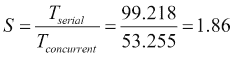

# 第 2 章管理大量线程–执行器

当您实现一个简单的并发应用程序时，您将为每个并发任务创建并执行一个线程。这种方法可能有一些重要的问题。自**Java 版本 5**以来，Java 并发 API 包含**executor framework**以提高并发任务较多的并发应用程序的性能。在本章中，我们将介绍以下内容：

*   遗嘱执行人简介
*   第一个例子——k-最近邻算法
*   第二个示例—客户机/服务器环境中的并发性

# 遗嘱执行人简介

在 Java 中实现并发应用程序的基本机制是：

*   **实现可运行接口**的类：这是您希望以并发方式实现的代码
*   **Thread 类**的实例：这是将以并发方式执行代码的线程

通过这种方法，您负责创建和管理`Thread` 对象，并实现线程之间的同步机制。但是，它可能会有一些问题，特别是对于那些有大量并发任务的应用程序。如果创建太多线程，可能会降低应用程序的性能，甚至会挂起整个系统。

Java5 包含了 executor 框架，以解决这些问题并提供一个高效的解决方案，这将比传统的并发机制更易于程序员使用。

在本章中，我们将通过使用 executor 框架实现以下两个示例来介绍 executor 框架的基本特征：

*   **k-最近邻算法**：这是在分类中使用的一种基本的**机器学习**算法。它根据列车数据集中*k*最相似示例的标记确定测试示例的标记。
*   **客户机/服务器环境中的并发**：为数千或数百万客户机提供信息的应用程序如今至关重要。必须以最佳方式实现系统的服务器端。

在[第 3 章](03.html#QMFO1-2fff3d3b99304faa8fa9b27f1b5053ba "Chapter 3. Getting the Maximum from Executors")、*从执行器获取最大值*、[第 4 章](04.html#VF2I1-2fff3d3b99304faa8fa9b27f1b5053ba "Chapter 4. Getting Data from the Tasks – The Callable and Future Interfaces")、*从任务获取数据–可调用和未来接口*中，我们将介绍执行器的更高级方面。

## 执行人的基本特征

执行人的主要特征是：

*   您不需要创建任何`Thread`对象。如果要执行并发任务，只需创建任务的实例（例如，实现`Runnable`接口的类）并将其发送给执行者。它将管理执行任务的线程。
*   执行器减少了线程创建和重用线程所带来的开销。在内部，它管理一个名为**工作线程**的线程池。如果您向执行器发送任务，且工作线程处于空闲状态，则执行器将使用该线程执行该任务。
*   很容易控制执行器使用的资源。您可以限制执行器的最大工作线程数。如果发送的任务多于工作线程，则执行器将它们存储在队列中。当工作线程完成任务的执行时，它会从队列中取出另一个。
*   您必须显式地完成执行器的执行。您必须向执行器指示它必须完成其执行并终止创建的线程。如果您不这样做，它将不会完成其执行，您的应用程序也不会结束。

执行者具有更有趣的特征，使他们非常强大和灵活。

## executor 框架的基本组件

executor 框架具有各种接口和类，这些接口和类实现了 executor 提供的所有功能。该框架的基本组成部分包括：

*   **执行器接口**：执行器框架的基本接口。它只定义了一个方法，允许程序员向执行器发送`Runnable`对象。
*   **ExecutorService 接口**：该接口对`Executor`接口进行了扩展，增加了框架功能的方法，如：
    *   执行返回结果的任务：`Runnable`接口提供的`run()`方法不返回结果，但对于执行者，您可以有返回结果的任务
    *   使用单个方法调用执行任务列表
    *   完成执行人的执行并等待其终止
*   **ThreadPoolExecutor 类**：这个类实现了`Executor`和`ExecutorService`接口。此外，它还包括一些获取执行器状态的附加方法（工作线程数、已执行任务数等）、建立执行器参数的方法（最小和最大工作线程数、空闲线程等待新任务的时间等）以及允许程序员扩展和调整其功能的方法。
*   **Executors 类**：该类提供实用方法来创建`Executor`对象及其他相关类。

# 第一个例子——k-最近邻算法

k-最近邻算法是一种用于监督分类的简单机器学习算法。该算法的主要组成部分包括：

*   **列车数据集**：该数据集由实例组成，实例具有一个或多个定义每个实例的属性，以及一个确定实例或实例标签的特殊属性
*   **距离度量**：该度量用于确定列车数据集实例与您要分类的新实例之间的距离（或相似性）
*   **测试数据集**：该数据集用于测量算法的行为

当它必须对一个实例进行分类时，它会根据该实例和 train 数据集的所有实例计算距离。然后，它获取 k 个最近的实例并查看这些实例的标记。实例最多的标记是分配给输入实例的标记。

在这一章中，我们将使用**UCI 机器学习库**的**银行营销**数据集，您可以从[下载该数据集 http://archive.ics.uci.edu/ml/datasets/Bank+营销](http://archive.ics.uci.edu/ml/datasets/Bank+Marketing)。为了测量实例之间的距离，我们将使用**欧几里德距离**。使用这个度量，我们实例的所有属性都必须有数值。银行营销数据集的一些属性是分类的（也就是说，它们可以采用一些预定义的值之一），因此我们不能将欧几里德距离直接用于此数据集。可以为每个分类值指定序号；例如，对于婚姻状况，0 为*单身*，1 为*已婚*，2 为*离婚*。然而，这意味着*离婚*的人更接近*已婚*而不是*单身*，这是有争议的。为了使所有分类值之间的距离相等，我们创建了单独的属性，例如*已婚*、*单身*和*离婚*，它们只有两个值：0（*否*）和 1（*是*）。

我们的数据集有 66 个属性和两个可能的标记：*是*和*否*。我们还将数据分为两个子集：

*   **列车数据集**：39129 个实例
*   **测试数据集**：2059 个实例

正如我们在[第一章](01.html#DB7S2-2fff3d3b99304faa8fa9b27f1b5053ba "Chapter 1. The First Step – Concurrency Design Principles")*第一步——并发设计原则*中所解释的，我们首先实现了该算法的串行版本。然后，我们寻找算法中可以并行化的部分，并使用 executor 框架来执行并发任务。在以下部分中，我们将解释 k-最近邻算法的串行实现和两个不同的并发版本。第一个具有细粒度的并发性，而第二个具有粗粒度的并发性。

## K-最近邻-串行版本

我们已经在`KnnClassifier`类中实现了该算法的串行版本。在内部，此类存储列车数据集和编号`k`（我们将用于确定实例标记的示例数）：

```java
public class KnnClassifier {

  private List <? extends Sample> dataSet;
  private int k;

  public KnnClassifier(List <? extends Sample> dataSet, int k) {
    this.dataSet=dataSet;
    this.k=k;
  }
```

`KnnClassifier`类只实现了一个名为`classify`的方法，该方法接收一个包含我们想要分类的实例的`Sample`对象，并返回一个字符串，该字符串带有分配给该实例的标记：

```java
  public String classify (Sample example) {
```

该方法有三个主要部分：首先，我们计算输入示例与列车数据集所有示例之间的距离：

```java
    Distance[] distances=new Distance[dataSet.size()];

    int index=0;

    for (Sample localExample : dataSet) {
      distances[index]=new Distance();
      distances[index].setIndex(index);
      distances[index].setDistance (EuclideanDistanceCalculator.calculate(localExample, example));
      index++;
    }
```

然后，我们使用`Arrays.sort()`方法，从较低的距离到较高的距离对示例进行排序：

```java
    Arrays.sort(distances);
```

最后，我们在 k-最近的示例中统计大多数实例的标签：

```java
    Map<String, Integer> results = new HashMap<>();
    for (int i = 0; i < k; i++) {
      Sample localExample = dataSet.get(distances[i].getIndex());
      String tag = localExample.getTag();
      results.merge(tag, 1, (a, b) -> a+b);
    }
    return Collections.max(results.entrySet(), Map.Entry.comparingByValue()).getKey();
  }
```

为了计算两个示例之间的距离，我们可以使用在辅助类中实现的欧几里德距离。这是该类的代码：

```java
public class EuclideanDistanceCalculator {
  public static double calculate (Sample example1, Sample example2) {
    double ret=0.0d;

    double[] data1=example1.getExample();
    double[] data2=example2.getExample();

    if (data1.length!=data2.length) {
      throw new IllegalArgumentException ("Vector doesn't have the same length");
    }

    for (int i=0; i<data1.length; i++) {
      ret+=Math.pow(data1[i]-data2[i], 2);
    }
    return Math.sqrt(ret);
  }

}
```

我们还使用`Distance`类存储`Sample`输入和火车数据集实例之间的距离。它只有两个属性：火车数据集示例的索引和到输入示例的距离。此外，它还实现了`Comparable`接口，以使用`Arrays.sort()`方法。最后，`Sample`类存储一个实例。它只有一个双精度数组和一个带有该实例标记的字符串。

## K-最近邻-细粒度并发版本

如果您分析 k-最近邻算法的串行版本，您可以找到以下两点，您可以将该算法并行化：

*   **距离的计算**：计算输入示例和列车数据集的一个示例之间距离的每个循环迭代独立于其他循环迭代
*   **距离排序**：Java 8 在`Arrays`类中包含了`parallelSort()`方法，可以对数组进行并发排序

在算法的第一个并发版本中，我们将根据要计算的示例之间的距离创建一个任务。我们还将使产生一种并行的距离数组成为可能。我们已经在一个名为`KnnClassifierParrallelIndividual`的类中实现了这个版本的算法。它存储 train 数据集、`k`参数、用于执行并行任务的`ThreadPoolExecutor`对象、用于存储我们希望在执行器中拥有的工作线程数量的属性，以及如果我们希望进行并行排序，则要存储的属性。

我们将创建一个具有固定线程数的执行器，以便控制该执行器将要使用的系统资源。这个数字将是我们通过`Runtime`类的`availableProcessors()`方法乘以名为`factor`的构造函数的参数值得到的系统中可用的处理器数量。它的值将是处理器中的线程数。我们将始终使用值`1`，但您可以使用其他值进行测试并比较结果。这是分类的构造器：

```java
public class KnnClassifierParallelIndividual {

  private List<? extends Sample> dataSet;
  private int k;
  private ThreadPoolExecutor executor;
  private int numThreads;
  private boolean parallelSort;

  public KnnClassifierParallelIndividual(List<? extends Sample> dataSet, int k, int factor, boolean parallelSort) {
    this.dataSet=dataSet;
    this.k=k;
    numThreads=factor* (Runtime.getRuntime().availableProcessors());
    executor=(ThreadPoolExecutor) Executors.newFixedThreadPool(numThreads);
    this.parallelSort=parallelSort;
  }
```

为了创建执行器，我们使用了`Executors`实用程序类及其`newFixedThreadPool()`方法。此方法接收您希望在执行器中拥有的工作线程数。执行器的工作线程数永远不会超过您在构造函数中指定的数目。此方法返回一个`ExecutorService`对象，但我们将其强制转换为`ThreadPoolExecutor`对象，以访问提供的方法，但该类不包括在接口中。

此类还实现了接收示例并返回字符串的`classify()`方法。

首先，我们为需要计算的每个距离创建一个任务，并将它们发送给执行者。然后，主线程必须等待这些任务的执行结束。为了控制这种终结，我们使用了 Java 并发 API 提供的同步机制：`CountDownLatch`类。此类允许线程等待，直到其他线程到达其代码的确定点。它是用您要等待的线程数初始化的。它实现了两种方法：

*   `getDown()`：此方法减少您必须等待的线程数
*   `await()`：此方法挂起调用它的线程，直到计数器达到零为止

在本例中，我们使用将在 executor 中执行的任务数初始化`CountDownLatch`类。主线程在完成计算后，调用`await()`方法，并为每个任务调用`getDown()`方法：

```java
  public String classify (Sample example) throws Exception {

    Distance[] distances=new Distance[dataSet.size()];
    CountDownLatch endController=new CountDownLatch(dataSet.size());

    int index=0;
    for (Sample localExample : dataSet) {
      IndividualDistanceTask task=new IndividualDistanceTask(distances, index, localExample, example, endController);
      executor.execute(task);
      index++;
    }
    endController.await();
```

然后，根据`parallelSort`属性的值，我们调用`Arrays.sort()`或`Arrays.parallelSort()`方法。

```java
    if (parallelSort) {
      Arrays.parallelSort(distances);
    } else {
      Arrays.sort(distances);
    }
```

最后，我们计算分配给输入示例的标记。此代码与串行版本中的代码相同。

`KnnClassifierParallelIndividual`类还包括一个方法，用于关闭调用其`shutdown()`方法的执行器。如果不调用此方法，应用程序将永远不会结束，因为由执行器创建的线程仍然处于活动状态，并等待新任务执行。执行以前提交的任务，拒绝新提交的任务。该方法不会等待执行器完成，它会立即返回：

```java
  public void destroy() {
    executor.shutdown();
  }
```

本例中一个关键的部分是`IndividualDistanceTask`类。该类将计算输入示例与作为并发任务的 train 数据集示例之间的距离。它存储完整的距离数组（我们将只建立其中一个位置的值）、火车数据集示例的索引、两个示例以及用于控制任务结束的`CountDownLatch`对象。它实现了`Runnable`接口，因此可以在执行器中执行。这是类的构造函数：

```java
public class IndividualDistanceTask implements Runnable {

  private Distance[] distances;
  private int index;
  private Sample localExample;
  private Sample example;
  private CountDownLatch endController;

  public IndividualDistanceTask(Distance[] distances, int index, Sample localExample,
      Sample example, CountDownLatch endController) {
    this.distances=distances;
    this.index=index;
    this.localExample=localExample;
    this.example=example;
    this.endController=endController;
  }
```

`run()`方法使用前面解释的`EuclideanDistanceCalculator`类计算两个示例之间的距离，并将结果存储在距离的相应位置：

```java
  public void run() {
    distances[index] = new Distance();
    distances[index].setIndex(index);
    distances[index].setDistance (EuclideanDistanceCalculator.calculate(localExample, example));
    endController.countDown();
  }
```

### 提示

注意尽管所有任务共享距离数组，但我们不需要使用任何同步机制，因为每个任务都会修改数组的不同位置。

## K-最近邻-粗粒度并发版本

上一节介绍的并行解决方案可能存在问题。您执行的任务太多。如果你停下来想一想，在本例中，我们有超过 29000 个训练示例，因此你将为每个要分类的示例启动 29000 个任务。另一方面，我们创建了一个执行器，其最大工作线程数为`numThreads`，因此另一个选项是仅启动`numThreads`任务，并将列车数据集拆分为`numThreads`组。我们使用四核处理器执行示例，因此每个任务将计算输入示例和大约 7000 个列车示例之间的距离。

我们已经在`KnnClassifierParallelGroup`类中实现了这个解决方案。它与`KnnClassifierParallelIndividual`类非常相似，但有两个主要区别。首先，`classify()`方法的第一部分。现在，我们只有`numThreads`任务，我们必须将列车数据集拆分为`numThreads`子集：

```java
  public String classify(Sample example) throws Exception {

    Distance distances[] = new Distance[dataSet.size()];
    CountDownLatch endController = new CountDownLatch(numThreads);

    int length = dataSet.size() / numThreads;
    int startIndex = 0, endIndex = length;

    for (int i = 0; i < numThreads; i++) {
      GroupDistanceTask task = new GroupDistanceTask(distances, startIndex, endIndex, dataSet, example, endController);
      startIndex = endIndex;
      if (i < numThreads - 2) {
       endIndex = endIndex + length;
      } else {
       endIndex = dataSet.size();
      }
      executor.execute(task);

    }
    endController.await();
```

我们在长度变量中计算每个任务的样本数。然后，我们为每个线程分配它们必须处理的样本的开始索引和结束索引。对于除最后一个线程外的所有线程，我们将长度值添加到开始索引以计算结束索引。对于数据集，最后一个索引的大小。

第二，这个类使用`GroupDistanceTask`而不是`IndividualDistanceTask`。这些类之间的主要区别在于，第一个类处理列车数据集的一个子集，因此它存储完整的列车数据集以及它必须处理的数据集的第一个和最后一个位置：

```java
public class GroupDistanceTask implements Runnable {
  private Distance[] distances;
  private int startIndex, endIndex;
  private Sample example;
  private List<? extends Sample> dataSet;
  private CountDownLatch endController;

  public GroupDistanceTask(Distance[] distances, int startIndex, int endIndex, List<? extends Sample> dataSet, Sample example, CountDownLatch endController) {
    this.distances = distances;
    this.startIndex = startIndex;
    this.endIndex = endIndex;
    this.example = example;
    this.dataSet = dataSet;
    this.endController = endController;
  }
```

`run()`方法处理一组示例，而不是仅处理一个示例：

```java
  public void run() {
    for (int index = startIndex; index < endIndex; index++) {
      Sample localExample=dataSet.get(index);
      distances[index] = new Distance();
      distances[index].setIndex(index);
        distances[index].setDistance(EuclideanDistanceCalculator
            .calculate(localExample, example));
    }
    endController.countDown();
  }
```

## 比较解决方案

让我们比较一下我们已经实现的 k-最近邻算法的不同版本。我们有以下五种不同的版本：

*   连载版本
*   具有串行排序的细粒度并发版本
*   具有并发排序的细粒度并发版本
*   具有串行排序的粗粒度并发版本
*   具有并发排序的粗粒度并发版本

为了测试该算法，我们使用了 2059 个测试实例，这些实例取自银行营销数据集。我们使用算法的五个版本对所有这些示例进行了分类，其中 k 的值为 10、30 和 50，，并测量了它们的执行时间。我们使用了**JMH 框架**（[http://openjdk.java.net/projects/code-tools/jmh/](http://openjdk.java.net/projects/code-tools/jmh/) 允许您在 Java 中实现微基准。使用基准测试框架是一个更好的解决方案，它只是使用`currentTimeMillis()`或`nanoTime()`方法测量时间。结果如下：

<colgroup class="calibre19"><col class="calibre20"> <col class="calibre20"> <col class="calibre20"></colgroup> 
| 

算法

 | 

K

 | 

执行时间（秒）

 |
| --- | --- | --- |
| 电视连续剧 | 10 | 100.296 |
| 30 | 99.218 |
| 50 | 99.458 |
| 细粒度串行排序 | 10 | 108.150 |
| 30 | 105.196 |
| 50 | 109.797 |
| 细粒度并发排序 | 10 | 84.663 |
| 30 | 85,392 |
| 50 | 83.373 |
| 粗粒度串行排序 | 10 | 78.328 |
| 30 | 77.041 |
| 50 | 76.549 |
| 粗粒度并发排序 | 10 | 54,017 |
| 30 | 53.473 |
| 50 | 53.255 |

我们可以得出以下结论：

*   K 参数的选定值（10、30 和 50）不会影响算法的执行时间。这五个版本对这三个值给出了类似的结果。
*   正如预期的那样，在细粒度和粗粒度并发版本的算法中，将并发排序与`Arrays.parallelSort()`方法结合使用可以极大地提高性能。
*   该算法的细粒度版本给出的结果与串行算法相同或稍差。创建和管理并发任务所带来的开销会导致这些结果。我们执行了太多的任务。
*   另一方面，粗粒度版本通过串行或并行排序极大地提高了性能。

因此，该算法的最佳版本是使用并行排序的粗粒度解决方案。如果我们将其与计算加速比的串行版本进行比较：



这个例子展示了一个好的并发解决方案选择如何给我们带来巨大的改进，而一个坏的选择如何给我们带来糟糕的性能。

# 第二个示例–客户机/服务器环境中的并发性

**客户机/服务器模式**是一种软件架构，其中应用程序分为两部分：提供资源（数据、操作、打印机、存储等）的服务器部分和使用服务器提供的资源的客户机部分。传统上，这种体系结构用于企业界，但随着互联网的繁荣，它仍然是一个实际的话题。您可以将 web 应用程序视为客户机/服务器应用程序，其中服务器部分是在 web 服务器中执行的应用程序的后端部分，web navigator 执行应用程序的客户机部分。**SOA**（简称**面向服务架构**）是客户机/服务器架构的另一个示例，其中公开的 web 服务是服务器部分，使用它们的不同客户机是客户机部分。

在客户机/服务器环境中，我们通常有一台服务器和许多使用服务器提供的服务的客户机，因此当您必须设计其中一个系统时，服务器的性能是一个关键方面。

在本节中，我们将实现一个简单的客户机/服务器应用程序。它将在**世界银行**的世界发展指标上搜索数据，您可以从这里下载：[http://data.worldbank.org/data-catalog/world-development-indicators](http://data.worldbank.org/data-catalog/world-development-indicators) 。该数据包含 1960 年至 2014 年世界所有国家的不同指标值。

我们服务器的主要特点是：

*   客户端和服务器将使用套接字进行连接
*   客户端将以字符串形式发送其查询，服务器将以另一个字符串形式响应结果
*   服务器可以响应三种不同的查询：
    *   **查询**：本次查询的格式为`q;codCountry;codIndicator;year`，其中`codCountry`为国家代码，`codIndicator`为指标代码，`year`为您要查询的年份的可选参数。服务器将用单个字符串中的信息进行响应。
    *   **报告**：本次查询的格式为`r;codIndicator`，其中`codIndicator`为您要报告的指标的编码。服务器将在单个字符串中以该指标多年来所有国家的平均值进行响应。
    *   **停止**：本次查询的格式为`z;`。服务器在收到此命令时停止执行。
    *   在其他情况下，服务器返回错误消息。

与前面的示例一样，我们将向您展示如何实现此客户机/服务器应用程序的串行版本。然后，我们将向您展示如何使用执行器实现并发版本。最后，我们将比较这两种解决方案，以查看在这种情况下使用并发的优势。

## 客户端/服务器-串行版本

我们的服务器应用程序的串行版本有三个主要部分：

*   **DAO**（简称**数据访问对象**部分，负责访问数据并获取查询结果
*   命令部分，由每种查询的命令组成
*   服务器部分接收查询，调用相应的命令，并将结果返回给客户端

让我们详细看看这些部分。

### 刀部

正如我们前面提到的，服务器将搜索世界银行世界发展指标的数据。此数据位于 CSV 文件中。应用程序中的 DAO 组件将整个文件加载到内存中的`List`对象中。它为它将参与的每个查询实现一个方法，该方法遍历查找数据的列表。

我们这里不包括这个类的代码，因为它很容易实现，而且这不是本书的主要目的。

### 指挥部

命令部分是 DAO 和服务器部分之间的中介。我们已经实现了一个基本抽象`Command`类作为所有命令的基类：

```java
public abstract class Command {

  protected String[] command;

  public Command (String [] command) {
    this.command=command;
  }

  public abstract String execute ();

}
```

然后，我们为每个查询实现了一个命令。查询在`QueryCommand`类中实现。`execute()`方法如下：

```java
  public String execute() {
    WDIDAO dao=WDIDAO.getDAO();

    if (command.length==3) {
      return dao.query(command[1], command[2]);
    } else if (command.length==4) {
      try {
        return dao.query(command[1], command[2], Short.parseShort(command[3]));
      } catch (Exception e) {
        return "ERROR;Bad Command";
      }
    } else {
      return "ERROR;Bad Command";
    }
  }
```

本报告在`ReportCommand`中实施。`execute()`方法如下：

```java
  @Override
  public String execute() {

    WDIDAO dao=WDIDAO.getDAO();
    return dao.report(command[1]);
  }
```

停止查询在`StopCommand`类中实现。其`execute()`方法如下：

```java
  @Override
  public String execute() {
    return "Server stopped";
  }
```

最后，由`ErrorCommand`类处理错误情况。其`execute()`方法如下：

```java
  @Override
  public String execute() {
    return "Unknown command: "+command[0];
  }
```

### 服务器部分

最后，在`SerialServer`类中实现了服务器部分。首先，它初始化调用`getDAO()`方法的 DAO。主要目标是 DAO 加载所有数据：

```java
public class SerialServer {

  public static void main(String[] args) throws IOException {
    WDIDAO dao = WDIDAO.getDAO();
    boolean stopServer = false;
    System.out.println("Initialization completed.");

    try (ServerSocket serverSocket = new ServerSocket(Constants.SERIAL_PORT)) {
```

在之后，我们将执行一个循环，直到服务器接收到停止查询。此循环执行以下四个步骤：

*   接收客户端的查询
*   解析和拆分查询的元素
*   调用相应的命令
*   将结果返回给客户端

以下代码段显示了这四个步骤：

```java
  do {
    try (Socket clientSocket = serverSocket.accept();
      PrintWriter out = new PrintWriter (clientSocket.getOutputStream(), true);
      BufferedReader in = new BufferedReader(new InputStreamReader(clientSocket.getInputStream()));) {
    String line = in.readLine();
    Command command;

    String[] commandData = line.split(";");
    System.out.println("Command: " + commandData[0]);
    switch (commandData[0]) {
    case "q":
      System.out.println("Query");
      command = new QueryCommand(commandData);
      break;
    case "r":
      System.out.println("Report");
      command = new ReportCommand(commandData);
      break;
    case "z":
      System.out.println("Stop");
      command = new StopCommand(commandData);
      stopServer = true;
      break;
    default:
      System.out.println("Error");
      command = new ErrorCommand(commandData);
    }
    String response = command.execute();
    System.out.println(response);
    out.println(response);
  } catch (IOException e) {
    e.printStackTrace();
  }
} while (!stopServer);
```

## 客户端/服务器-并行版本

服务器的串行版本有一个非常重要的限制。当它处理一个查询时，它不能处理其他查询。如果服务器需要大量时间来响应每个请求或某些请求，那么服务器的性能将非常低。

我们可以使用并发获得更好的性能。如果服务器在收到请求时创建一个线程，那么它可以将查询的所有进程委托给该线程，并可以处理新的请求。这种方法也可能存在一些问题。如果我们收到大量的查询，我们可能会使系统饱和，从而创建太多的线程。但是，如果我们使用具有固定线程数的执行器，我们可以控制服务器使用的资源，并获得比串行版本更好的性能。

要使用执行器将串行服务器转换为并发服务器，我们必须修改服务器部分。DAO 部分是相同的，我们已经更改了实现命令部分的类的名称，但是它们的实现几乎是相同的。只有停止查询更改，因为现在它有更多的职责。让我们看看并发服务器部分的实现细节。

### 服务器部分

并发服务器部分在`ConcurrentServer`部分实现。我们添加了两个未包含在串行服务器中的元素：`ParallelCache`类中实现的缓存系统和`Logger`类中实现的日志系统。首先，它初始化 DAO 部分，调用`getDAO()`方法。主要目标是 DAO 加载所有数据，并使用`Executors`类的`newFixedThreadPool()`方法创建`ThreadPoolExecutor`对象。此方法接收服务器中所需的最大工作线程数。执行器的线程数永远不会超过这些工作线程数。为了获得工作线程的数量，我们使用`Runtime`类的`availableProcessors()`方法获得系统的内核数量：

```java
public class ConcurrentServer {

  private static ThreadPoolExecutor executor;

  private static ParallelCache cache;

  private static ServerSocket serverSocket;

  private static volatile boolean stopped = false;

  public static void main(String[] args) {

    serverSocket=null;
    WDIDAO dao=WDIDAO.getDAO();
    executor=(ThreadPoolExecutor) Executors.newFixedThreadPool (Runtime.getRuntime().availableProcessors());
    cache=new ParallelCache();
    Logger.initializeLog();

    System.out.println("Initialization completed.");
```

`stopped`布尔变量被声明为 volatile，因为它将从另一个线程更改。`volatile`关键字确保当另一个线程将`stopped`变量设置为`true`时，此更改将在主方法中可见。如果没有`volatile`关键字，由于 CPU 缓存或编译器优化，更改将不可见。然后，我们初始化`ServerSocket`以侦听请求：

```java
    serverSocket = new ServerSocket(Constants.CONCURRENT_PORT);
```

无法使用 try with resources 语句来管理服务器套接字。当我们收到一个`stop`命令时，我们需要关闭服务器，但是服务器正在`serverSocket`对象的`accept()`方法中等待。要强制服务器离开该方法，我们需要显式地关闭服务器（我们将在`shutdown()`方法中这样做），因此我们不能让 try with resources 语句为我们关闭套接字。

在此之后，我们将执行一个循环，直到服务器接收到停止查询。此循环执行三个步骤，如下所示：

*   接收客户端的查询
*   创建一个任务来处理该查询
*   将任务发送给执行者

以下代码段显示了这三个步骤：

```java
  do {
    try {
      Socket clientSocket = serverSocket.accept();
      RequestTask task = new RequestTask(clientSocket);
      executor.execute(task);
    } catch (IOException e) {
      e.printStackTrace();
    }
  } while (!stopped);
```

最后，一旦服务器完成其执行（离开循环），我们就必须使用`awaitTermination()`方法等待执行器的最终确定。此方法将阻塞主线程，直到执行器完成其`execution()`方法。然后，我们关闭缓存系统，等待一条消息指示服务器的执行结束，如下所示：

```java
  executor.awaitTermination(1, TimeUnit.DAYS);
  System.out.println("Shutting down cache");
  cache.shutdown();
  System.out.println("Cache ok");

  System.out.println("Main server thread ended");
```

我们添加了两个额外的方法：`getExecutor()`方法，返回用于执行并发任务的`ThreadPoolExecutor`对象；以及`shutdown()`方法，用于以有序方式完成服务器的执行者。调用执行人的`shutdown()`方法，关闭`ServerSocket`：

```java
  public static void shutdown() {
    stopped = true;
    System.out.println("Shutting down the server...");
    System.out.println("Shutting down executor");
    executor.shutdown();
    System.out.println("Executor ok");
    System.out.println("Closing socket");
    try {
      serverSocket.close();
      System.out.println("Socket ok");
    } catch (IOException e) {
      e.printStackTrace();
    }
    System.out.println("Shutting down logger");
    Logger.sendMessage("Shutting down the logger");
    Logger.shutdown();
    System.out.println("Logger ok");
  }
```

在并发服务器中，有一个重要的部分：`RequestTask`类，它处理客户端的每个请求。此类实现了`Runnable`接口，因此可以在执行器中以并发方式执行。其构造函数接收`Socket`参数，该参数将用于与客户端通信：

```java
public class RequestTask implements Runnable {

  private Socket clientSocket;

  public RequestTask(Socket clientSocket) {
    this.clientSocket = clientSocket;
  }
```

`run()`方法执行与串行服务器相同的操作来响应每个请求：

*   接收客户端的查询
*   解析和拆分查询的元素
*   调用相应的命令
*   将结果返回给客户端

下面是它的代码片段：

```java
  public void run() {

    try (PrintWriter out = new PrintWriter(clientSocket.getOutputStream(), true);
      BufferedReader in = new BufferedReader(new InputStreamReader( clientSocket.getInputStream()));) {

      String line = in.readLine();

      Logger.sendMessage(line);
      ParallelCache cache = ConcurrentServer.getCache();
      String ret = cache.get(line);

      if (ret == null) {
        Command command;

        String[] commandData = line.split(";");
        System.out.println("Command: " + commandData[0]);
        switch (commandData[0]) {
        case "q":
          System.err.println("Query");
          command = new ConcurrentQueryCommand(commandData);
          break;
        case "r":
          System.err.println("Report");
          command = new ConcurrentReportCommand(commandData);
          break;
        case "s":
          System.err.println("Status");
          command = new ConcurrentStatusCommand(commandData);
          break;
        case "z":
          System.err.println("Stop");
          command = new ConcurrentStopCommand(commandData);
          break;
        default:
          System.err.println("Error");
          command = new ConcurrentErrorCommand(commandData);
          break;
        }
        ret = command.execute();
        if (command.isCacheable()) {
          cache.put(line, ret);
        }
      } else {
        Logger.sendMessage("Command "+line+" was found in the cache");
      }

      System.out.println(ret);
      out.println(ret);
    } catch (Exception e) {
      e.printStackTrace();
    } finally {
      try {
        clientSocket.close();
      } catch (IOException e) {
        e.printStackTrace();
      }
    }
  }
```

### 指挥部

在命令部分，我们重命名了所有类，正如您在前面的代码片段中看到的那样。除了在`ConcurrentStopCommand`类中，实现是相同的。现在，它调用`ConcurrentServer`类的`shutdown()`方法，以有序的方式终止服务器的执行。这就是`execute()`方法：

```java
  @Override
  public String execute() {
    ConcurrentServer.shutdown();
    return "Server stopped";
  }
```

另外，现在`Command`类包含一个新的`isCacheable()`布尔方法，如果命令结果存储在缓存中，则返回`true`，否则返回`false`。

### 并发服务器的额外组件

我们已经在并发服务器中实现了一些额外的组件：返回服务器状态信息的新命令、存储命令结果的缓存系统、重复请求时节省的时间，以及写入错误和调试信息的日志系统。以下各节描述了这些组件中的每一个。

#### 状态命令

首先，我们有一个新的可能的查询。格式为`s;`，由`ConcurrentStatusCommand`类处理。获取服务器使用的`ThreadPoolExecutor`并获取执行者的状态信息：

```java
public class ConcurrentStatusCommand extends Command {
  public ConcurrentStatusCommand (String[] command) {
    super(command);
    setCacheable(false);
  }
  @Override
  public String execute() {
    StringBuilder sb=new StringBuilder();
    ThreadPoolExecutor executor=ConcurrentServer.getExecutor();

    sb.append("Server Status;");
    sb.append("Actived Threads: ");
    sb.append(String.valueOf(executor.getActiveCount()));
    sb.append(";");
    sb.append("Maximum Pool Size: ");
    sb.append(String.valueOf(executor.getMaximumPoolSize()));
    sb.append(";");
    sb.append("Core Pool Size: ");
    sb.append(String.valueOf(executor.getCorePoolSize()));
    sb.append(";");
    sb.append("Pool Size: ");
    sb.append(String.valueOf(executor.getPoolSize()));
    sb.append(";");
    sb.append("Largest Pool Size: ");
    sb.append(String.valueOf(executor.getLargestPoolSize()));
    sb.append(";");
    sb.append("Completed Task Count: ");
    sb.append(String.valueOf(executor.getCompletedTaskCount()));
    sb.append(";");
    sb.append("Task Count: ");
    sb.append(String.valueOf(executor.getTaskCount()));
    sb.append(";");
    sb.append("Queue Size: ");
    sb.append(String.valueOf(executor.getQueue().size()));
    sb.append(";");
    sb.append("Cache Size: ");
    sb.append(String.valueOf (ConcurrentServer.getCache().getItemCount()));
    sb.append(";");
    Logger.sendMessage(sb.toString());
    return sb.toString();
  }
}
```

我们从服务器获取的信息为：

*   `getActiveCount()`：返回执行并发任务的大致任务数。池中可能有更多线程，但它们可能处于空闲状态。
*   `getMaximumPoolSize()`：返回执行器可以拥有的最大工作线程数。
*   `getCorePoolSize()`：返回执行器将拥有的工作线程的核心数量。此数字确定池将具有的最小线程数。
*   `getPoolSize()`：返回池中当前线程数。
*   `getLargestPoolSize()`：返回池在执行期间的最大线程数。
*   `getCompletedTaskCount()`：返回执行者执行的任务数。
*   `getTaskCount()`：返回计划执行的任务的大致数量。
*   `getQueue().size()`：返回任务队列中等待的任务数。

由于我们已经使用`Executor`类的`newFixedThreadPool()`方法创建了我们的执行器，我们的执行器将具有相同的最大和核心工作线程。

#### 缓存系统

我们已经在我们的并行服务器中包括了一个缓存系统，以避免最近进行的数据搜索。我们的缓存系统有三个要素：

*   **CacheItem 类**：该类表示缓存中存储的每个元素。它有四个属性：
    *   存储在缓存中的命令。我们将把`query`和`report`命令存储在缓存中。
    *   由该命令生成的响应。
    *   缓存中项目的创建日期。
    *   上次在缓存中访问此项的时间。
*   **CleanCacheTask 类**：如果我们将所有命令都存储在缓存中，但从不删除其中存储的元素，那么缓存将无限期地增加其大小。为了避免这种情况，我们可以执行删除缓存中元素的任务。我们将把这个任务作为一个`Thread`对象来实现。有两种选择：
    *   缓存中可以有最大大小。如果缓存中的元素多于最大大小，则可以删除最近访问的元素。
    *   您可以从缓存中删除预定义时间段内未访问的元素。我们将使用这种方法。
*   **ParallelCache 类**：该类实现了缓存中元素的存储和检索操作。为了将数据存储在缓存中，我们使用了`ConcurrentHashMap`数据结构。由于缓存将在服务器的所有任务之间共享，因此我们必须使用同步机制来保护对缓存的访问，以避免数据争用情况。我们有三个选择：
    *   我们可以使用一个非同步的数据结构（例如，`HashMap`），并添加必要的代码来同步对该数据结构的访问类型，例如，使用锁。您还可以使用`Collections`类的`synchronizedMap()`方法将`HashMap`转换为同步结构。
    *   使用同步数据结构，例如，`Hashtable`。在这种情况下，我们没有数据竞争条件，但性能可以更好。
    *   使用并发数据结构，例如`ConcurrentHashMap`类，它消除了数据竞争条件的可能性，并且经过优化以在高并发环境中工作。这是我们将使用`ConcurrentHashMap`类的对象实现的选项。

`CleanCacheTask`类的代码如下：

```java
public class CleanCacheTask implements Runnable {

  private ParallelCache cache;

  public CleanCacheTask(ParallelCache cache) {
    this.cache = cache;
  }

  @Override
  public void run() {
    try {
      while (!Thread.currentThread().interrupted()) {
        TimeUnit.SECONDS.sleep(10);
        cache.cleanCache();
      }
    } catch (InterruptedException e) {

    }
  }

}
```

类有一个`ParallelCache`对象。每隔 10 秒执行`ParallelCache`实例的`cleanCache()`方法。

`ParallelCache`类有五种不同的方法。首先，初始化缓存元素的类的构造函数。它创建`ConcurrentHashMap`对象并启动一个线程，该线程将执行`CleanCacheTask`类：

```java
public class ParallelCache {

  private ConcurrentHashMap<String, CacheItem> cache;
  private CleanCacheTask task;
  private Thread thread;
  public static int MAX_LIVING_TIME_MILLIS = 600_000;

  public ParallelCache() {
    cache=new ConcurrentHashMap<>();
    task=new CleanCacheTask(this);
    thread=new Thread(task);
    thread.start();
  }
```

然后，有两种方法在缓存中存储和检索元素。我们使用`put()`方法在`HashMap`中插入元素，使用`get()`方法从`HashMap`中检索元素：

```java
  public void put(String command, String response) {
    CacheItem item = new CacheItem(command, response);
    cache.put(command, item);

  }

  public String get (String command) {
    CacheItem item=cache.get(command);
    if (item==null) {
      return null;
    }
    item.setAccessDate(new Date());
    return item.getResponse();
  }
```

然后，`CleanCacheTask`类使用的清理缓存的方法是：

```java
  public void cleanCache() {
    Date revisionDate = new Date();
    Iterator<CacheItem> iterator = cache.values().iterator();

    while (iterator.hasNext()) {
      CacheItem item = iterator.next();
      if (revisionDate.getTime() - item.getAccessDate().getTime() > MAX_LIVING_TIME_MILLIS) {
        iterator.remove();
      }
    }
  }
```

最后，关闭中断执行`CleanCacheTask`类的线程的缓存的方法和返回缓存中存储的元素数的方法是：

```java
  public void shutdown() {
    thread.interrupt();
  }

  public int getItemCount() {
    return cache.size();
  }
```

#### 日志系统

在本章的所有示例中，我们使用`System.out.println()`方法在控制台中写入信息。当您实现将在生产环境中执行的企业应用程序时，最好使用日志系统来编写调试和错误信息。在 Java 中，`log4j`是最流行的日志系统。在本例中，我们将实现我们自己的日志系统，实现生产者/消费者并发设计模式。使用日志系统的任务将是生产者，而将日志信息写入文件的特殊任务（作为线程执行）将是使用者。该日志系统的组件包括：

*   **LogTask**：这个类实现日志使用者，每隔 10 秒读取队列中存储的日志消息并将其写入文件。它将由一个`Thread`对象执行。
*   **记录器**：这个是我们日志系统的主类。它有一个队列，生产者存储信息，消费者读取信息。它还包括向队列中添加消息的方法，以及获取队列中存储的所有消息并将其写入磁盘的方法。

为了实现队列，就像缓存系统一样，我们需要一个并发数据结构来避免任何数据不一致性错误。我们有两个选择：

*   使用一个**阻塞数据结构**，当队列已满（在我们的例子中，它永远不会满）或为空时阻塞线程
*   使用一个**非阻塞数据结构**，如果队列已满或为空，返回一个特殊值

我们选择了一个非阻塞的数据结构，`ConcurrentLinkedQueue`类，它实现了`Queue`接口。我们使用`offer()`方法在队列中插入元素，使用`poll()`方法从队列中获取元素。

`LogTask`类代码非常简单：

```java
public class LogTask implements Runnable {

  @Override
  public void run() {
    try {
      while (Thread.currentThread().interrupted()) {
        TimeUnit.SECONDS.sleep(10);
        Logger.writeLogs();
      }
    } catch (InterruptedException e) {
    }
    Logger.writeLogs();
  }
}
```

类实现`Runnable`接口，在`run()`方法中每隔 10 秒调用`Logger`类的`writeLogs()`方法。

`Logger`类有五种不同的静态方法。首先，一个静态代码块初始化并启动一个线程，该线程执行`LogTask`并创建用于存储日志数据的`ConcurrentLinkedQueue`类：

```java
public class Logger {

  private static ConcurrentLinkedQueue<String> logQueue = new ConcurrentLinkedQueue<String>();

  private static Thread thread;

  private static final String LOG_FILE = Paths.get("output", "server.log").toString();

  static {
    LogTask task = new LogTask();
    thread = new Thread(task);
  }
```

然后，有一个`sendMessage()`方法，它接收一个字符串作为参数，并将该消息存储在队列中。为了存储消息，它使用`offer()`方法：

```java
  public static void sendMessage(String message) {
    logQueue.offer(new Date()+": "+message);
  }
```

这个类的一个关键方法是`writeLogs()`类。它使用`ConcurrentLinkedQueue`类的`poll()`方法获取并删除队列中存储的所有日志消息，并将其写入文件：

```java
  public static void writeLogs() {
    String message;
    Path path = Paths.get(LOG_FILE);
    try (BufferedWriter fileWriter = Files.newBufferedWriter(path,StandardOpenOption.CREATE,
        StandardOpenOption.APPEND)) {
      while ((message = logQueue.poll()) != null) {
        fileWriter.write(new Date()+": "+message);
        fileWriter.newLine();
      }
    } catch (IOException e) {
      e.printStackTrace();
    }
  }
```

最后，两种方法：一种是截断日志文件，另一种是完成日志系统的执行器，中断正在执行`LogTask`的线程：

```java
  public static void initializeLog() {
    Path path = Paths.get(LOG_FILE);
    if (Files.exists(path)) {
      try (OutputStream out = Files.newOutputStream(path,
          StandardOpenOption.TRUNCATE_EXISTING)) {

      } catch (IOException e) {
        e.printStackTrace();
      }
    }
    thread.start();
  }
  public static void shutdown() {
    thread.interrupt();
  }
```

# 比较两种解决方案

现在是对串行和并发服务器进行测试的时候了，看看哪个服务器性能更好。我们已经自动化了实现四个类的测试，这些类对服务器进行查询。这些课程包括：

*   `SerialClient`：这实现了串行服务器的一个可能的客户端。它使用查询消息发出九个请求，使用报告消息发出一个查询。它重复这个过程 10 次，因此它请求 90 个查询和 10 个报告。
*   `MultipleSerialClients`：此类模拟同时存在多个客户端。为此，我们根据`SerialClient`创建一个线程，并同时执行它们，以查看服务器的性能。我们已经测试了一到五个并发客户端。
*   `ConcurrentClient`：与`SerialClient`类类似，但调用的是并发服务器，而不是串行服务器。
*   `MultipleConcurrentClients`：与`MultipleSerialClients`类类似，但调用的是并发服务器，而不是串行服务器。

要测试串行服务器，可以执行以下步骤：

1.  启动串行服务器并等待其初始化。
2.  启动`MultipleSerialClients`类，启动一个，然后启动两个、三个、四个，最后启动五个`SerialClient`类。

您可以对并发服务器执行类似的过程：

1.  启动并发服务器并等待其初始化。
2.  启动`MultipleConcurrentClients`类，启动一、二、三、四，最后是五个`ConcurrentClient`类。

为了比较两个版本的执行时间，我们使用 JMH 框架（[中的实现了一个微基准 http://openjdk.java.net/projects/code-tools/jmh/](http://openjdk.java.net/projects/code-tools/jmh/) ）。我们在`SerialClient`和`ConcurrentClient`任务中实现了两个执行。我们重复了这个过程 10 次，计算每个并发客户端的平均时间。我们在一台具有四个内核的处理器的计算机上启动了测试，因此它可以同时执行四个并行任务。

以下是所有这些执行的结果：

<colgroup class="calibre19"><col class="calibre20"> <col class="calibre20"> <col class="calibre20"> <col class="calibre20"></colgroup> 
| 

并发客户端

 | 

串行服务器

 | 

并发服务器

 | 

加速

 |
| --- | --- | --- | --- |
| 1. | 7.404 | 5.144 | 1.43 |
| 2. | 9.344 | 4.491 | 2.08 |
| 3. | 19.641 | 9.308 | 2.11 |
| 4. | 29.180 | 12.842 | 2.27 |
| 5. | 30.542 | 16.322 | 1.87 |

单元格的内容是每个客户端的平均时间，以秒为单位。我们可以得出以下结论：

*   这两种服务器的性能都受到向服务器发送请求的并发客户端数量的影响
*   在所有情况下，并发版本的执行时间远低于串行版本的执行时间

# 其他感兴趣的方法

在本章的页面中，我们使用了一些 Java 并发 API 类来实现 executor 框架的基本功能。这些类还有其他有趣的方法。在本节中，我们将整理其中一些。

`Executors`类提供了创建`ThreadPoolExecutor`对象的其他方法。这些方法是：

*   `newCachedThreadPool()`：此方法创建一个`ThreadPoolExecutor`对象，该对象在工作线程空闲时重用工作线程，但在必要时创建一个新的工作线程。没有最大工作线程数。
*   `newSingleThreadExecutor()`：此方法创建一个仅使用单个工作线程的`ThreadPoolExecutor`对象。发送给执行器的任务存储在队列中，直到工作线程可以执行它们为止。
*   `CountDownLatch`类提供了以下附加方法：
    *   `await(long timeout, TimeUnit unit)`：等待内部计数器到达零，通过参数中指定的时间。如果时间流逝，该方法返回`false`值。
    *   `getCount()`：此方法返回内部计数器的实际值。

Java 中有两种并发数据结构：

*   **阻塞数据结构**：当您调用一个方法，而库无法执行该操作时（例如，您试图获取一个元素，而数据结构为空），它们会阻塞线程，直到操作可以完成为止。
*   **非阻塞数据结构**：当您调用一个方法而库无法执行该操作时（因为该结构为空或已满），该方法返回一个特殊值或抛出一个异常。

存在同时实现行为的数据结构和只实现一种行为的数据结构。通常，阻塞数据结构也实现具有非阻塞行为的方法，而非阻塞数据结构不实现阻塞方法。

执行阻塞操作的方法有：

*   `put()`、`putFirst()`、`putLast()`：在数据结构中插入一个元素。如果已满，则会阻塞线程，直到有空间为止。
*   `take()`、`takeFirst()`、`takeLast()`：返回并删除数据结构的一个元素。如果为空，则会阻塞线程，直到其中有元素为止。

实现非阻塞操作的方法有：

*   `add()`、`addFirst()`、`addLast()`：在数据结构中插入一个元素。如果已满，该方法将抛出一个`IllegalStateException`异常。
*   `remove()`、`removeFirst()`、`removeLast()`：返回并从数据结构中删除一个元素。如果为空，则该方法抛出一个`IllegalStateException`异常。
*   `element()`、`getFirst()`、`getLast()`：返回，但不从数据结构中删除元素。如果为空，则该方法抛出一个`IllegalStateException`异常。
*   `offer()`、`offerFirst()`、`offerLast()`：在数据结构中插入一个元素值。如果已满，则返回`false`布尔值。
*   `poll()`、`pollFirst()`、`pollLast()`：返回并从数据结构中删除一个元素。如果为空，则返回空值。
*   `peek()`、`peekFirst()`、`peekLast()`：返回，但不从数据结构中删除元素。如果为空，则返回空值。

在[第 9 章](09.html#1LCVG2-2fff3d3b99304faa8fa9b27f1b5053ba "Chapter 9. Diving into Concurrent Data Structures and Synchronization Utilities")中*深入到并发数据结构和同步实用程序*中，我们将更详细地描述并发数据结构。

# 总结

在简单的并发应用程序中，我们使用`Runnable`接口和`Thread`类执行并发任务。我们创建和管理线程并控制它们的执行。我们不能在大型并发应用程序中采用这种方法，因为它会给我们带来很多问题。对于这些情况，Java 并发 API 引入了 executor 框架。在本章中，我们介绍了构成该框架的基本特征和组件。首先是`Executor`接口，它定义了向执行者发送`Runnable`任务的基本方法。这个接口有一个子接口，`ExecutorService`接口，它包括发送给返回结果的执行者任务的方法（这些任务实现`Callable`接口，我们将在[第 4 章](04.html#VF2I1-2fff3d3b99304faa8fa9b27f1b5053ba "Chapter 4. Getting Data from the Tasks – The Callable and Future Interfaces")中看到，*从任务获取数据–可调用和未来的接口*以及任务列表。

`ThreadPoolExecutor`类是两个接口的基本实现：添加额外的方法以获取有关执行器状态以及正在执行的线程或任务数量的信息。使用`Executors`类的不同方法创建对象是最容易的。

我们向您展示了如何使用执行器，并使用实现两个真实示例的执行器将串行算法转换为并发算法。第一个例子是 k-最近邻算法，将其应用于 UCI 机器学习库的银行营销数据集。第二个示例是一个客户机/服务器应用程序，用于查询世界银行的世界发展指标。

在这两种情况下，执行器的使用使我们的性能有了很大的提高。

在下一章中，我们将描述如何使用执行器实现高级技术。我们将完成我们的客户机/服务器应用程序，添加在低优先级任务之前取消和执行高优先级任务的可能性。我们还将向您展示如何实现定期执行的任务，实现 RSS 新闻阅读器。