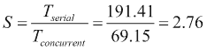
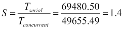

# 第 4 章。从任务获取数据–可调用接口和未来接口

在[第 2 章](02.html#KVCC1-2fff3d3b99304faa8fa9b27f1b5053ba "Chapter 2. Managing Lots of Threads – Executors")、*管理大量线程–执行器、*和[第 3 章](03.html#QMFO1-2fff3d3b99304faa8fa9b27f1b5053ba "Chapter 3. Getting the Maximum from Executors")、*从执行器*获取最大值，我们介绍了 executor 框架以提高并发应用程序的性能，并向您展示了如何实现高级特性以使此框架适应您的需要。在这些章节中，执行者执行的所有任务都基于`Runnable`接口及其不返回值的`run()`方法。但是，executor 框架允许我们执行其他类型的任务，这些任务返回基于`Callable`和`Future`接口的结果。在本章中，我们将介绍以下主题：

*   `Callable`和`Future`接口介绍
*   第一个示例–单词的最佳匹配算法
*   第二个示例–构建文档集合的反向索引

# 引入可调用接口和未来接口

executor 框架允许程序员在不创建和管理线程的情况下执行并发任务。创建任务并将其发送给执行者。它创建并管理必要的线程。

在执行器中，您可以执行两种任务：

*   基于可运行接口的**任务：这些任务实现了不返回任何结果的`run()`方法。**
*   **基于可调用接口**的任务：这些任务实现`call()`接口，该接口返回一个对象作为结果。`call()`方法返回的具体类型由`Callable`接口的泛型类型参数指定。为了得到任务返回的结果，执行者将为每个任务返回一个`Future`接口的实现。

在前面的章节中，您学习了如何创建执行者，如何根据`Runnable`界面向其发送任务，以及如何对执行者进行个性化设置以使其适应您的需要。在本章中，您将学习如何使用基于`Callable`和`Future`接口的任务。

## 可调用接口

`Callable`接口与`Runnable`接口非常相似。该接口的主要特点是：

*   这是一个通用接口。它有一个类型参数，对应于`call()`方法的返回类型。
*   它声明了`call()`方法。此方法将由执行器在运行任务时执行。它必须返回声明中指定类型的对象。
*   `call()`方法可以抛出任何已检查的异常。您可以通过实现自己的执行器并重写`afterExecute()`方法来处理异常。

## 未来接口

当您向执行者发送`Callable`任务时，它将返回`Future`接口的实现，允许您控制任务的执行和状态，并获得结果。该接口的主要特点是：

*   您可以使用`cancel()`方法取消任务的执行。此方法有一个`boolean`参数，用于指定如果任务正在运行，是否要中断任务。
*   您可以检查任务是否已取消（使用`isCancelled()`方法）或已完成（使用`isDone()`方法）。
*   您可以使用`get()`方法获取任务返回的值。此方法有两种变体。第一个没有参数，如果任务已完成执行，则返回任务返回的值。如果任务尚未完成执行，它将暂停执行线程，直到任务完成。第二个变量包含两个参数：一个时间段和该时间段的`TimeUnit`。与第一个线程的主要区别在于线程等待作为参数传递的时间段。如果周期结束且任务尚未完成执行，则该方法将抛出一个`TimeoutException`异常。

# 第一个示例–单词的最佳匹配算法

单词的**最佳匹配算法**的主要目标是找到与作为参数传递的字符串最相似的单词。要实现其中一种算法，您需要以下内容：

*   **单词列表**：在案例中，我们使用了**英国高级密码词典**（**UKACD**），这是为纵横字谜社区编制的单词列表。它有 250353 个单词和习语。可从[免费下载 http://www.crosswordman.com/wordlist.html](http://www.crosswordman.com/wordlist.html) 。
*   **衡量两个单词**之间相似性的指标：我们使用了 Levenshtein 距离来衡量**字符**的两个序列之间的差异。第二个字符串[HTT6]的最小插入数是[HTT6]的最小插入数。您可以在[中找到对该指标的简要描述 https://en.wikipedia.org/wiki/Levenshtein_distance](https://en.wikipedia.org/wiki/Levenshtein_distance) 。

在我们的示例中，您将实现两个操作：

*   第一个操作使用 Levenshtein 距离将最相似的单词列表返回给**字符序列**。
*   第二个操作使用 Levenshtein 距离确定字典中是否存在字符序列。如果我们使用`equals()`方法会更快，但是我们的版本对于本书的目标来说是一个更有趣的选择。

您将实现这些操作的串行和并发版本，以验证并发性在这种情况下对我们有帮助。

## 普通班

在本例中实现的所有任务中，您将使用以下三个基本类：

*   `WordsLoader`类，将单词列表加载到`String`对象列表中。
*   `LevenshteinDistance`类，用于计算两个字符串之间的 Levenshtein 距离。
*   存储最佳匹配算法结果的`BestMatchingData`类。它存储单词列表以及这些单词与输入字符串的距离。

UKACD 位于每行一个字的文件中，因此`WordsLoader`类实现`load()`静态方法，该方法接收包含字列表的文件路径，并返回包含 250353 个字的字符串对象列表。

`LevenshteinDistance`类实现了`calculate()`方法，该方法接收两个字符串对象作为参数，并返回一个包含这两个单词之间距离的`int`值。这是该分类的代码：

```
public class LevenshteinDistance {

    public static int calculate (String string1, String string2) {
        int[][] distances=new int[string1.length()+1][string2.length()+1];

        for (int i=1; i<=string1.length();i++) {
            distances[i][0]=i;
        }

        for (int j=1; j<=string2.length(); j++) {
            distances[0][j]=j;
        }

        for(int i=1; i<=string1.length(); i++) {
            for (int j=1; j<=string2.length(); j++) {
                if (string1.charAt(i-1)==string2.charAt(j-1)) {
                    distances[i][j]=distances[i-1][j-1];
                } else {
                    distances[i][j]=minimum(distances[i-1][j], distances[i][j-1],distances[i-1][j-1])+1;
                }
            }
        }

        return distances[string1.length()][string2.length()];
    }

    private static int minimum(int i, int j, int k) {
        return Math.min(i,Math.min(j, k));
    }
}
```

`BestMatchingData`类只有两个属性：一个字符串对象列表，用于存储单词列表；一个名为 distance 的整数属性，用于存储这些单词与输入字符串之间的距离。

## 最佳匹配算法——串行版本

首先，我们将实现串行版本的最佳匹配算法。我们将使用此版本作为并发版本的起点，然后比较两个版本的执行时间，以验证并发性是否有助于我们获得更好的性能。

我们在以下两类中实现了最佳匹配算法的串行版本：

*   `BestMatchingSerialCalculation`类，用于计算与输入字符串最相似的单词列表
*   包括执行算法的`main()`方法的`BestMatchingSerialMain`，测量执行时间，并在控制台中显示结果

让我们分析这两个类的源代码。

### 最佳匹配串行计算类

这个类只有一个名为`getBestMatchingWords`（）的方法，该方法接收两个参数：一个字符串和一个字符串对象列表，该字符串对象包含字典中的所有单词。返回一个带有算法结果的`BestMatchingData`对象：

```
public class BestMatchingSerialCalculation {

    public static BestMatchingData getBestMatchingWords(String word, List<String> dictionary) {
        List<String> results=new ArrayList<String>();
        int minDistance=Integer.MAX_VALUE;
        int distance;
```

初始化内部变量后，算法处理字典中的所有单词，计算这些单词与参考字符串之间的 Levenshtein 距离。如果单词的计算距离小于实际最小距离，我们将清除结果列表并将实际单词存储到列表中。如果一个单词的计算距离等于实际最小距离，我们将该单词添加到结果列表中：

```
        for (String str: dictionary) {
            distance=LevenshteinDistance.calculate(word,str);
            if (distance<minDistance) {
                results.clear();
                minDistance=distance;
                results.add(str);
            } else if (distance==minDistance) {
                results.add(str);
            }
        }
```

最后我们创建`BestMatchingData`对象返回算法结果：

```
        BestMatchingData result=new BestMatchingData();
        result.setWords(results);
        result.setDistance(minDistance);
        return result;
    }

}
```

### 最好的机械制造主类

这是示例的主要类。它加载 UKACD 文件，以接收到的字符串作为参数调用`getBestMatchingWords()`，并在控制台中显示结果，包括算法的执行时间。

```
public class BestMatchingSerialMain {

    public static void main(String[] args) {

        Date startTime, endTime;
        List<String> dictionary=WordsLoader.load("data/UK Advanced Cryptics Dictionary.txt");

        System.out.println("Dictionary Size: "+dictionary.size());

        startTime=new Date();
        BestMatchingData result= BestMatchingSerialCalculation.getBestMatchingWords (args[0], dictionary);
        List<String> results=result.getWords();
        endTime=new Date();
        System.out.println("Word: "+args[0]);
        System.out.println("Minimum distance: " +result.getDistance());
        System.out.println("List of best matching words: " +results.size());
        results.forEach(System.out::println);
        System.out.println("Execution Time: "+(endTime.getTime()- startTime.getTime()));
    }

}
```

在这里，我们使用了一种新的 Java8 语言构造**方法引用**和一种新的`List.forEach()`方法来输出结果。

## 最佳匹配算法——第一个并发版本

我们已经实现了最佳匹配算法的两个不同并发版本。第一个基于`Callable`接口和`AbstractExecutorService`接口中定义的`submit()`方法。

我们使用以下三个类实现了此版本的算法：

*   `BestMatchingBasicTask`类，该类实现了实现`Callable`接口的任务，并将在 executor 中执行
*   `BestMatchingBasicConcurrentCalculation`类，用于创建执行器和必要的任务，并将它们发送给执行器
*   实现`main()`方法以执行算法并在控制台中显示结果的`BestMatchingConcurrentMain`类

让我们看看这些类的源代码。

### 最佳匹配基本任务类

正如我们前面提到的，这个类将实现获得最佳匹配单词列表的任务。此任务将实现用`BestMatchingData`类参数化的`Callable`接口。这意味着该类将实现`call()`方法，该方法将返回一个`BestMatchingData`对象。

每个任务将处理字典的一部分，并返回该部分的结果。我们使用了四个内部属性，如下所示：

*   它将分析的词典的第一个位置（包括）
*   它将分析的词典的最后一个位置（排除）
*   字典作为字符串对象的列表
*   引用输入字符串

其代码如下所示：

```
public class BestMatchingBasicTask implements Callable <BestMatchingData > {

    private int startIndex;

    private int endIndex;

    private List < String > dictionary;

    private String word;

    public BestMatchingBasicTask(int startIndex, int endIndex, List < String > dictionary, String word) {
        this.startIndex = startIndex;
        this.endIndex = endIndex;
        this.dictionary = dictionary;
        this.word = word;
    }
```

`call()`方法处理`startIndex`和`endIndex`属性之间的所有单词，并计算这些单词与输入字符串之间的 Levenshtein 距离。它将只返回与输入字符串最近的单词。如果在这个过程中，它发现一个单词比前面的单词更接近，它将清除结果列表并将新单词添加到该列表中。如果它发现一个单词的距离与到目前为止找到的结果的距离相同，它会将该单词添加到结果列表中，如下所示：

```
    @Override
    public BestMatchingData call() throws Exception {
        List<String> results=new ArrayList<String>();
        int minDistance=Integer.MAX_VALUE;
        int distance;
        for (int i=startIndex; i<endIndex; i++) {
            distance = LevenshteinDistance.calculate (word,dictionary.get(i));
            if (distance<minDistance) {
                results.clear();
                minDistance=distance;
                results.add(dictionary.get(i));
            } else if (distance==minDistance) {
                results.add(dictionary.get(i));
            }
        }
```

最后，我们创建一个`BestMatchingData`对象，其中包含我们找到的单词列表及其到输入字符串的距离，并返回该对象。

```
        BestMatchingData result=new BestMatchingData();
        result.setWords(results);
        result.setDistance(minDistance);
        return result;
    }
}
```

与基于`Runnable`接口的任务的主要区别在于返回语句包含在方法的最后一行中。`run()`方法不返回值，因此这些任务无法返回结果。另一方面，`call()`方法返回一个对象（该对象的类在 implements 语句中定义），因此此类任务可以返回一个结果。

### 最佳匹配基本电流计算类

此类负责创建必要的任务来处理完整的字典，执行器执行这些任务，并控制执行器中任务的执行。

它只有一个方法`getBestMatchingWords()`，它接收两个输入参数：包含完整单词列表的字典和引用字符串。它返回一个带有算法结果的`BestMatchingData`对象。首先，我们已经创建并初始化了执行器。我们使用了机器的内核数作为希望在其上使用的最大线程数。

```
public class BestMatchingBasicConcurrentCalculation {

    public static BestMatchingData getBestMatchingWords(String word, List<String> dictionary) throws InterruptedException, ExecutionException {

        int numCores = Runtime.getRuntime().availableProcessors();
        ThreadPoolExecutor executor = (ThreadPoolExecutor) Executors.newFixedThreadPool(numCores);
```

然后，我们计算每个任务将处理的字典部分的大小，并创建一个`Future`对象列表来存储任务的结果。当您将基于`Callable`接口的任务发送给执行者时，您将得到`Future`接口的实现。您可以使用该对象来：

*   了解任务是否已执行
*   获取任务执行的结果（`call()`方法返回的对象）
*   取消任务的执行

其代码如下：

```
        int size = dictionary.size();
        int step = size / numCores;
        int startIndex, endIndex;
        List<Future<BestMatchingData>> results = new ArrayList<>();
```

然后，我们创建任务，使用`submit()`方法将任务发送给执行者，并将方法返回的`Future`对象添加到`Future`对象列表中。`submit()`方法立即返回。它不会等到任务被执行。我们有以下代码：

```
        for (int i = 0; i < numCores; i++) {
            startIndex = i * step;
            if (i == numCores - 1) {
                endIndex = dictionary.size();
            } else {
                endIndex = (i + 1) * step;
            }
            BestMatchingBasicTask task = new BestMatchingBasicTask(startIndex, endIndex, dictionary, word);
            Future<BestMatchingData> future = executor.submit(task);
            results.add(future);
        }
```

一旦我们将任务发送给执行者，我们调用执行者的`shutdown()`方法来完成其执行，并迭代`Future`对象列表以获得每个任务的结果。我们使用了无任何参数的`get()`方法。如果任务已执行完毕，此方法返回`call()`方法返回的对象。如果任务未完成，该方法将当前线程置于调用线程的休眠状态，直到任务完成且结果可用。

我们用任务的结果组成一个结果列表，因此我们只返回最接近引用字符串的单词列表，如下所示：

```
        executor.shutdown();
        List<String> words=new ArrayList<String>();
        int minDistance=Integer.MAX_VALUE;
        for (Future<BestMatchingData> future: results) {
            BestMatchingData data=future.get();
            if (data.getDistance()<minDistance) {
                words.clear();
                minDistance=data.getDistance();
                words.addAll(data.getWords());
            } else if (data.getDistance()==minDistance) {
                words.addAll(data.getWords());
            }

        }
```

最后，我们创建并返回一个`BestMatchingData`对象，并给出算法结果：

```
        BestMatchingData result=new BestMatchingData();
        result.setDistance(minDistance);
        result.setWords(words);
        return result;
    }
}
```

### 注

`BestMatchingConcurrentMain`类与前面介绍的`BestMatchingSerialMain`类非常相似。唯一的区别是所使用的类（`BestMatchingBasicConcurrentCalculation`而不是`BestMatchingSerialCalculation`），所以我们这里不包括源代码。请注意，我们既没有使用线程安全数据结构，也没有使用同步，因为我们的并发任务处理独立的数据块，最终结果在并发任务终止后以顺序方式合并。

## 最佳匹配算法——第二个并发版本

我们已经使用`AbstractExecutorService`中的`invokeAll()`方法实现了最佳匹配算法的第二个版本（在`ThreadPoolExecutorClass`中实现）。在上一个版本中，我们使用了接收`Callable`对象并返回`Future`对象的`submit()`方法。`invokeAll()`方法接收`Callable`对象的`List`作为参数，并返回`Future`对象的`List`。第一个`Future`与第一个`Callable`关联，依此类推。这两种方法之间还有另一个重要区别。虽然`submit()`方法会立即返回，但`invokeAll()` 方法会在所有`Callable`任务结束执行后返回。这意味着，如果调用它们的`isDone()`方法，所有返回的`Future`对象都将返回`true`。

为了实现这个版本，我们使用了前面示例中实现的`BestMatchingBasicTask`类，并实现了`BestMatchingAdvancedConcurrentCalculation`类。与`BestMatchingBasicConcurrentCalculation`类的区别在于任务的创建和结果的处理。在创建任务时，现在我们创建一个列表，并将其存储在要执行的任务上：

```
        for (int i = 0; i < numCores; i++) {
            startIndex = i * step;
            if (i == numCores - 1) {
                endIndex = dictionary.size();
            } else {
                endIndex = (i + 1) * step;
            }
            BestMatchingBasicTask task = new BestMatchingBasicTask(startIndex, endIndex, dictionary, word);
            tasks.add(task);
        }
```

为了处理结果，我们调用`invokeAll()`方法，然后查看返回的`Future`对象列表：

```
        results = executor.invokeAll(tasks);
        executor.shutdown();
        List<String> words = new ArrayList<String>();
        int minDistance = Integer.MAX_VALUE;
        for (Future<BestMatchingData> future : results) {
            BestMatchingData data = future.get();
            if (data.getDistance() < minDistance) {
                words.clear();
                minDistance = data.getDistance();
                words.addAll(data.getWords());
            } else if (data.getDistance()== minDistance) {
                words.addAll(data.getWords());
            }
        }
        BestMatchingData result = new BestMatchingData();
        result.setDistance(minDistance);
        result.setWords(words);
        return result;
    }
```

为了执行这个版本，我们已经实现了`BestMatchingConcurrentAdvancedMain`。它的源代码与以前的非常相似，因此不包括在内。

## 单词 exists 算法–串行版本

作为这个示例的一部分，我们实现了另一个操作来检查单词列表中是否存在字符串。为了检查这个词是否存在，我们再次使用 Levenshtein 距离。我们认为如果一个词与席的单词有距离，则存在一个词。如果我们使用 ALE T1 或 Ty2 T2 方法进行比较，或者将输入的单词读入一个 TA3 T3，并使用 AUTYT4ED 方法（比我们的版本更有效），这将更快，但我们认为我们的版本将更有用的书的目的。

与前面的示例一样，首先，我们实现了操作的串行版本，将其作为实现并发版本的基础，并比较两个版本的执行时间。

为了实现串行版本，我们使用了两个类：

*   `ExistSerialCalculation`类，它实现了`existWord()`方法，将输入字符串与字典中的所有单词进行比较，直到找到为止
*   `ExistSerialMain`类，它启动示例并测量执行时间

让我们分析这两个类的源代码。

### ExistSerialCalculation 类

这个类只有一个方法，即`existWord()`方法。它接收两个参数：我们正在寻找的单词和完整的单词列表。它遍历完整列表，计算输入单词和列表中单词之间的 Levenshtein 距离，直到找到单词（距离为`0`），在这种情况下返回`true`值，或者在没有找到单词的情况下完成单词列表，在这种情况下返回`false`值。

```
public class ExistSerialCalculation {

    public static boolean existWord(String word, List<String> dictionary) {
        for (String str: dictionary) {
            if (LevenshteinDistance.calculate(word, str) == 0) {
                return true;
            }
        }
        return false;
    }
}
```

### ExistSerialMain 类

这个类实现了`main()`方法来调用`exist()`方法。它获取 main 方法的第一个参数作为我们要查找的单词，并调用该方法。它测量其执行时间并在控制台中显示结果。我们有以下代码：

```
public class ExistSerialMain {

    public static void main(String[] args) {

        Date startTime, endTime;
        List<String> dictionary=WordsLoader.load("data/UK Advanced Cryptics Dictionary.txt");

        System.out.println("Dictionary Size: "+dictionary.size());

        startTime=new Date();
        boolean result=ExistSerialCalculation.existWord(args[0], dictionary);
        endTime=new Date();

        System.out.println("Word: "+args[0]);
        System.out.println("Exists: "+result);
        System.out.println("Execution Time: "+(endTime.getTime()- startTime.getTime()));
    }
}
```

## 单词 exists 算法-并发版本

为了实现此操作的并发版本，我们必须考虑其最重要的特性。我们不需要处理整个单词列表。当我们找到单词时，我们可以完成列表的处理并返回结果。这种不处理整个输入数据并在满足某些条件时停止的操作称为**短路操作**。

`AbstractExecutorService`接口定义了一个完全符合此思想的操作（在`ThreadPoolExecutor`类中实现）。这就是`invokeAny()`方法。此方法将作为参数接收的`Callable`任务列表发送给执行者，并返回第一个任务的结果，该任务已完成执行，且不会引发异常。如果所有任务都抛出异常，则此方法抛出`ExecutionException`异常。

与前面的示例一样，我们实现了不同的类来实现此版本的算法：

*   实现我们将在 executor 中执行的任务的`ExistBasicTask`类
*   `ExistBasicConcurrentCalculation`类，用于创建执行器和任务，并将任务发送给执行器
*   执行测量其运行时间的示例的`ExistBasicConcurrentMain`类

### 现有基本任务类

这个类实现了搜索单词的任务。实现了用`Boolean`类参数化的`Callable`接口。如果任务找到单词，`call()`方法将返回`true`值。它使用四个内部属性：

*   单词的完整列表
*   任务将处理的列表中的第一个单词（包括）
*   任务将处理的列表中的最后一个单词（已排除）
*   任务将查找的单词

我们有以下代码：

```
public class ExistBasicTask implements Callable<Boolean> {

    private int startIndex;

    private int endIndex;

    private List<String> dictionary;

    private String word;

    public ExistBasicTask(int startIndex, int endIndex, List<String> dictionary, String word) {
        this.startIndex=startIndex;
        this.endIndex=endIndex;
        this.dictionary=dictionary;
        this.word=word;
    }
```

`call`方法将遍历分配给此任务的列表部分。它计算输入字和列表字之间的 Levenshtein 距离。如果找到单词，则返回`true`值。

如果任务处理其所有单词，但未找到该单词，则会抛出异常以适应`invokeAny()`方法的行为。在这种情况下，如果任务返回`false`值，`invokeAny()`方法将返回`false`值，而不等待其余任务。也许另一个任务会找到这个词。

我们有以下代码：

```
    @Override
    public Boolean call() throws Exception {
        for (int i=startIndex; i<endIndex; i++) {
            if (LevenshteinDistance.calculate(word, dictionary.get(i))==0) {
                return true;
            }
        }
            if (Thread.interrupted()) {
                return false;
            }
        throw new NoSuchElementException("The word "+word+" doesn't exists.");
    }
```

### 现有的 BasicCurrentCalculation 类

这个类将在单词的完整列表中搜索输入单词，创建并执行必要的任务。它只实现了一个名为`existWord()`的方法。它接收两个参数，输入字符串和单词的完整列表，并返回一个布尔值，指示单词是否存在。

首先，我们创建执行器来执行任务。我们使用`Executor`类并创建一个`ThreadPoolExecutor`类，其最大线程数由机器的可用硬件线程数决定，如下所示：

```
public class ExistBasicConcurrentCalculation {

    public static boolean existWord(String word, List<String> dictionary) throws InterruptedException, ExecutionException{
        int numCores = Runtime.getRuntime().availableProcessors();
        ThreadPoolExecutor executor = (ThreadPoolExecutor) Executors.newFixedThreadPool(numCores);
```

然后，我们创建与执行器中运行的线程数量相同的任务。每个任务将处理单词列表中相等的部分。我们创建任务并将其存储在列表中：

```
        int size = dictionary.size();
        int step = size / numCores;
        int startIndex, endIndex;
        List<ExistBasicTask> tasks = new ArrayList<>();

        for (int i = 0; i < numCores; i++) {
            startIndex = i * step;
            if (i == numCores - 1) {
                endIndex = dictionary.size();
            } else {
                endIndex = (i + 1) * step;
            }
            ExistBasicTask task = new ExistBasicTask(startIndex, endIndex, dictionary,
                    word);
            tasks.add(task);
        }
```

然后，我们使用`invokeAny()`方法在执行器中执行任务。如果这些方法返回布尔值，则表示该词存在。我们返回该值。如果该方法引发异常，则该单词不存在。我们在控制台中打印异常并返回`false`值。在这两种情况下，我们调用执行者的`shutdown()`方法来终止其执行，如下所示：

```
        try {
            Boolean result=executor.invokeAny(tasks);
            return result;
        } catch (ExecutionException e) {
            if (e.getCause() instanceof NoSuchElementException)
                return false;
            throw e;
        } finally {
            executor.shutdown();
        }
    }
}
```

### 现有的 BasicConcurrentMain 类

此类实现了本例的`main()`方法。它等同于`ExistSerialMain`类，有一个区别，它使用`ExistBasicConcurrentCalculation`类而不是`ExistSerialCalculation`，因此不包含其源代码。

## 比较解决方案

让我们比较一下我们在本节中实现的两个操作的不同解决方案（串行和并发）。为了测试算法，我们使用 JMH 框架（[执行了示例 http://openjdk.java.net/projects/code-tools/jmh/](http://openjdk.java.net/projects/code-tools/jmh/) ），允许您在 Java 中实现微基准测试。使用基准测试框架是一个更好的解决方案，它使用`currentTimeMillis()`或`nanoTime()`等方法简单地测量时间。我们已经在一台四核处理器的计算机上执行了 10 次，并计算了这 10 次的中间执行时间。让我们分析一下执行结果。

### 最佳匹配算法

在这种情况下，我们实现了算法的三个版本：

*   连载版本
*   并发版本，一次发送一个任务
*   并发版本，使用`invokeAll()`方法

为了测试算法，我们使用了单词列表中不存在的三个不同字符串：

*   `Stitter`
*   `Abicus`
*   `Lonx`

以下是每个单词的最佳匹配算法返回的单词：

*   `Stitter`：`sitter`、`skitter`、`slitter`、`spitter`、`stilter`、`stinter`、`stotter`、`stutter`、`titter`
*   `Abicus`：`abacus`和`amicus`
*   `Lonx`：`lanx`、`lone`、`long`、`lox`、`lynx`

下表讨论了介质执行时间及其以毫秒为单位的标准偏差：

<colgroup class="calibre19"><col class="calibre20"> <col class="calibre20"> <col class="calibre20"> <col class="calibre20"></colgroup> 
| 

算法

 | 

缝纫机

 | 

阿比克斯

 | 

朗克斯

 |
| --- | --- | --- | --- |
| 电视连续剧 | 467.01 ± 23.40 | 408.03 ± 14.66 | 317.60 ± 28.78 |
| 并发：`submit()`方法 | 209.72 ± 74.79 | 184.10 ± 90.47 | 155.61 ± 65.43 |
| 并发：`invokeAll()`方法 | 217.66 ± 65.46 | 188.28 ± 81.28 | 160.43 ± 65.14 |

我们可以得出以下结论：

*   该算法的并发版本比串行版本具有更好的性能。
*   The concurrent versions of the algorithm obtain similar results between them. All the concurrent versions have very high standard deviation values high. We can compare the concurrent version method with the serial version using the speed-up for the word `lonx` to see how concurrency improves the performance of our algorithm:

    

### 现有算法

在这种情况下，我们实现了两种版本的算法：

*   连载版本
*   并发版本，使用`invokeAny()`方法

为了测试算法，我们使用了一些字符串：

*   单词列表中不存在的字符串`xyzt`
*   单词列表中靠近列表末尾的字符串`stutter`
*   单词列表中的字符串`abacus`非常靠近列表的开头
*   单词列表中位于列表后半部分之后的字符串`lynx`

介质执行时间（毫秒）及其标准偏差如下表所示：

<colgroup class="calibre19"><col class="calibre20"> <col class="calibre20"> <col class="calibre20"></colgroup> 
| 

算法

 | 

单词

 | 

执行时间（毫秒）

 |
| --- | --- | --- |
| 电视连续剧 | `abacus` | 50.70 ± 13.95 |
|   | `lynx` | 194.41 ± 26.02 |
| `stutter` | 398.11 ± 23.4 |
| `xyzt` | 315.62 ± 28.7 |
| 同时发生的 | `abacus` | 50.72 ± 7.17 |
|   | `lynx` | 69.15 ± 62.5 |
| `stutter` | 126.74 ± 104.52 |
| `xyzt` | 203.37 ± 76.67 |

我们可以得出以下结论：

*   一般来说，该算法的并发版本比串行版本提供更好的性能。
*   单词在列表中的位置是一个关键因素。对于出现在列表开头的`abacus`字，两种算法给出的执行时间相似，但对于`stutter`字，差异非常大。
*   并发情况下的标准差非常大。

如果我们使用加速功能将`lynx`一词的并发版本与串行版本进行比较，结果是：



# 第二个示例–为文档集合创建反向索引

在**信息检索**世界中，**倒排索引**是一种常用的数据结构，用于在文档集合中加速文本搜索。它存储文档集合中的所有单词以及包含该单词的文档列表。

要构造索引，我们必须解析集合中的所有文档，并以增量方式构造索引。对于每个文档，我们提取该文档的重要单词（删除最常见的单词，也称为停止单词，可能应用词干算法），然后将这些单词添加到索引中。如果索引中存在一个单词，我们将该文档添加到与该单词相关联的文档列表中。如果某个单词不存在，请将该单词添加到索引的单词列表中，并将文档与该单词关联。您可以向关联中添加参数，如文档中提供更多信息的单词的**术语频率**。

搜索文档集合中的单词或单词列表时，可以使用反向索引获取与每个单词关联的文档列表，并使用搜索结果创建唯一列表。

在本节中，您将学习如何使用 Java 并发实用程序为文档集合构造反向索引文件。作为文档集合，我们使用包含电影信息的维基百科页面构建了一组 100673 个文档。我们已将每个维基百科页面转换为文本文件。您可以下载此文档集以及有关该书的所有信息。

为了构造反向索引，我们不删除任何单词，也不使用任何词干算法。我们希望使算法尽可能简单，以便将注意力集中在并发实用程序中。

此处解释的相同原理可用于获取有关文档集合的其他信息，例如，每个文档的向量表示，可作为**聚类算法**的输入，如您将在[第 6 章](06.html#173722-2fff3d3b99304faa8fa9b27f1b5053ba "Chapter 6. Optimizing Divide and Conquer Solutions – The Fork/Join Framework")、*中了解的优化分而治之的解决方案——Fork/Join 框架*。

与其他示例一样，您将实现这些操作的串行和并发版本，以验证并发性在这种情况下对我们有帮助。

## 普通班

两个版本（串行和并发）都有将文档集合加载到 Java 对象中的类。我们使用了以下两类：

*   存储文档中包含的单词列表的`Document`类
*   `DocumentParse`类，用于转换存储在文档对象文件中的文档

让我们分析这两个类的源代码。

### 文档类

`Document`类非常简单。它只有两个属性以及获取和设置这些属性值的方法。这些属性是：

*   以字符串形式显示的文件名。
*   词汇表（即文档中使用的单词列表）作为`HashMap`。**键**为**字**，数值为该字在文档中出现的次数。

### DocumentParser 类

正如前面提到的一样，这个类将存储在`Document`对象中的文档中的文件转换为文档。它把这个词分成三种方法。第一个是`parse()` 方法，它接收文件路径作为参数，并返回一个包含该文档词汇表的`HashMap`。此方法逐行读取文件，并使用`parseLine()`方法转换单词列表中的每一行，并将其添加到词汇表中，如下所示：

```
public class DocumentParser {

    public Map<String, Integer>  parse(String route) {
        Map<String, Integer> ret=new HashMap<String,Integer>();
        Path file=Paths.get(route);
        try ( BufferedReader reader = Files.newBufferedReader(file)) {
                String line = null;
                while ((line = reader.readLine()) != null) {
                    parseLine(line,ret);
                }
            } catch (IOException x) {
              x.printStackTrace();
            } catch (Exception e) {
              e.printStackTrace();
            }
        return ret;

    }
```

`parseLine()`方法处理提取其单词的行。我们认为一个单词是一个字母序列的序列，以继续这个例子的简单性。我们使用`Pattern`类提取单词，使用`Normalizer`类将单词转换为小写，并删除元音的重音，如下所示：

```
private static final Pattern PATTERN = Pattern.compile("\\P{IsAlphabetic}+");

private void parseLine(String line, Map<String, Integer> ret) {
  for(String word: PATTERN.split(line)) {
    if(!word.isEmpty())
      ret.merge(Normalizer.normalize(word, Normalizer.Form.NFKD).toLowerCase(), 1, (a, b) -> a+b);
  }
}
```

## 序列版本

本例的串行版本在`SerialIndexing`类中实现。这个类有一个`main()`方法，该方法读取所有文档，获取其词汇表，并以增量方式构造反向索引。

首先，我们初始化必要的变量。文档集合存储在数据目录中，因此我们将所有文档存储在一个`File`对象数组中。我们还初始化了`invertedIndex`对象。我们使用一个`HashMap`，其中键是单词，值是字符串对象列表，包含单词的文件名如下：

```
public class SerialIndexing {

    public static void main(String[] args) {

        Date start, end;

        File source = new File("data");
        File[] files = source.listFiles();
        Map<String, List<String>> invertedIndex=new HashMap<String,List<String>> ();
```

然后，我们使用`DocumentParse`类解析所有文档，并使用`updateInvertedIndex()`方法将从每个文档获得的词汇添加到反向索引中。我们测量所有流程的执行时间。我们有以下代码：

```
        start=new Date();
        for (File file : files) {

            DocumentParser parser = new DocumentParser();

            if (file.getName().endsWith(".txt")) {
                Map<String, Integer> voc = parser.parse (file.getAbsolutePath());
                updateInvertedIndex(voc,invertedIndex, file.getName());
            }
        }
        end=new Date();
```

最后，我们在控制台中显示执行结果：

```
        System.out.println("Execution Time: "+(end.getTime()- start.getTime()));
        System.out.println("invertedIndex: "+invertedIndex.size());
    }
```

`updateInvertedIndex()`方法将文档的词汇表添加到反向索引结构中。它处理构成词汇表的所有单词。如果该单词存在于倒排索引中，我们将该文档的名称添加到与该单词相关联的文档列表中。如果该词不存在，我们添加该词并将文档与该词关联，如下所示：

```
private static void updateInvertedIndex(Map<String, Integer> voc, Map<String, List<String>> invertedIndex, String fileName) {
  for (String word : voc.keySet()) {
    if (word.length() >= 3) {
      invertedIndex.computeIfAbsent(word, k -> new ArrayList<>()).add(fileName);
    }
  }
}
```

## 第一个并发版本–每个文档一个任务

现在是时候实现文本索引算法的并发版本了。显然，我们可以并行处理每个文档。这包括从文件中读取文档并处理每一行以获得文档的词汇表。任务可以返回词汇表作为结果，因此我们可以在`Callable`接口中实现任务。

在前面的示例中，我们使用了三种方法向执行者发送`Callable`任务：

*   `submit()`
*   `invokeAll()`
*   `invokeAny()`

我们必须处理所有文件，因此我们必须放弃`invokeAny()`方法。另外两种方法不方便。如果我们使用`submit()`方法，我们必须在处理任务结果时决定。如果我们为每个文档发送任务，我们可以处理结果：

*   发送每个任务后，这是不可行的
*   在完成所有任务后，我们必须存储大量的`Future`对象
*   发送一组任务后，我们必须包含同步这两个操作的代码

所有这些方法都有一个问题：我们按顺序处理任务的结果。如果我们使用`invokeAll()`方法，我们的情况与第 2 点类似。我们必须等待所有任务的完成。

一个可能的选择是创建其他任务来处理与每个任务相关联的`Future`对象，Java 并发 API 为我们提供了一个优雅的解决方案，用`CompletionService`接口及其实现`ExecutorCompletionService`类来实现这个解决方案。

`CompletionService`对象是一种具有执行器的机制，它允许您将任务的产生与这些任务的结果的消耗解耦。您可以使用`submit()`方法将任务发送给执行者，并在执行者使用`poll()`或`take()`方法完成任务后获得任务结果。因此，对于我们的解决方案，我们将实施以下要素：

*   用于执行任务的`CompletionService`对象。
*   每个文档的一项任务，用于解析文档并生成其词汇表。此任务将由`CompletionService`对象执行。这些任务在`IndexingTask`类中实现。
*   两个线程处理任务的结果并构造反向索引。这些线程在`InvertedIndexTask`类中实现。
*   创建和执行所有元素的`main()`方法。此`main()`方法在`ConcurrentIndexingMain`类中实现。

让我们分析这些类的源代码。

### IndexingTask 类

这个类实现了解析文档以获取其词汇表的任务。实现了用`Document`类参数化的`Callable`接口。它有一个内部属性来存储表示它必须解析的文档的`File`对象。请看下面的代码：

```
public class IndexingTask implements Callable<Document> {
    private File file;
    public IndexingTask(File file) {
        this.file=file;
    }
```

在`call()`方法中，它简单地使用`DocumentParser`类的`parse()`方法解析文档并获取词汇表，创建并返回`Document`对象以及获取的数据：

```
    @Override
    public Document call() throws Exception {
        DocumentParser parser = new DocumentParser();

        Map<String, Integer> voc = parser.parse(file.getAbsolutePath());

        Document document=new Document();
        document.setFileName(file.getName());
        document.setVoc(voc);
        return document;
    }
}
```

### 任务类

这个类实现了获取`IndexingTask`对象生成的`Document`对象并构造反向索引的任务。此任务将作为`Thread`对象执行（本例中我们不使用执行器），因此它们基于`Runnable`接口。

`InvertedIndexTask`类使用三个内部属性：

*   用`Document`类参数化的`CompletionService`对象，用于访问`IndexingTask`对象返回的对象。
*   A`ConcurrentHashMap`存储反向索引。键是单词，值是带文件名的字符串`ConcurrentLinkedDeque`。在这种情况下，我们必须使用并发数据结构，而串行版本中使用的数据结构是不同步的。
*   一个布尔值，用于指示任务可以完成其工作。

其代码如下：

```
public class InvertedIndexTask implements Runnable {

    private CompletionService<Document> completionService;
    private ConcurrentHashMap<String, ConcurrentLinkedDeque<String>> invertedIndex;

    public InvertedIndexTask(CompletionService<Document> completionService,
            ConcurrentHashMap<String, ConcurrentLinkedDeque<String>> invertedIndex) {
        this.completionService = completionService;
        this.invertedIndex = invertedIndex;

    }
```

`run()`方法使用`CompletionService`中的`take()`方法获取与任务关联的`Future`对象。我们实现了一个循环，该循环将一直运行，直到线程被中断。一旦线程被中断，它将再次使用`take()`方法处理所有挂起的`Future`对象。我们使用`updateInvertedIndex()`方法和`take()`方法返回的对象更新反向索引。我们有以下方法：

```
public void run() {
        try {
            while (!Thread.interrupted()) {
                try {
                    Document document = completionService.take().get();
                    updateInvertedIndex(document.getVoc(), invertedIndex, document.getFileName());
                } catch (InterruptedException e) {
                    break;
                }
            }
            while (true) {
                Future<Document> future = completionService.poll();
                if (future == null)
                    break;
                Document document = future.get();
                updateInvertedIndex(document.getVoc(), invertedIndex, document.getFileName());
            }
        } catch (InterruptedException | ExecutionException e) {
            e.printStackTrace();
        }
    }
```

最后，`updateInvertedIndex`方法接收从文档获得的词汇表、反向索引和作为参数处理的文件名。它处理词汇表中的所有单词。如果`invertedIndex`不存在，我们使用`computeIfAbsent()`方法将该词添加到`invertedIndex`：

```
     private void updateInvertedIndex(Map<String, Integer> voc, ConcurrentHashMap<String, ConcurrentLinkedDeque<String>> invertedIndex, String fileName) {
        for (String word : voc.keySet()) {
            if (word.length() >= 3) {
                invertedIndex.computeIfAbsent(word, k -> new ConcurrentLinkedDeque<>()).add(fileName);
            }
        }
    }
```

### ConcurrentIndexing 类

这个是示例中的主类。它创建并启动所有组件，等待其完成，并在控制台中打印最终执行时间。

首先，它创建并初始化执行所需的所有变量：

*   运行`InvertedTask`任务的执行者。与前面的示例一样，我们使用机器的内核数作为执行器中的最大工作线程数，但在本例中，我们保留一个内核来执行独立线程。
*   用于运行任务的`CompletionService`对象。我们使用之前创建的执行器来初始化此对象。
*   A`ConcurrentHashMap`存储反向索引。
*   一个包含我们必须处理的所有文档的`File`对象数组。

我们有以下方法：

```
public class ConcurrentIndexing {

    public static void main(String[] args) {

        int numCores=Runtime.getRuntime().availableProcessors();
        ThreadPoolExecutor executor=(ThreadPoolExecutor) Executors.newFixedThreadPool(Math.max(numCores-1, 1));
        ExecutorCompletionService<Document> completionService=new ExecutorCompletionService<>(executor);
        ConcurrentHashMap<String, ConcurrentLinkedDeque<String>> invertedIndex=new ConcurrentHashMap <String,ConcurrentLinkedDeque<String>> ();

        Date start, end;

        File source = new File("data");
        File[] files = source.listFiles();
```

然后，我们处理数组的所有文件。对于每个文件，我们创建一个`InvertedTask`对象，并使用`submit()`方法将其发送给`CompletionService`类：

```
        start=new Date();
        for (File file : files) {
            IndexingTask task=new IndexingTask(file);
            completionService.submit(task);
        }
```

然后，我们创建两个`InvertedIndexTask`对象来处理`InvertedTask`任务返回的结果，并将其作为正常`Thread`对象执行：

```
        InvertedIndexTask invertedIndexTask=new InvertedIndexTask(completionService,invertedIndex);
        Thread thread1=new Thread(invertedIndexTask);
        thread1.start();
        InvertedIndexTask invertedIndexTask2=new InvertedIndexTask(completionService,invertedIndex);
        Thread thread2=new Thread(invertedIndexTask2);
        thread2.start();
```

一旦我们启动了所有元素，我们将使用`shutdown()`和`awaitTermination()`方法等待执行器的最终确定。`awaitTermination()`方法将在所有`InvertedTask`任务完成执行后返回，因此我们可以完成执行`InvertedIndexTask`任务的线程。为此，我们中断这些线程（参见我对`InvertedIndexTask`的评论）。

```
        executor.shutdown();
        try {
            executor.awaitTermination(1, TimeUnit.DAYS);
            thread1.interrupt();
            thread2.interrupt();
            thread1.join();
            thread2.join();
        } catch (InterruptedException e) {
            e.printStackTrace();
        }
```

最后，我们在控制台中写入反转的索引的大小和所有进程的执行时间：

```
        end=new Date();
        System.out.println("Execution Time: "+(end.getTime()- start.getTime()));
        System.out.println("invertedIndex: "+invertedIndex.size());
    }

}
```

## 第二个并发版本-每个任务有多个文档

我们已经实现了这个示例的第二个并发版本。基本原则与第一个版本相同，但在本例中，每个任务将处理多个文档，而不是仅处理一个文档。每个任务处理的文档数将是 main 方法的输入参数。我们已经用每个任务 100、1000 和 5000 个文档测试了结果。

为了实现这种新方法，我们将实现三个新类：

*   `MultipleIndexingTask`类，相当于`IndexingTask`类，但它将处理一个文档列表，而不是一个文档列表
*   `MultipleInvertedIndexTask`类，相当于`InvertedIndexTask`类，但现在任务将检索`Document`对象列表，而不是仅检索一个
*   `MultipleConcurrentIndexing`类，相当于`ConcurrentIndexing`类，但使用新类

由于大部分源代码与以前的版本相似，我们只展示了不同之处。

### 多索引任务类

正如前面提到的类，这个类与前面介绍的`IndexingTask`类类似。主要区别在于它使用了一个`File`对象列表，而不是一个文件：

```
public class MultipleIndexingTask implements Callable<List<Document>> {

    private List<File> files;

    public MultipleIndexingTask(List<File> files) {
        this.files = files;
    }
```

`call()`方法返回`Document`对象列表，而不是仅返回一个：

```
    @Override
    public List<Document> call() throws Exception {
        List<Document> documents = new ArrayList<Document>();
        for (File file : files) {
            DocumentParser parser = new DocumentParser();

            Hashtable<String, Integer> voc = parser.parse (file.getAbsolutePath());

            Document document = new Document();
            document.setFileName(file.getName());
            document.setVoc(voc);

            documents.add(document);
        }

        return documents;
    }
}
```

### MultipleInvertedIndexTask 类

正如我们前面提到的，这个类类似于前面介绍的`InvertedIndexClass`。主要区别在于`run()`方法。`poll()`方法返回的`Future`对象返回一个`Document`对象列表，因此我们必须处理整个列表。

```
    @Override
    public void run() {
        try {
            while (!Thread.interrupted()) {
                try {
                    List<Document> documents = completionService.take().get();
                    for (Document document : documents) {
                        updateInvertedIndex(document.getVoc(), invertedIndex, document.getFileName());
                    }
                } catch (InterruptedException e) {
                    break;
                }
            }
            while (true) {
                Future<List<Document>> future = completionService.poll();
                if (future == null)
                    break;
                List<Document> documents = future.get();
                for (Document document : documents) {
                    updateInvertedIndex(document.getVoc(), invertedIndex, document.getFileName());
                }
            }
        } catch (InterruptedException | ExecutionException e) {
            e.printStackTrace();
        }
    }
```

### MultipleConcurrentIndexing 类

正如我们前面提到的，这个类与`ConcurrentIndexing`类类似。唯一的区别是使用了新类和第一个参数来确定每个任务处理的文档数量。我们有以下方法：

```
        start=new Date();
        List<File> taskFiles=new ArrayList<>();
        for (File file : files) {
            taskFiles.add(file);
            if (taskFiles.size()==NUMBER_OF_TASKS) {
                MultipleIndexingTask task=new MultipleIndexingTask(taskFiles);
                completionService.submit(task);
                taskFiles=new ArrayList<>();
            }
        }
        if (taskFiles.size()>0) {
            MultipleIndexingTask task=new MultipleIndexingTask(taskFiles);
            completionService.submit(task);
        }

        MultipleInvertedIndexTask invertedIndexTask=new MultipleInvertedIndexTask (completionService,invertedIndex);
        Thread thread1=new Thread(invertedIndexTask);
        thread1.start();
        MultipleInvertedIndexTask invertedIndexTask2=new MultipleInvertedIndexTask (completionService,invertedIndex);
        Thread thread2=new Thread(invertedIndexTask2);
        thread2.start();
```

## 比较解决方案

让我们比较一下我们实现的示例的三个版本的解决方案。正如我们前面提到的，与文档集合一样，我们使用包含电影信息的维基百科页面构建了一组 100673 个文档。我们已将每个维基百科页面转换为文本文件。您可以下载此文档集以及有关该书的所有信息。

我们已经执行了五种不同版本的解决方案：

*   连载版本
*   每个文档有一个任务的并发版本
*   每个文档包含多个任务的并发版本，每个任务包含 100、1000 和 5000 个文档

下表显示了五个版本的执行时间：

<colgroup class="calibre19"><col class="calibre20"> <col class="calibre20"></colgroup> 
| 

算法

 | 

执行时间（毫秒）

 |
| --- | --- |
| 电视连续剧 | 69,480.50 |
| 并发：每个任务一个文档 | 49,655.49 |
| 并发：每个任务 100 个文档 | 48,438.14 |
| 并发：每个任务 1000 个文档 | 49,362.37 |
| 并发：每个任务 5000 个文档 | 58,362.22 |

我们可以得出以下结论：

*   并发版本总是比串行版本获得更好的性能
*   对于并发版本，如果我们增加每个任务的文档数量，我们会得到更糟糕的结果

如果我们使用加速比较并发版本和串行版本，结果是：



## 其他感兴趣的方法

在这一章中，我们使用了`AbstractExecutorService`接口（在`ThreadPoolExecutor`类中实现）和`CompletionService`接口（在`ExecutorCompletionService`中实现）的一些方法来管理`Callable`任务的结果。然而，我们使用的方法还有其他版本，我们想在这里提到的其他方法。

关于`AbstractExecutorService`接口，我们来讨论以下方法：

*   `invokeAll (Collection<? extends Callable<T>> tasks, long timeout, TimeUnit unit)`：当所有任务都已完成执行或第二个和第三个参数指定的超时过期时，此方法返回与作为参数传递的`Callable`任务列表关联的`Future`对象列表。
*   `invokeAny (Collection<? Extends Callable<T>> tasks, long timeout, TimeUnit unit)`：此方法返回作为参数传递的`Callable`任务列表中第一个任务的结果，如果该任务在第二个和第三个参数指定的超时过期之前完成，则不会引发异常。如果超时过期，该方法将抛出一个`TimeoutException`异常。

关于`CompletionService`接口，我们来讨论以下方法：

*   `poll()` 方法：我们使用了这个方法的一个版本，有两个参数，但也有一个版本没有参数。从内部数据结构中，此版本检索并删除自上次调用`poll()`或`take()`方法以来已完成的下一个任务的`Future`对象。如果没有任务完成，则其执行返回一个`null`值。
*   `take()`方法：此方法类似于前一种方法，但是如果没有任务完成，它会休眠线程，直到一个任务完成执行。

# 总结

在本章中，您学习了用于处理返回结果的任务的不同机制。这些任务基于`Callable`接口，该接口声明了`call()`方法。这是一个参数化接口，带有`call`方法返回的类。

在 executor 中执行`Callable`任务时，始终会获得`Future`接口的实现。您可以使用此对象取消任务的执行，了解任务是否已完成执行，或者获取`call()` 方法返回的结果。

您使用三种不同的方法向执行者发送`Callable`任务。使用`submit()`方法，您发送一个任务，您将立即得到一个与此任务关联的`Future`对象。使用`invokeAll()`方法，您发送一个任务列表，当所有任务都完成执行后，您将获得一个`Future`对象列表。使用`invokeAny()`方法，您发送一个任务列表，您将收到第一个任务的结果（而不是`Future`对象），该任务完成后不会引发异常。其余的任务将被取消。

Java 并发 API 提供了另一种处理此类任务的机制。该机制在`CompletionService`接口中定义，并在`ExecutorCompletionService`类中实现。此机制允许您将任务的执行与其结果的处理解耦。`CompletionService`接口与执行器内部工作，提供`submit()`方法将任务发送到`CompletionService`接口，以及`poll()`和`take()`方法获取任务结果。这些结果以任务完成其执行的相同顺序提供。

您还通过两个实际示例学习了如何实现这些概念：

*   使用 UKACD 数据集的最佳匹配算法
*   一个反向索引构造器，使用一个包含 100000 多个文档的数据集，其中包含从维基百科中提取的电影信息

在下一章中，您将学习如何以可分为阶段的并发方式执行算法，例如，关键字提取算法。您可以通过以下三个步骤实现该算法：

1.  步骤 1–解析所有文档并提取所有单词。
2.  步骤 2–计算每个文档中每个单词的重要性。
3.  步骤 3–获取最佳关键字。

这些步骤的主要特点是，在开始下一个步骤之前，必须完全完成一个步骤。Java 并发 API 提供了`Phaser`类来促进这些算法的并发实现。它允许您在一个阶段结束时同步其中涉及的所有任务，因此在所有任务都完成当前任务之前，它们都不会启动下一个任务。