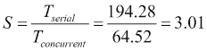
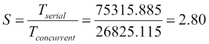

# 四、分阶段运行任务——相位器类

并发 API 中最重要的元素是它为程序员提供的同步机制。**同步**是协调两个或多个任务以获得所需结果。当必须按预定义顺序执行两个或多个任务时，您可以同步它们的执行；当一次只有一个线程可以执行代码片段或修改内存块时，您可以同步对共享资源的访问。Java 8 并发 API 提供了许多同步机制，从基本的`synchronized`关键字或`Lock`接口及其实现，以保护关键部分到更高级的`CyclicBarrier`或`CountDownLatch`类，这些类允许您同步不同任务的执行顺序。在 Java7 中，并发 API 引入了`Phaser`类。此类提供了一个强大的机制（**移相器**来执行分阶段的任务。任务可以要求 Phaser 类等待所有其他参与者完成该阶段。在本章中，我们将介绍以下主题：

*   `Phaser`课程简介
*   第一个示例–关键字提取算法
*   第二个例子——遗传算法

# 相位器类介绍

`Phaser`类是一种同步机制，设计用于控制算法的执行，这些算法可以以并发方式分为多个阶段。如果您有一个具有明确定义步骤的流程，因此必须先完成第一个步骤，然后才能开始第二个步骤，依此类推，那么可以使用此类来创建流程的并发版本。`Phaser`类的主要特征为：

*   移相器必须知道必须控制的任务数量。Java 将此称为参与者的注册。参与者可以随时在相位器中注册。
*   任务必须在完成阶段时通知相位器。移相器将使该任务休眠，直到所有参与者完成该阶段。
*   在内部，相位器保存一个整数，该整数存储相位所做的相位变化数。
*   参与者可以随时离开相位器的控制。Java 将此称为参与者的注销。
*   当移相器进行相位变化时，您可以执行自定义代码。
*   您可以控制移相器的终止。如果相位器终止，则不会接受新的参与者，也不会在任务之间进行同步。
*   您可以使用一些方法了解相位器的状态和参与者数量。

## 参与者的登记和注销

正如我们前面提到的，移相器必须知道它必须控制的任务数量。它必须知道有多少不同的线程正在执行相位分割算法，以便以正确的方式控制同时发生的相位变化。

Java 将此过程称为参与者注册。通常情况下，参与者在执行开始时注册，但参与者可以随时注册。

您可以使用不同的方式注册参与者：

*   创建`Phaser`对象时，`Phaser`类提供四种不同的构造函数。其中两个是常用的：
    *   `Phaser()`：此构造函数创建了一个零参与者的相位器
    *   `Phaser(int parties)`：此构造函数创建具有给定参与人数的相位器
*   明确地，使用以下方法之一：
    *   `bulkRegister(int parties)`：同时登记给定数量的新参与者
    *   `register()`：注册一名新参与者

当移相器控制的任务之一完成其执行时，必须从移相器注销。如果不这样做，移相器将在下一个相变中无休止地等待它。要注销参与者，您可以使用此`arriveAndDeregister()`方法。您使用此方法来指示移相器此任务已完成当前阶段，且不会参与下一阶段。

## 同步相位变化

相位器的主要目的是允许以并行方式实现清晰划分为阶段的算法。在所有任务完成前一阶段之前，任何任务都不能进入下一阶段。`Phaser`类提供了三种方法来表示任务完成了阶段：`arrive()`、`arriveAndDeregister()`和`arriveAndAwaitAdvance()`。如果其中一个任务不调用其中一个方法，则其他参与任务将被移相器无限期地阻止。为了进入下一个阶段，使用以下方法：

*   `arriveAndAwaitAdvance()`：任务使用此方法向移相器指示其已完成当前阶段并希望继续下一阶段。移相器将阻塞任务，直到所有参与者任务调用其中一种同步方法。
*   `awaitAdvance(int phase)`：如果作为参数传递的数字与相位器的实际相位相等，则任务使用此方法向相位器指示它要等待当前相位的结束。如果它们不相等，此方法将立即返回。

## 其他功能

当所有参与者任务都完成了一个阶段的执行，并且在继续下一个阶段之前，`Phaser`类执行`onAdvance()`方法。此方法接收以下两个参数：

*   `phase`：这是已经完成的阶段的编号。第一阶段是数字零
*   `registeredParties`：表示参与任务的数量

如果您想在两个阶段之间执行一些代码，例如，排序或转换一些数据，您可以实现自己的相位器，扩展`Phaser`类并重写此方法。

移相器可处于两种状态：

*   **激活**：相位器在创建时进入此状态，新的参与者注册并在其上继续，直到其终止。当它处于这种状态时，它会接受新的参与者，并按照前面的解释工作。
*   **终止**：当`onAdvance()`方法返回`true`值时移相器进入此状态。默认情况下，当所有参与者都已注销时，它返回`true`值。

### 注

当移相器处于终止状态时，新参与者的注册无效，同步方法立即返回。

最后，`Phaser`类提供了一些方法来获取相位器中状态和参与者的信息：

*   `getRegisteredParties()`：此方法返回相位器中的参与者数量
*   `getPhase()`：此方法返回当前相位的编号
*   `getArrivedParties()`：此方法返回完成当前阶段的参与者数量
*   `getUnarrivedParties()`：此方法返回当前阶段未完成的参与者数量
*   `isTerminated()`：如果移相器处于终止状态，则返回`true`值，否则返回`false`值

# 第一个示例–关键字提取算法

在部分中，您将使用相位器实现**关键字提取算法**。这类算法的主要目的是从文本文档或文档集合中提取单词，以便更好地定义集合中文档的文档。这些术语可用于总结文档、对文档进行聚类或改进信息搜索过程。

提取集合中文档关键字的最基本算法（但现在仍然是常用）基于**TF-IDF**度量，其中：

*   **TF**（简称**术语频率**）是一个单词在文档中出现的次数。
*   **DF**（简称**文档频率**）是包含一个单词的文档数。**IDF**（简称**逆文档频率**）测量 word 提供以区分文档与其他文档的信息。如果一个单词非常常见，它的 IDF 将很低，但如果该单词仅出现在少数文档中，它的 IDF 将很高。

*d*文件中*t*一词的 TF-IDF 可采用以下公式计算：


上述公式中使用的属性可以解释如下：

*   *F**<sub class="calibre17">t，d</sub>*是*d*文件中*t*一词的出现次数
*   *N*是集合中的文档数
*   *n**<sub class="calibre17">t</sub>*是包含*t*一词的文档数

要获取文档的关键字，可以选择 TF-IDF 值较高的单词。

您将要实现的算法将计算文档集合中执行以下阶段的最佳关键字：

*   **第一阶段**：解析所有文档，提取所有单词的 DF。请注意，只有解析完所有文档后，您才能获得准确的值。
*   **第二阶段**：计算所有文档中所有单词的 TF-IDF。每个文档选择 10 个关键字（TF-IDF 度量值较高的 10 个单词）。
*   **第三阶段**：获取最佳关键词列表。我们认为这些词是更多文档的关键词。

为了测试算法，我们将使用包含电影信息的维基百科页面作为文档集合。我们在[第 4 章](04.html#VF2I1-2fff3d3b99304faa8fa9b27f1b5053ba "Chapter 4. Getting Data from the Tasks – The Callable and Future Interfaces")中使用了相同的集合，*从任务中获取数据–可调用接口和未来接口*。此集合由 100673 份文档组成。我们已将每个维基百科页面转换为文本文件。您可以下载此文档集以及有关该书的所有信息。

您将使用`Phaser`类实现两个不同版本的算法：基本串行算法和并发算法。在此之后，我们将比较两个版本的执行时间，以验证并发性为我们提供了更好的性能。

## 普通班

算法的两个版本共享解析文档和存储文档、关键字和单词信息的一些通用功能。常见的类别有：

*   `Document` 类，用于存储包含文档的文件名和构成文档的单词
*   `Word`类，用于存储包含单词的字符串以及该单词的度量值（TF、DF 和 TF-IDF）
*   `Keyword`类，用于存储包含单词的字符串以及单词作为关键字的文档数
*   为文档提取单词的`DocumentParser`类

让我们更详细地了解这些类。

### 单词 class

`Word`类存储关于单词的信息。这些信息包括整个单词和影响它的措施，也就是说，它是文档中的 TF，它是全局 DF，以及由此产生的 TF-IDF。

这个类实现了`Comparable`接口，因为我们将对一个单词数组进行排序，以获得 TF-IDF 更高的单词。请参阅以下代码：

```java
public class Word implements Comparable<Word> {
```

然后，我们声明类的属性并实现 getter 和 setter（不包括这些）：

```java
    private String word;
    private int tf;
    private int df;
    private double tfIdf;
```

我们实现了其他感兴趣的方法，如下所示：

*   类的构造函数，它初始化单词（以接收到的单词作为参数）和`df`属性（值为`1`。
*   `addTf()`方法，增加`tf`属性。
*   `merge()`方法，接收`Word`对象并合并来自两个不同文档的相同单词。它将两个对象的`tf`和`df`属性相加。

然后，我们实现了一个特殊版本的`setDf()`方法。它接收`df`属性的值作为参数和集合中的文档总数，并计算`tfIdf`属性：

```java
    public void setDf(int df, int N) {
        this.df = df;
        tfIdf = tf * Math.log(Double.valueOf(N) / df);
    }
```

最后，我们实现了`compareTo()`方法。我们希望单词从高到低`tfIdf`属性排序：

```java
    @Override
    public int compareTo(Word o) {
        return Double.compare(o.getTfIdf(), this.getTfIdf());
    }
}
```

### 关键字类

`Keyword`类存储关于关键字的信息。该信息包括整个单词以及该单词作为关键字的文档数量。

与`Word`类一样，它实现了`Comparable`接口，因为我们将对关键字数组进行排序，以获得最佳关键字：

```java
public class Keyword implements Comparable<Keyword> {
```

然后，我们声明类的属性，并实现建立和返回其值的方法（此处不包括这些值）：

```java
    private String word;
    private int df;
```

最后，我们实现了`compareTo()`方法。我们希望关键字从较高数量的文档到较低数量的文档排序：

```java
    @Override
    public int compareTo(Keyword o) {

        return Integer.compare(o.getDf(), this.getDf());
    }
}
```

### 文档类

`Document`类存储有关集合文档的信息（请记住，我们的集合有 100673 个文档），其中包括文件名和构成文档的单词集。该组单词（通常称为文档词汇表）被实现为一个`HashMap`，使用整个单词作为字符串作为键，使用`Word`对象作为值：

```java
public class Document {
    private String fileName;
    private HashMap <String, Word> voc;
```

我们已经实现了一个构造函数，它创建了`HashMap`和方法来获取和设置文件的名称，并返回文档的词汇表（不包括这些方法）。我们还实现了在词汇表中添加单词的方法。如果上面没有这个词，我们就加上它。如果单词存在于词汇表中，我们增加单词的`tf`属性。我们使用了`voc`对象的`computeIfAbsent()`方法。此方法在`HashMap`中插入不存在的单词，然后使用`addTf()`方法增加`tf`：

```java
    public void addWord(String string) {
        voc.computeIfAbsent(string, k -> new Word(k)).addTf();
    }
}
```

`HashMap`类不是同步的，但我们可以在并发应用中使用它，因为它不会在不同的任务之间共享。一个`Document`对象将只由一个任务生成，因此我们在利用`HashMap`类派生的并发版本中不会有竞争条件。

### DocumentParser 类

`DocumentParser`类读取文本文件的内容并将其转换为`Document`对象。它将文本拆分为单词并存储在`Document`对象中，以生成类的词汇表。这个类有两个静态方法。第一个是`parse()`方法，该方法接收带有文件路径的字符串并返回`Document`对象。它打开文件并逐行读取，使用`parseLine()`方法将每一行转换为一个单词序列，并将其存储到`Document`类中：

```java
public class DocumentParser {

    public static Document parse(String path) {
        Document ret = new Document();
        Path file = Paths.get(path);
        ret.setFileName(file.toString());

        try (BufferedReader reader = Files.newBufferedReader(file)) {
            for(String line : Files.readAllLines(file)) {
                parseLine(line, ret);
            }
        } catch (IOException x) {
            x.printStackTrace();
        }
        return ret;

    }
```

`parseLine()`方法接收要解析的行和`Document`对象以存储单词作为参数。

首先，它使用`Normalizer`类删除行的重音，并将其转换为小写：

```java
    private static void parseLine(String line, Document ret) {

        // Clean string
        line = Normalizer.normalize(line, Normalizer.Form.NFKD);
        line = line.replaceAll("[^\\p{ASCII}]", "");
        line = line.toLowerCase();
```

然后，我们使用`StringTokenizer`类将行拆分为单词，并将这些单词添加到`Document`对象中：

```java
    private static void parseLine(String line, Document ret) {

        // Clean string
        line = Normalizer.normalize(line, Normalizer.Form.NFKD);
        line = line.replaceAll("[^\\p{ASCII}]", "");
        line = line.toLowerCase();

        // Tokenizer

        for(String w: line.split("\\W+")) {
              ret.addWord(w);
        }
    }

}
```

## 序列版本

我们已经在`SerialKeywordExtraction`类中实现了我们的关键字算法的串行版本。它定义了您要执行以测试算法的`main()`方法。

第一步是声明以下必要的内部变量以执行算法：

*   两个`Date`对象测量执行时间
*   用于存储包含文档集合的目录名称的字符串
*   用于存储文档集合中的文件的`File`对象数组
*   `HashMap`用于存储文档集合的全局词汇表
*   A`HashMap`存储关键字
*   两个`int`值，用于测量有关执行的统计数据

以下包括这些变量的声明：

```java
public class SerialKeywordExtraction {

    public static void main(String[] args) {

        Date start, end;

        File source = new File("data");
        File[] files = source.listFiles();
        HashMap<String, Word> globalVoc = new HashMap<>();
        HashMap<String, Integer> globalKeywords = new HashMap<>();
        int totalCalls = 0;
        int numDocuments = 0;

        start = new Date();
```

然后，我们包含了算法的第一阶段。我们使用`DocumentParser`类的`parse()`方法解析所有文档。此方法返回一个包含该文档词汇表的`Document`对象。我们使用`HashMap`类的`merge()`方法将文档词汇表添加到全局词汇表中。如果某个单词不存在，则将其插入到`HashMap`中。如果单词存在，则将两个单词对象合并在一起，将`Tf`和`Df`属性相加：

```java
        if(files == null) {
            System.err.println("Unable to read the 'data' folder");
            return;
        }
        for (File file : files) {

            if (file.getName().endsWith(".txt")) {
                Document doc = DocumentParser.parse (file.getAbsolutePath());
                for (Word word : doc.getVoc().values()) {
                    globalVoc.merge(word.getWord(), word, Word::merge);
                }
                numDocuments++;
            }
        }
        System.out.println("Corpus: " + numDocuments + " documents.");
```

在此阶段之后，`globalVocHashMap`类包含文档集合的所有单词及其全局 TF（单词在集合中出现的总数）和 DF。

然后，我们包含了算法的第二阶段。我们将使用 TF-IDF 度量来计算每个文档的关键字，正如我们前面所解释的。我们必须再次解析每个文档以生成其词汇表。我们必须这样做，因为我们无法在内存中存储构成文档集合的 100673 个文档的词汇表。如果使用较小的文档集合，可以尝试只解析一次文档，并将所有文档的词汇表存储在内存中，但在我们的例子中，这是不可能的。因此，我们再次解析所有文档，并使用存储在`globalVoc`中的值更新每个单词的`Df`属性。我们还使用文档中的所有单词构造一个数组：

```java
        for (File file : files) {
            if (file.getName().endsWith(".txt")) {
                Document doc = DocumentParser.parse(file.getAbsolutePath());
                List<Word> keywords = new ArrayList<>( doc.getVoc().values());

                int index = 0;
                for (Word word : keywords) {
                      Word globalWord = globalVoc.get(word.getWord());
                      word.setDf(globalWord.getDf(), numDocuments);
                }
```

现在，我们有了关键字列表，其中包含文档中的所有单词，并计算了它们的 TF-IDF。我们使用`Collections`类的`sort()`方法对列表进行排序，得到第一个位置 TF-IDF 值较高的单词。然后，我们使用`addKeyword()`方法将该列表的前 10 个单词存储在`globalKeywordsHashMap`中。

没有特别的理由选择前 10 个单词。您可以尝试其他选项，如单词百分比或 TF-IDF 度量的最小值，并查看它们的行为：

```java
                Collections.sort(keywords);

                int counter = 0;

                for (Word word : keywords) {
                      addKeyword(globalKeywords, word.getWord());
                      totalCalls++;
                }
            }
        }
```

最后，我们包含了我们算法的第三阶段。我们将`globalKeywordsHashMap`转换成`Keyword`对象列表，使用`Collections`类的`sort()`方法对数组进行排序，在列表的第一个位置获得 DF 值较高的关键字，并在控制台中写入前 100 个单词。

请参阅以下代码：

```java
        List<Keyword> orderedGlobalKeywords = new ArrayList<>();
        for (Entry<String, Integer> entry : globalKeywords.entrySet()) {
          Keyword keyword = new Keyword();
          keyword.setWord(entry.getKey());
          keyword.setDf(entry.getValue());
          orderedGlobalKeywords.add(keyword);
        }

        Collections.sort(orderedGlobalKeywords);

        if (orderedGlobalKeywords.size() > 100) {
            orderedGlobalKeywords = orderedGlobalKeywords.subList(0, 100);
        }
        for (Keyword keyword : orderedGlobalKeywords) {
            System.out.println(keyword.getWord() + ": " + keyword.getDf());
        }
```

与第二阶段一样，没有特别的理由选择前 100 个单词。如果你愿意，你可以尝试其他选择。

为了完成主方法，我们在控制台中写入执行时间等统计数据：

```java
        end = new Date();
        System.out.println("Execution Time: " + (end.getTime() - start.getTime()));
        System.out.println("Vocabulary Size: " + globalVoc.size());
        System.out.println("Keyword Size: " + globalKeywords.size());
        System.out.println("Number of Documents: " + numDocuments);
        System.out.println("Total calls: " + totalCalls);

    }
```

`SerialKeywordExtraction`类还包括更新`globalKeywordsHashMap`类中关键字信息的`addKeyword()`方法。如果单词存在，则类更新其 DF，如果单词不存在，则插入它。请参阅以下代码：

```java
    private static void addKeyword(Map<String, Integer> globalKeywords, String word) {
        globalKeywords.merge(word, 1, Integer::sum);
    }

}
```

## 并发版本

为了实现本例的并发版本，我们使用了两个不同的类，如下所示：

*   `KeywordExtractionTasks`类，该类实现将以并发方式计算关键字的任务。我们将以`Thread`对象的形式执行任务，所以这个类实现了`Runnable`接口。
*   `ConcurrentKeywordExtraction`类，提供`main()`方法来执行算法，并创建、启动和等待任务完成。

让我们详细了解这些类。

### 关键字 ExtractionTask 类

正如我们前面提到的，这个类实现了将要计算最终关键字列表的任务。它实现了`Runnable`接口，所以我们可以将它们作为`Thread`执行，内部使用一些属性，这些属性大部分在所有任务之间共享：

*   **两个 ConcurrentHashMap 对象来存储全局词汇表和全局关键字**：我们使用`ConcurrentHashMap`，因为这些对象将被所有任务更新，所以我们必须使用并发数据结构来避免竞争条件。
*   **两个 ConcurrentLinkedQue 文件对象来存储构成文档集合的文件列表**：我们使用`ConcurrentLinkedDeque`类，因为所有任务都将同时提取列表中的（`get`和`delete`元素，所以我们必须使用并发数据结构来避免竞争条件。如果我们使用普通的`List`，相同的`File`可以被不同的任务解析两次。我们有两个`ConcurrentLinkedDeque`，因为我们必须两次解析文档集合。如前所述，我们解析文档集合，从数据结构中提取`File`对象，因此，当我们解析集合时，数据结构将为空。
*   **控制任务执行的 Phaser 对象**：如前所述，我们的关键字提取算法分三个阶段执行。在所有任务完成前一阶段之前，所有任务都不会进入前一阶段。我们使用`Phaser`对象来控制它。如果我们不控制这一点，我们将得到不一致的结果。
*   **最后一步只能由一个线程**执行：我们将使用布尔值区分一个主任务和其他任务。这些主要任务将执行最后阶段。
*   **集合中的文档总数**：我们需要这个值来计算 TF-IDF 度量。

我们包含了一个构造函数来初始化所有这些属性：

```java
public class KeywordExtractionTask implements Runnable {

    private ConcurrentHashMap<String, Word> globalVoc;
    private ConcurrentHashMap<String, Integer> globalKeywords;

    private ConcurrentLinkedDeque<File> concurrentFileListPhase1;
    private ConcurrentLinkedDeque<File> concurrentFileListPhase2;

    private Phaser phaser;

    private String name;
    private boolean main;

    private int parsedDocuments;
    private int numDocuments;

    public KeywordExtractionTask(
            ConcurrentLinkedDeque<File> concurrentFileListPhase1,
            ConcurrentLinkedDeque<File> concurrentFileListPhase2,
            Phaser phaser, ConcurrentHashMap<String, Word> globalVoc,
            ConcurrentHashMap<String, Integer> globalKeywords,
            int numDocuments, String name, boolean main) {
        this.concurrentFileListPhase1 = concurrentFileListPhase1;
        this.concurrentFileListPhase2 = concurrentFileListPhase2;
        this.globalVoc = globalVoc;
        this.globalKeywords = globalKeywords;
        this.phaser = phaser;
        this.main = main;
        this.name = name;
        this.numDocuments = numDocuments;
    }
```

`run()`方法分三个阶段实现算法。首先，我们调用 phaser 的`arriveAndAwaitAdvance()`方法来等待其他任务的创建。所有任务将在同一时刻开始执行。然后，正如我们在算法的串行版本中所解释的，我们解析所有文档，并使用所有单词及其全局 TF 和 DF 值构建`globalVocConcurrentHashMap`类。为了完成第一阶段，我们再次调用`arriveAndAwaitAdvance()`方法，在执行第二阶段之前等待其他任务的完成：

```java
    @Override
    public void run() {
        File file;

        // Phase 1
        phaser.arriveAndAwaitAdvance();
        System.out.println(name + ": Phase 1");
        while ((file = concurrentFileListPhase1.poll()) != null) {
            Document doc = DocumentParser.parse(file.getAbsolutePath());
            for (Word word : doc.getVoc().values()) {
                globalVoc.merge(word.getWord(), word, Word::merge);
            }
            parsedDocuments++;
        }

        System.out.println(name + ": " + parsedDocuments + " parsed.");
        phaser.arriveAndAwaitAdvance();
```

如您所见，为了得到要处理的`File`对象，我们使用`ConcurrentLinkedDeque`类的`poll()` 方法。此方法*检索并删除`Deque`的*第一个元素，因此下一个任务将获得另一个要解析的文件，并且不会对任何文件进行两次解析。

第二阶段计算`globalKeywords`结构，正如我们在算法的串行版本中所解释的。首先，计算每个文档中最好的 10 个关键字，然后将它们插入到`ConcurrentHashMap`类中。该代码与串行版本中的代码相同，更改了并发数据结构的串行数据结构：

```java
        // Phase 2
        System.out.println(name + ": Phase 2");
        while ((file = concurrentFileListPhase2.poll()) != null) {

            Document doc = DocumentParser.parse(file.getAbsolutePath());
            List<Word> keywords = new ArrayList<>(doc.getVoc().values());

            for (Word word : keywords) {
              Word globalWord = globalVoc.get(word.getWord());
              word.setDf(globalWord.getDf(), numDocuments);
            }
            Collections.sort(keywords);

            if(keywords.size() > 10) keywords = keywords.subList(0, 10);
            for (Word word : keywords) {
              addKeyword(globalKeywords, word.getWord());
            }
        }
        System.out.println(name + ": " + parsedDocuments + " parsed.");
```

主要任务和其他任务的最后阶段将有所不同。主任务使用`Phaser`类的`arriveAndAwaitAdvance()`方法等待所有任务的第二阶段结束，然后在控制台中写入整个集合中最好的 100 个关键字。最后，它使用`arriveAndDeregister()`方法从相位器注销。

其余任务使用`arriveAndDeregister()`方法标记第二阶段的结束，从相位器注销，并完成其执行。

当所有任务完成工作后，所有任务都已从相位器注销。移相器将无任何参与方，并将进入终止状态：

```java
        if (main) {
            phaser.arriveAndAwaitAdvance();

            Iterator<Entry<String, Integer>> iterator = globalKeywords.entrySet().iterator();
            Keyword orderedGlobalKeywords[] = new Keyword[globalKeywords.size()];
            int index = 0;
            while (iterator.hasNext()) {
                Entry<String, AtomicInteger> entry = iterator.next();
                Keyword keyword = new Keyword();
                keyword.setWord(entry.getKey());
                keyword.setDf(entry.getValue().get());
                orderedGlobalKeywords[index] = keyword;
                index++;
            }

            System.out.println("Keyword Size: " + orderedGlobalKeywords.length);

            Arrays.parallelSort(orderedGlobalKeywords);
            int counter = 0;
            for (int i = 0; i < orderedGlobalKeywords.length; i++){

                Keyword keyword = orderedGlobalKeywords[i];
                System.out.println(keyword.getWord() + ": " + keyword.getDf());
                counter++;
                if (counter == 100) {
                    break;
                }
            }
        }
        phaser.arriveAndDeregister();

        System.out.println("Thread " + name + " has finished.");
    }
```

### ConcurrentKeywordExtraction 类

`ConcurrentKeywordExtraction`类初始化共享对象，创建任务，执行任务，并等待其完成。它实现了可接收可选参数的`main()`方法。默认情况下，我们正在执行由返回**Java 虚拟机**（**JVM**可用的硬件线程数的`Runtime`类的`availableProcessors()`方法确定的任务数。如果我们收到一个参数，我们将它转换成一个整数，并将其用作可用处理器数量的乘数，以确定我们将要创建的任务数量。

首先，我们初始化所有必要的数据结构和参数。为了填充这两个`ConcurrentLinkedDeque`结构，我们使用`File`类的`listFiles()`方法获得一个包含以`txt`后缀结尾的文件的`File`对象数组。

我们还使用不带参数的构造函数创建了`Phaser`对象，因此所有任务都必须显式地在 phaser 中注册它们自己。请参阅以下代码：

```java
public class ConcurrentKeywordExtraction {

    public static void main(String[] args) {

        Date start, end;

        ConcurrentHashMap<String, Word> globalVoc = new ConcurrentHashMap<>();
        ConcurrentHashMap<String, Integer> globalKeywords = new ConcurrentHashMap<>();

        start = new Date();
        File source = new File("data");

        File[] files = source.listFiles(f -> f.getName().endsWith(".txt"));
        if (files == null) {
            System.err.println("The 'data' folder not found!");
            return;
        }
        ConcurrentLinkedDeque<File> concurrentFileListPhase1 = new ConcurrentLinkedDeque<>(Arrays.asList(files));
        ConcurrentLinkedDeque<File> concurrentFileListPhase2 = new ConcurrentLinkedDeque<>(Arrays.asList(files));

        int numDocuments = files.length();
        int factor = 1;
        if (args.length > 0) {
            factor = Integer.valueOf(args[0]);
        }

        int numTasks = factor * Runtime.getRuntime().availableProcessors();
        Phaser phaser = new Phaser();

        Thread[] threads = new Thread[numTasks];
        KeywordExtractionTask[] tasks = new KeywordExtractionTask[numTasks];
```

然后，我们创建第一个任务，主参数为到`true`，其余任务的主参数为`false`。创建每个任务后，我们使用`Phaser`类的`register()`方法在 phaser 中注册一个新参与者，如下所示：

```java
        for (int i = 0; i < numTasks; i++) {
            tasks[i] = new KeywordExtractionTask(concurrentFileListPhase1, concurrentFileListPhase2, phaser, globalVoc, globalKeywords, concurrentFileListPhase1.size(), "Task" + i, i==0);
            phaser.register();
            System.out.println(phaser.getRegisteredParties() + " tasks arrived to the Phaser.");
        }
```

然后，我们创建并启动运行任务的线程对象，并等待其完成：

```java
        for (int i = 0; i < numTasks; i++) {
            threads[i] = new Thread(tasks[i]);
            threads[i].start();
        }

        for (int i = 0; i < numTasks; i++) {
            try {
                threads[i].join();
            } catch (InterruptedException e) {
                e.printStackTrace();
            }
        }
```

最后，我们在控制台中写入一些关于执行的统计信息，包括：

```java
        System.out.println("Is Terminated: " + phaser.isTerminated());

        end = new Date();
        System.out.println("Execution Time: " + (end.getTime() - start.getTime()));
        System.out.println("Vocabulary Size: " + globalVoc.size());
        System.out.println("Number of Documents: " + numDocuments);

    }

}
```

## 比较两种解决方案

让我们比较一下关键字提取 100673 文档的串行和并发版本。我们已经使用 JMH 框架（[执行了示例 http://openjdk.java.net/projects/code-tools/jmh/](http://openjdk.java.net/projects/code-tools/jmh/) ），允许您在 Java 中实现微基准测试。使用基准测试框架是一个更好的解决方案，它可以使用`currentTimeMillis()`或`nanoTime()`等方法简单地测量时间。我们已经在一台四核处理器的计算机上执行了 10 次，并计算了这 10 次的中间执行时间。

<colgroup class="calibre19"><col class="calibre20"> <col class="calibre20"> <col class="calibre20"></colgroup> 
| 

算法

 | 

因素

 | 

执行时间（秒）

 |
| --- | --- | --- |
| **序列号** | 不适用 | 194.45 |
| **并发** | 1. | 64.52 |
| 2. | 65.55 |
| 3. | 68,23 |

我们可以得出以下结论：

*   该算法的并发版本提高了串行版本的性能。
*   如果我们使用的任务多于可用硬件线程的数量，我们不会得到更好的结果。更糟糕的是，由于移相器必须做额外的同步工作。

我们使用以下公式比较计算速度的算法的并发版本和串行版本：



# 第二个例子——遗传算法

**遗传算法**是基于自然选择原则的自适应启发式搜索算法，用于生成**优化**和**搜索问题**的良好解决方案。他们为一个名为**个体**或**表型**的问题提供可能的解决方案。每个个体都有一个由一组名为**染色体**的属性组成的表征。通常，个体由一系列位表示，但您可以选择更适合您的问题的表示。

您还需要一个名为**适应度函数**的函数来确定解决方案的好坏。遗传算法的主要目标是找到最大化或最小化该函数的解。

遗传算法从问题的一组可能的解决方案开始。这组可能的解决方案称为总体。您可以随机生成这个初始集，或者使用某种启发式函数来获得更好的初始解。

一旦你有了初始的人口，你开始一个迭代过程有三个阶段。迭代过程的每一步称为一代。每一代的阶段是：

*   **选择**：您从您的群体中选择更好的个体。这些个体在适应度函数中具有更好的值。
*   **交叉**：将上一步选择的个体交叉，生成新的个体，形成新一代。此操作需要两个个体并生成两个新的个体。此操作的实现取决于您要解决的问题以及您选择的个人的表示。
*   **突变**：您可以应用突变算子来改变个体的值。通常，您会将该操作应用于数量非常少的个人。虽然变异是找到一个好的解决方案的一个非常重要的操作，但我们并没有应用它来简化我们的示例。

重复这三个操作，直到达到完成标准。这些完工标准可以是：

*   固定的世代数
*   适应度函数的预定义值
*   找到满足预定义标准的解决方案
*   时限
*   手动停车

通常情况下，您会将在整个过程中发现的最佳个体存储在人群之外。这个个体将是算法提出的解决方案，通常，它将是一个更好的解决方案，因为我们产生了新一代。

在部分，我们将实现一个遗传算法来解决著名的**旅行商问题**（**TSP**）。在这个问题中，你有一组城市和它们之间的距离，你想找到一条最优的路线穿过所有的城市，使旅行的总距离最小化。根据其他示例，我们使用`Phaser`类实现了一个串行版本和一个并发版本。应用于 TSP 问题的遗传算法的主要特点是：

*   **个体**：个体代表城市的遍历顺序。
*   **交叉**：交叉操作后必须创建有效的解决方案。每个城市你只能参观一次。
*   **适应度函数**：该算法的主要目标是最小化穿越城市的总距离。
*   **完成标准**：我们将按照预定义的代数执行算法。

例如，您可以拥有一个包含四个城市的距离矩阵，如下表所示：

<colgroup class="calibre19"><col class="calibre20"> <col class="calibre20"> <col class="calibre20"> <col class="calibre20"> <col class="calibre20"></colgroup> 
|   | 

城市 1

 | 

城市 2

 | 

城市 3

 | 

城市 4

 |
| --- | --- | --- | --- | --- |
| **城市 1** | 0 | 11 | 6. | 9 |
| **城市 2** | 7. | 0 | 8. | 2. |
| **城市 3** | 7. | 3. | 0 | 3. |
| **城市 4** | 10 | 9 | 4. | 0 |

这意味着城市 2 和城市 1 之间的距离是 7，而城市 1 和城市 2 之间的距离是 11。个体可以是（2,4,3,1），其适应度函数是 2 与 4、4 与 3、3 与 1、1 与 2 之间距离的总和，即 2+4+7+11=24。

如果要在个体（1,2,3,4）和（1,3,2,4）之间进行交叉，则无法生成个体（1,2,2,4），因为您要访问城市 2 两次。您可以生成个体（1,2,4,3）和（1,3,4,2）。

为了测试算法，我们使用了**城市距离数据集**（[的两个示例 http://people.sc.fsu.edu/~jburkardt/datasets/cities/cities.html](http://people.sc.fsu.edu/~jburkardt/datasets/cities/cities.html)，分别有 15 个`lau15_dist`和 57 个`kn57_dist`城市。

## 普通班

两个版本都使用以下三个常见类：

*   从文件加载距离矩阵的`DataLoader`类。我们这里不包括这个类的代码。它有一个静态方法，接收文件名并返回一个带有城市之间距离的`int[][]`矩阵。距离存储在 csv 文件中（我们在原始格式中进行了一些转换），因此很容易进行转换。
*   `Individual`类存储人口中某个个体的信息（问题的可能解决方案）。为了表示每个人，我们选择了一个整数值数组，用于存储您访问不同城市的顺序。
*   `GeneticOperators`类实现群体或个体的交叉、选择和评估。

让我们看看`Individual`和`GeneticOperators`类的详细信息。

### 个别班级

这个类存储了 TSP 问题的每个可能的解决方案。我们称每一种可能的解决方案为个体及其表示染色体。在我们的例子中，我们将每个可能的解决方案表示为一个整数数组。这个数组包含了我们的销售人员在各个城市的销售顺序。此类还有一个整数值来存储适应度函数的结果。我们有以下代码：

```java
public class Individual implements Comparable<Individual> {
    private Integer[] chromosomes;
    private int value;
```

我们包括了两名施工人员。第一个接收您必须访问的城市数，我们创建一个空数组。另一个接收一个`Individual`对象并复制其染色体，如下所示：

```java
    public Individual(int size) {
        chromosomes=new Integer[size];
    }

    public Individual(Individual other) {
        chromosomes = other.getChromosomes().clone();

    }
```

我们还实现了`compareTo()`方法，使用适应度函数的结果比较两个个体：

```java
    @Override
    public int compareTo(Individual o) {
          return Integer.compare(this.getValue(), o.getValue());
    }
```

最后，我们包含了获取和设置属性值的方法。

### GeneticOperators 类

这是一个复杂的类，因为它实现了遗传算法的内部逻辑。它提供了进行初始化、选择、交叉和评估操作的方法，如本节开头介绍的。我们将只描述这个类提供的方法，而不是如何实现它们以避免不必要的复杂性。您可以获取示例的源代码来分析方法的实现。

此类提供的方法有：

*   `initialize(int numberOfIndividuals, int size)`：这创造了一个新的群体。该群体的个体数量将由`numberOfIndividuals`参数确定。染色体的数量（在我们的例子中是城市）将由大小参数决定。它返回一个`Individual`对象数组。它使用方法 initialize（`Integer[]`来初始化每个个体。
*   `initialize(Integer[] chromosomes)`：随机初始化个体染色体。它生成有效的个人（每个城市只需访问一次）。
*   `selection(Individual[] population)`：此方法执行选择操作，以获得群体中的最佳个体。它返回数组中的个人。该数组的大小将是总体大小的一半。您可以测试其他条件以确定所选个人的数量。我们选择具有最佳拟合函数的个体。
*   `crossover(Individual[] selected, int numberOfIndividuals, int size)`：该方法接收一代选择的个体作为参数，并使用交叉操作生成下一代的种群。下一代的个体数量将由同名参数决定。每个个体的染色体数目将由大小参数决定。它使用交叉方法（`Individual`、`Individual`、`Individual`、`Individual`）从两个选定个体中生成两个新个体。
*   `crossover(Individual parent1, Individual parent2, Individual individual1, Individual individual2)`：该方法对`parent1`和`parent2`个体进行交叉操作，生成下一代的`individual1`和`individual2`个体。
*   `evaluate(Individual[] population, int [][] distanceMatrix)`：这将适应度函数应用于使用其接收的距离矩阵作为参数的群体中的所有个体。最后，它将人口从最佳到最差的解决方案进行排序。它使用评估方法（`Individual`、`int[][]`来评估每个个体。
*   `evaluate(Individual individual, int[][] distanceMatrix)`：这将健身功能应用于一个人。

有了这个类及其方法，您就有了实现遗传算法来解决 TSP 问题所需的一切。

## 序列版本

我们已经用以下两类实现了算法的串行版本：

*   实现算法的`SerialGeneticAlgorithm`类
*   使用输入参数执行算法并测量执行时间的`SerialMain`类

让我们详细分析这两个类。

### 序列生成算法类

这个类实现了我们的遗传算法的串行版本。在内部，它使用以下四个属性：

*   包含所有城市之间距离的距离矩阵
*   世代数
*   人口中的个体数量
*   每个个体的染色体数目

该类还具有用于初始化所有属性的构造函数：

```java
    private int[][] distanceMatrix;

    private int numberOfGenerations;
    private int numberOfIndividuals;

    private int size;

    public SerialGeneticAlgorithm(int[][] distanceMatrix,
            int numberOfGenerations, int numberOfIndividuals) {
        this.distanceMatrix = distanceMatrix;
        this.numberOfGenerations = numberOfGenerations;
        this.numberOfIndividuals = numberOfIndividuals;
        size = distanceMatrix.length;
    }
```

本课程的主要方法是`calculate()`方法。首先，使用`initialize()`方法创建初始种群。然后，评估初始总体并获得其最佳个体作为算法的第一个解：

```java
    public Individual calculate() {
        Individual best;

        Individual[] population = GeneticOperators.initialize(
                numberOfIndividuals, size);
        GeneticOperators.evaluate(population, distanceMatrix);

        best = population[0];
```

然后，它执行由`numberOfGenerations`属性确定的循环。在每个周期中，使用`selection()`方法获得所选个体，使用`crossover()`方法计算下一代，评估新一代，如果新一代的最佳解决方案优于目前为止的最佳个体，我们将其替换。循环结束后，我们返回最佳个体作为算法提出的解决方案：

```java
        for (int i = 1; i <= numberOfGenerations; i++) {
            Individual[] selected = GeneticOperators.selection(population);
            population = GeneticOperators.crossover(selected, numberOfIndividuals, size);
            GeneticOperators.evaluate(population, distanceMatrix);
            if (population[0].getValue() < best.getValue()) {
                best = population[0];
            }

        }

        return best;
    }
```

### 主课

该类对本节中使用的两个数据集执行遗传算法，其中`lau15`有 15 个城市，而`kn57`有 57 个城市。

`main()`方法必须接收两个参数。第一个参数是我们想要创建的世代数，第二个参数是我们想要在每一代中拥有的个体数：

```java
public class SerialMain {

    public static void main(String[] args) {

        Date start, end;

        int generations = Integer.valueOf(args[0]);
        int individuals = Integer.valueOf(args[1]);
```

对于每个示例，我们使用`DataLoader`类的`load()`方法加载距离矩阵，创建`SerialGeneticAlgorith`对象，执行测量执行时间的`calculate()`方法，并将执行时间和结果写入控制台：

```java
    for (String name : new String[] { "lau15_dist", "kn57_dist" }) {
        int[][] distanceMatrix = DataLoader.load(Paths.get("data", name + ".txt"));
        SerialGeneticAlgorithm serialGeneticAlgorithm = new SerialGeneticAlgorithm(distanceMatrix, generations, individuals);
            start = new Date();
            Individual result = serialGeneticAlgorithm.calculate();
            end = new Date();
        System.out.println ("=======================================");
        System.out.println("Example:"+name);
        System.out.println("Generations: " + generations);
        System.out.println("Population: " + individuals);
        System.out.println("Execution Time: " + (end.getTime() - start.getTime()));
        System.out.println("Best Individual: " + result);
        System.out.println("Total Distance: " + result.getValue());
        System.out.println ("=======================================");
    }
```

## 并发版本

我们已经实现了遗传算法不同类的并发版本：

*   `SharedData`类存储任务之间共享的所有对象
*   `GeneticPhaser`类扩展`Phaser`类，并在所有任务完成一个阶段时重写其`onAdvance()`方法以执行代码
*   `ConcurrentGeneticTask`类实现将实现遗传算法各个阶段的任务
*   `ConcurrentGeneticAlgorithm`类将使用前面的类实现遗传算法的并发版本
*   `ConcurrentMain`类将在我们的两个数据集中测试遗传算法的并发版本

在内部，`ConcurrentGeneticTask`类将执行三个阶段。第一个是选择阶段，只由一个任务执行。第二个阶段是交叉阶段，所有任务将使用选定的个体构建新一代，最后一个阶段是评估阶段，所有任务将评估新一代的个体。

让我们详细了解这些类中的每一个。

### 共享数据类

正如我们前面提到的，这个类包含任务共享的所有对象。这包括：

*   包含一代中所有个体的总体数组。
*   包含选定个体的选定阵列。
*   一个名为`index`的原子整数。这是用于了解任务必须生成或处理的单个线程的索引的唯一线程安全对象。
*   将作为算法的解决方案返回的所有代中的最佳个体。
*   包含城市之间距离的距离矩阵。

所有这些对象都将由所有线程共享，但我们只需要使用一个并发数据结构。这是所有任务有效共享的唯一属性。其余对象将仅被读取（距离矩阵），或者每个任务将访问对象的不同部分（总体和选定阵列），因此我们不需要使用并发数据结构或同步机制来避免竞争条件：

```java
public class SharedData {

    private Individual[] population;
    private Individual selected[];
    private AtomicInteger index;
    private Individual best;
    private int[][] distanceMatrix;
}
```

此类还包括获取和建立这些属性值的 getter 和 setter。

### GeneticPhaser 类

我们需要在任务的阶段变化上执行代码，因此我们必须实现我们自己的相位器，并覆盖`onAdvance()`方法，该方法在所有各方完成一个阶段后、开始执行下一个阶段之前执行。`GeneticPhaser`类实现了这个移相器。它存储要使用的`SharedData`对象，并将其作为参数接收给构造函数：

```java
public class GeneticPhaser extends Phaser {

    private SharedData data;

    public GeneticPhaser(int parties, SharedData data) {
        super(parties);
        this.data=data;
    }
```

`onAdvance()`方法将接收相器相位数和注册方数作为参数。相位器在内部将相位数存储为一个整数，该整数随着相位的每次变化而依次增长。相反，我们的算法只有三个阶段，需要执行很多次。我们必须将相位器相位号转换为遗传算法相位号，以了解任务是否将执行选择、交叉或评估阶段。为此，我们计算相位器的相位号与三之间的余数，如下所示：

```java
    protected boolean onAdvance(int phase, int registeredParties) {
        int realPhase=phase%3;
        if (registeredParties>0) {
            switch (realPhase) {
            case 0:
            case 1:
                data.getIndex().set(0);
                break;
            case 2:
                Arrays.sort(data.getPopulation());
                if (data.getPopulation()[0].getValue() < data.getBest().getValue()) {
                    data.setBest(data.getPopulation()[0]);
                }
                break;
            }
            return false;
        }
        return true;
    }
```

如果余数为零，则任务已完成选择阶段，并将执行交叉阶段。我们用值 0 初始化索引对象。

如果余数为 1，则任务已完成交叉阶段，并将执行评估阶段。我们用值 0 初始化索引对象。

最后，如果余数为 2，则任务已完成评估阶段，并将再次开始选择阶段。我们根据适应度函数对种群进行排序，并在必要时更新最佳个体。

考虑到这个方法只由一个线程独立于任务执行。它将在任务的线程中执行，该线程是最后一个完成上一阶段的线程（在`arriveAndAwaitAdvance()`调用中）。其余的任务将是睡眠和等待相位器。

### ConcurrentGeneticTask 类

此类实现协作执行遗传算法的任务。他们执行算法的三个阶段（选择、交叉和评估）。选择阶段将仅由一个任务（我们称之为主任务）执行，而其余阶段将由所有任务执行。

在内部，它使用四个属性：

*   一个`GeneticPhaser`对象，用于在每个阶段结束时同步任务
*   访问共享数据的`SharedData`对象
*   它必须计算的代数
*   布尔值标志指示该任务是否为主任务

所有这些属性都在类的构造函数中初始化：

```java
public class ConcurrentGeneticTask implements Runnable {
    private GeneticPhaser phaser;
    private SharedData data;
    private int numberOfGenerations;
    private boolean main;

    public ConcurrentGeneticTask(GeneticPhaser phaser, int numberOfGenerations, boolean main) {
        this.phaser = phaser;
        this.numberOfGenerations = numberOfGenerations;
        this.main = main;
        this.data = phaser.getData();
    }
```

`run()`方法实现了遗传算法的逻辑。它有一个循环来生成指定的代。如前所述，只有主任务将执行选择阶段。其余的任务将使用`arriveAndAwaitAdvance()`方法等待此阶段的结束。请参阅以下代码：

```java
    @Override
    public void run() {

        Random rm = new Random(System.nanoTime());

		for (int i = 0; i < numberOfGenerations; i++) {
            if (main) {
                data.setSelected(GeneticOperators.selection(data
                        .getPopulation()));
            }
            phaser.arriveAndAwaitAdvance();
```

第二阶段是交叉阶段。我们使用`SharedData`类中存储的`AtomicInteger`变量索引来获取每个任务将计算的总体数组中的下一个位置。如前所述，交叉操作生成两个新个体，因此每个任务首先在总体数组中保留两个位置。为此，我们使用`getAndAdd(2)`方法返回变量的实际值，并将其值增加两个单位。它是一个原子变量，所以我们不必使用任何同步机制。这是原子变量固有的。请参阅以下代码：

```java
            // Crossover
            int individualIndex;
            do {
                individualIndex = data.getIndex().getAndAdd(2);
                if (individualIndex < data.getPopulation().length) {
                    int secondIndividual = individualIndex++;

                    int p1Index = rm.nextInt (data.getSelected().length);
                    int p2Index;
                    do {
                        p2Index = rm.nextInt (data.getSelected().length);
                    } while (p1Index == p2Index);

                    Individual parent1 = data.getSelected() [p1Index];
                    Individual parent2 = data.getSelected() [p2Index];
                    Individual individual1 = data.getPopulation() [individualIndex];
                    Individual individual2 = data.getPopulation() [secondIndividual];

                    GeneticOperators.crossover(parent1, parent2, individual1, individual2);
                }
            } while (individualIndex < data.getPopulation().length);
            phaser.arriveAndAwaitAdvance();
```

当新群体中的所有个体生成后，任务使用`arriveAndAwaitAdvance()`方法同步阶段结束。

最后一个阶段是评估阶段。我们再次使用`AtomicInteger`索引。每个任务获取变量的实际值，该值表示个体在总体中的位置，并使用`getAndIncrement()`值增加其值。一旦我们对所有个体进行了评估，就可以将其同步到该阶段。记住，当所有任务完成此阶段后，`GeneticPhaser`类将执行对填充数组排序的代码，并在必要时更新最佳单个变量，如下所示：

```java
            // Evaluation
            do {
                individualIndex = data.getIndex().getAndIncrement();
                if (individualIndex < data.getPopulation().length) {
                    GeneticOperators.evaluate(data.getPopulation() [individualIndex], data.getDistanceMatrix());
                }
            } while (individualIndex < data.getPopulation().length);
            phaser.arriveAndAwaitAdvance();

        }

        phaser.arriveAndDeregister();
    }
```

最后，当计算完所有代后，任务使用`arriveAndDeregister()`方法指示执行结束，因此相位器将进入其最终状态。

### ConcurrentGeneticAlgorithm 类

此类是遗传算法的外部接口。在内部，它创建、启动并等待计算不同代的任务完成。它使用四个属性：世代数、每代中的个体数、每个个体的染色体数和距离矩阵，如下所示：

```java
public class ConcurrentGeneticAlgorithm {

    private int numberOfGenerations;
    private int numberOfIndividuals;
    private int[][] distanceMatrix;
    private int size;

    public ConcurrentGeneticAlgorithm(int[][] distanceMatrix, int numberOfGenerations, int numberOfIndividuals) {
        this.distanceMatrix=distanceMatrix;
        this.numberOfGenerations=numberOfGenerations;
        this.numberOfIndividuals=numberOfIndividuals;
        size=distanceMatrix.length;
    }
```

`calculate()`方法执行遗传算法并返回最佳个体。首先，它使用`initialize()`方法创建初始填充，评估该填充，并使用所有必要的数据创建并初始化一个`SharedData`对象，如下所示：

```java
    public Individual calculate() {

        Individual[] population= GeneticOperators.initialize(numberOfIndividuals,size);
        GeneticOperators.evaluate(population,distanceMatrix);

        SharedData data=new SharedData();
        data.setPopulation(population);
        data.setDistanceMatrix(distanceMatrix);
        data.setBest(population[0]);
```

然后，它创建任务。我们使用`Runtime`类的`availableProcessors()`方法返回的计算机可用硬件线程数作为我们要创建的任务数。我们还创建了一个`GeneticPhaser`对象，同步执行这些任务，如下所示：

```java
        int numTasks=Runtime.getRuntime().availableProcessors();
        GeneticPhaser phaser=new GeneticPhaser(numTasks,data);

        ConcurrentGeneticTask[] tasks=new ConcurrentGeneticTask[numTasks];
        Thread[] threads=new Thread[numTasks];

        tasks[0]=new ConcurrentGeneticTask(phaser, numberOfGenerations, true);
        for (int i=1; i< numTasks; i++) {
            tasks[i]=new ConcurrentGeneticTask(phaser, numberOfGenerations, false);
        }
```

然后，我们创建`Thread`对象来执行任务，启动它们，并等待它们完成。最后，我们返回存储在`ShareData`对象中的最佳个体，如下所示：

```java
        for (int i=0; i<numTasks; i++) {
            threads[i]=new Thread(tasks[i]);
            threads[i].start();
        }

        for (int i=0; i<numTasks; i++) {
            try {
                threads[i].join();
            } catch (InterruptedException e) {
                e.printStackTrace();
            }
        }

        return data.getBest();
    }
}
```

### ConcurrentMain 类

这个类对本节中使用的两个数据集执行遗传算法`lau15`有 15 个城市，而`kn57`有 57 个城市。其代码类似于`SerialMain`类，但使用`ConcurrentGeneticAlgorithm`而不是`SerialGeneticAlgorithm`。

## 比较两种解决方案

现在是测试这两种解决方案的时候了，看看哪一种性能更好。如前所述，我们使用了来自城市距离数据集（[的两个数据集 http://people.sc.fsu.edu/~jburkardt/dataset/cities/cities.html](http://people.sc.fsu.edu/~jburkardt/datasets/cities/cities.html)-`lau15`有 15 个城市，`kn57`有 57 个城市。我们还对人群（100、1000 和 10000 人）和不同世代（10、100 和 1000）进行了不同的测试。为了测试算法，我们使用 JMH 框架（[执行了示例 http://openjdk.java.net/projects/code-tools/jmh/](http://openjdk.java.net/projects/code-tools/jmh/) 允许您在 Java 中实现微基准测试。使用基准测试框架是一个更好的解决方案，它可以使用`currentTimeMillis()`或`nanoTime()`等方法简单地测量时间。我们已经在一台四核处理器的计算机上执行了 10 次，并计算了这 10 次的中间执行时间。

### Lau15 数据集

第一个数据集的执行时间（毫秒）为：

<colgroup class="calibre19"><col class="calibre20"> <col class="calibre20"> <col class="calibre20"> <col class="calibre20"> <col class="calibre20"> <col class="calibre20"> <col class="calibre20"></colgroup> 
|   | 

人口

 |
| --- | --- |
|   | **100** | **1000** | **10000** |
| **世代** | **序列号** | **并发** | **序列号** | **并发** | **序列号** | **并发** |
| **10** | 8.42 | 13.309 | 30.783 | 36.395 | 182.213 | 99.728 |
| **100** | 25.848 | 29.292 | 135.562 | 69.257 | 1488.457 | 688.840 |
| **1000** | 117.929 | 71.771 | 1134.983 | 420.145 | 11810.518 | 4102.72 |

### Kn57 数据集

第二个数据集的执行时间（毫秒）为：

<colgroup class="calibre19"><col class="calibre20"> <col class="calibre20"> <col class="calibre20"> <col class="calibre20"> <col class="calibre20"> <col class="calibre20"> <col class="calibre20"></colgroup> 
|   | 

人口

 |
| --- | --- |
|   | **100** | **1000** | **10000** |
| **世代** | **序列号** | **并发** | **序列号** | **并发** | **序列号** | **并发** |
| **10** | 19.205 | 22.246 | 80.509 | 63.370 | 758.235 | 300.669 |
| **100** | 75.129 | 63.815 | 680.548 | 225.393 | 7406.392 | 2561.219 |
| **1000** | 676.390 | 243.572 | 6796.780 | 2159.124 | 75315.885 | 26825.115 |

### 结论

算法的行为与两个数据集相似。您可以看到，由于个体和代数较少，算法的串行版本具有更好的执行时间，但当个体数或代数增加时，并发版本具有更好的吞吐量。例如，对于具有 1000 代和 10000 个个体的`kn57`数据集，速度为：



# 总结

在本章中，我们解释了 Java 并发 API 提供的最强大的同步机制之一：phaser。它的主要目标是在执行分阶段算法的任务之间提供同步。在其他任务完成前一阶段之前，任何任务都不能开始执行阶段。

移相器必须知道需要同步多少任务。您必须使用构造函数、`bulkRegister()`方法或`register()`方法在 phaser 中注册任务。

任务可以以不同的方式与相位器同步。最常见的是向移相器指示它已完成一个阶段的执行，并希望使用`arriveAndAwaitAdvance()`方法继续执行下一个阶段。此方法将休眠线程，直到其余任务完成实际阶段。但是，您可以使用其他方法来同步任务。方法`arrive()`用于通知移相器您已完成当前阶段，但您不会等待其余任务（使用此方法时要非常小心）。`arriveAndDeregister()`方法用于通知移相器您已完成当前阶段，并且您不想继续在移相器中工作（通常，因为您已完成工作）。最后，可以使用`awaitAdvance()`方法等待当前阶段的结束。

您可以使用`onAdvance()`方法，在所有任务完成当前阶段后以及开始新阶段之前，控制阶段变化并执行代码。此方法在两个阶段的执行之间调用，并将阶段数和相位器中的参与者数作为参数接收。您可以扩展`Phaser`类并重写此方法以在两个阶段之间执行代码。

移相器可以处于两种状态：激活状态（同步任务时）和终止状态（完成工作时）。当所有参与者调用`arriveAndDeregister()`方法或`onAdvance()`方法返回`true`值时（默认情况下总是返回`false`，移相器将进入终止状态。当`Phaser`类处于终止状态时，它将不接受新的参与者，并且同步方法将始终立即返回。

我们使用`Phaser`类实现了两种算法：关键词提取算法和遗传算法。在这两种情况下，相对于这些算法的串行版本，我们得到了吞吐量的显著提高。

在下一章中，您将学习如何使用另一个 Java 并发框架来解决特殊类型的问题。这是一个 Fork/Join 框架，它的开发目的是以并行方式执行那些可以使用分治算法解决的问题。它基于一个执行器，该执行器具有一个特殊的工作窃取算法，可以最大限度地提高执行器的性能。