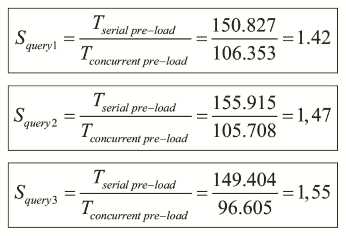
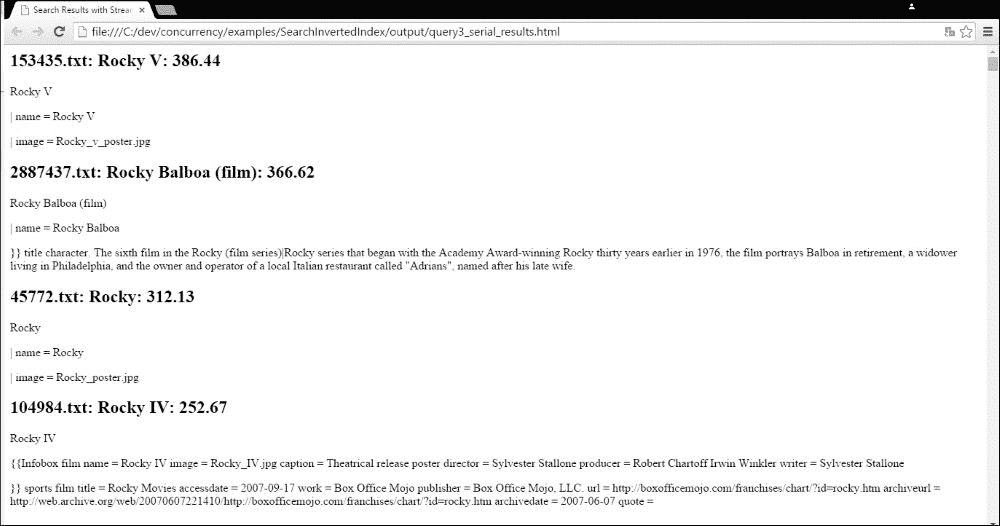

# 第 7 章，用并行流处理海量数据集——Map 和 Reduce 模型

毫无疑问，Java8 中引入的最重要的创新是**lambda**表达式和**流**API。流是可以顺序或并行方式处理的元素序列。我们可以应用中间操作转换流，然后执行最终计算以获得所需的结果（列表、数组、数字等）。在本章中，我们将介绍以下主题：

*   溪流导论
*   第一个示例–数字摘要应用程序
*   第二个示例–信息检索搜索工具

# 溪流简介

流是一个数据序列（它不是一个数据结构），允许您以顺序或并发的方式应用一系列操作来过滤、转换、排序、减少或组织这些元素以获得最终对象。例如，如果您有一个包含员工数据的流，则可以使用该流来：

*   计算员工总数
*   计算居住在特定地点的所有员工的平均工资
*   获取未达到目标的员工名单
*   暗示与全部或部分员工合作的任何操作

流受函数式编程的影响很大（Scala 编程语言提供了一种非常类似的机制），它们被认为可以与 lambda 表达式一起工作。流 API 类似于 C 语言中可用的**LINQ**（简称**语言集成查询**）查询，在某种程度上可以与 SQL 查询进行比较。

在下面的章节中，我们将解释流的基本特征以及您将在流中找到的部分。

## 河流的基本特征

水流的主要特征有：

*   流不存储其元素。流从其源中获取元素，并通过构成管道的所有操作发送它们。
*   您可以并行处理流，而无需任何额外工作。创建流时，可以使用`stream()`方法创建顺序流，也可以使用`parallelStream()`方法创建并发流。`BaseStream`接口定义了获取流的顺序版本的`sequential()`方法和获取流的并发版本的`parallel()`方法。您可以根据需要多次将顺序流转换为并行流，并将并行流转换为顺序流。考虑到当执行终端流操作时，所有流操作将根据最后的设置进行处理。不能指示流按顺序执行某些操作，同时执行其他操作。在内部，OracleJDK8 和 OpenJDK8 中的并行流使用 Fork/Join 框架的实现来执行并发操作。
*   流受函数式编程和 Scala 编程语言的影响很大。您可以使用新的 lambda 表达式来定义要在流上的操作中执行的算法。
*   流不能被重用。例如，从值列表中获取流时，只能使用该流一次。如果要对同一数据执行另一个操作，则必须再创建一个流。
*   流对数据进行延迟处理。他们在必要时才获得数据。正如您稍后将了解的，流有一个原点、一些中间操作和一个终端操作。在终端操作需要数据之前，数据不会被处理，因此流处理在终端操作执行之前不会开始。
*   您不能以其他方式访问流的元素。当您拥有一个数据结构时，您可以访问其中存储的一个确定的元素，例如，指示其位置或键。流操作通常统一处理元素，因此您唯一拥有的就是元素本身。您不知道元素在流中的位置和相邻元素。在并行流的情况下，可以按任何顺序处理元素。
*   流操作不允许您修改流源。例如，如果使用列表作为流源，则可以将处理结果存储到新列表中，但不能添加、删除或替换原始列表的元素。虽然这听起来有限制，但它是一个非常有用的功能，因为您可以返回从内部集合创建的流，而不用担心调用方会修改列表。

## 溪流的各个部分

流有三个不同的部分：

*   生成流消耗的数据的**源**。
*   零个或多个**中间操作**，生成另一个流作为输出。
*   一个生成对象的**终端操作**，对象可以是简单对象，也可以是数组、列表或哈希表等集合。也可能存在不产生任何显式结果的终端操作。

### 溪流的源头

流的源生成将由`Stream`对象处理的数据。您可以从不同的源创建流。例如，`Collection`接口包含 Java 8 中的`stream()`方法来生成顺序流和`parallelStream()`方法来生成并行流。这允许您生成一个流来处理 Java 中实现的几乎所有数据结构中的所有数据，如列表（`ArrayList`、`LinkedList`等）、集合（`HashSet`、`EnumSet`）或并发数据结构（`LinkedBlockingDeque`、`PriorityBlockingQueue`等）。另一种可以生成流的数据结构是数组。`Array`类包括`stream()`方法的四个版本，用于从数组生成流。如果您将一个`int`数字数组传递给该方法，它将生成`IntStream`。这是一种实现用于处理整数的特殊流（您仍然可以使用`Stream<Integer>`而不是`IntStream`，但性能可能会更差）。同样，您可以从`long[]`或`double[]`数组创建`LongStream`或`DoubleStream`。

当然，如果您将对象数组传递给`stream()`方法，您将获得相同类型的泛型流。在这种情况下，没有`parallelStream()`方法，但是一旦获得流，就可以调用`BaseStream`接口中定义的`parallel()`方法，将顺序流转换为并发流。

`Stream`API 提供的其他有趣功能是，您可以生成和流式处理目录或文件的内容。`Files`类提供了使用流处理文件的不同方法。例如，`find()`方法返回一个流，其中包含满足特定条件的文件树中文件的`Path`对象。`list()`方法返回包含目录内容的`Path`对象流。`walk()`方法返回`Path`对象流，使用深度优先算法处理目录树中的所有对象。但是最有趣的方法是`lines()`方法，它创建了一个带有文件行的`String`对象流，因此您可以使用流处理其内容。不幸的是，这里提到的所有方法并行性都很差，除非您有数千个元素（文件或行）。

另外，您可以使用`Stream`接口提供的两种方法`generate()`和`iterate()`创建流。`generate()`方法接收以对象类型作为参数的`Supplier`参数，并生成该类型对象的无限顺序流。`Supplier`接口采用`get()`方式。每次流需要一个新对象时，它都会调用此方法来获取流的下一个值。正如我们前面提到的，流以惰性的方式处理数据，因此流的无限性没有问题。您将使用其他方法以有限的方式转换该流。`iterate()`方法类似，但在本例中，该方法接收种子和`UnaryOperator`。第一个值是将`UnaryOperator`应用于种子的结果；第二个值是将`UnaryOperator`应用于第一个结果的结果，依此类推。由于并发应用程序的性能，应该尽可能避免使用这种方法。

还有更多的流源，如下所示：

*   `String.chars()`：返回一个包含`String`的`char`值的`IntStream`。
*   `Random.ints()`、`Random.doubles()`或`Random.longs()`：分别以伪随机值返回`IntStream`、`DoubleStream`和`LongStream`。可以指定随机数之间的数字范围，也可以指定要获取的数字或随机值。例如，您可以使用`new Random.ints(10,20)`生成 10 到 20 之间的伪随机数。
*   `SplittableRandom`类：该类提供与`Random`类相同的方法生成伪随机`int`、`double`和`long`值，但更适合并行处理。您可以查看 JavaAPI 文档以获得此类的详细信息。
*   `Stream.concat()`方法：接收两个流作为参数，创建一个新流，第一个流的元素后跟第二个流的元素。

您可以从其他来源生成流，但我们认为它们并不重要。

### 中间操作

中间操作最重要的特征是返回另一个流作为结果。输入和输出流的对象可以是不同的类型，但中间操作始终会生成新的流。一个流中可以有零个或多个中间操作。`Stream`接口提供的最重要的中间操作有：

*   `distinct()`：此方法返回具有唯一值的流。所有重复的元素都将被消除
*   `filter()`：此方法返回一个包含满足特定条件的元素的流
*   `flatMap()`：此方法用于将单个流中的流（例如列表、集合流等）转换为一个流
*   `limit()`：此方法返回一个流，该流最多包含从第一个元素开始的相遇顺序中指定数量的原始元素
*   `map()`：此方法用于将一种类型的流元素转换为另一种类型
*   `peek()`：此方法返回相同的流，但执行一些代码；通常，它用于写入日志消息
*   `skip()`：此方法忽略流的第一个元素（具体编号作为参数传递）
*   `sorted()`：此方法对流的元素进行排序

### 终端操作

终端操作返回一个对象作为结果。它从不返回流。通常，所有流都将以终端操作结束，该操作返回所有操作序列的最终结果。最重要的终端操作包括：

*   `collect()`：该方法提供了一种减少源流元素数量的方法，将流的元素组织在数据结构中。例如，您希望根据任何条件对流的元素进行分组。
*   `count()`：返回流的元素数。
*   `max()`：返回流的最大元素。
*   `min()`：返回流的最小元素。
*   `reduce()`：此方法将流的元素转换为表示流的唯一对象。
*   `forEach()`/`forEachOrdered()`：此方法将动作应用于流中的每个元素。如果流具有定义的顺序，则第二种方法使用流元素的顺序。
*   `findFirst()`/`findAny()`：分别返回`1`或流的第一个元素（如果存在）。
*   `anyMatch()`/`allMatch()`/`noneMatch()`：它们接收一个谓词作为参数，并返回一个布尔值，以指示流中是否有、全部或无元素与谓词匹配。
*   `toArray()`：此方法返回包含流元素的数组。

## MapReduce 与 MapCollect

MapReduce 是一种编程模型，用于在分布式环境中处理非常大的数据集，其中许多机器在集群中工作。它有两个步骤，通常通过两种方法实现：

*   **映射**：对数据进行过滤和转换
*   **减少**：对数据进行汇总操作

要在分布式环境中执行此操作，我们必须拆分数据，然后在集群的机器上进行分发。这种编程模型在函数式编程领域已经使用了很长时间。谷歌最近开发了一个基于这一原理的框架，在 Apache 基金会 To.T1 中，ToadT2Hadoop MyT3 项目作为这个模型的开源实现非常流行。

Java8 和 streams 允许程序员实现类似的东西。`Stream`接口定义了可视为 map 函数的中间操作（`map()`、`filter()`、`sorted()`、`skip()`等），并提供了作为终端操作的`reduce()`方法，其主要目的是将流元素的缩减作为 MapReduce 模型的缩减。

`reduce`操作的主要思想是基于先前的中间结果和流元素创建新的中间结果。另一种归约方式（也称为可变归约）是将新的结果项合并到可变容器中（例如，将其添加到`ArrayList`中）。这种还原是通过`collect()`操作进行的，我们将其命名为**MapCollect**模型。

我们将在本章中了解如何使用 MapReduce 模型，以及如何在[第 8 章](08.html#1GKCM1-2fff3d3b99304faa8fa9b27f1b5053ba "Chapter 8. Processing Massive Datasets with Parallel Streams – The Map and Collect Model")中使用 MapCollect 模型，*使用并行流处理海量数据集–Map and Collect 模型*。

# 第一个例子——数值总结应用

当你有一个大数据集时，最常见的需求之一就是处理它的元素来测量某些特征。例如，如果您有一套在商店购买的产品，您可以计算您销售的产品数量、您销售的每种产品的单位数量，或者每个客户在这套产品上的平均花费。我们将该过程命名为**数值总结**。

在本章中，我们将使用 streams 获取**UCI 机器学习库**的**银行营销**数据集的一些度量，您可以从[下载 http://archive.ics.uci.edu/ml/datasets/Bank+营销](http://archive.ics.uci.edu/ml/datasets/Bank+Marketing)。具体来说，我们使用了`bank-additional-full.csv`文件。此数据集存储有关葡萄牙银行机构营销活动的信息。

与其他章节不同，在本例中，我们将解释使用流的并发版本，然后解释如何实现一个串行等效版本，以验证并发性也可以提高流的性能。考虑到并发对于程序员来说是透明的，正如我们在本章的引言中提到的。

## 并发版本

我们的数值总结应用程序非常简单。它具有以下组件：

*   `Record`：此类定义了文件中每条记录的内部结构。它定义了每个记录的 21 个属性以及相应的`get()`和`set()`方法来建立它们的值。它的代码非常简单，因此不会包含在本书中。
*   `ConcurrentDataLoader`：此类将加载`bank-additional-full.csv`文件中的数据，并将其转换为`Record`对象列表。我们将使用流来加载数据并进行转换。
*   `ConcurrentStatistics`：此类实现我们将用于对数据进行计算的操作。
*   `ConcurrentMain`：此类实现`main()`方法调用`ConcurrentStatistics`类的操作并测量其执行时间。

让我们详细描述最后三个类。

### ConcurrentDataLoader 类

`ConcurrentDataLoader`类实现了`load()`方法，该方法使用银行营销数据集加载文件，并将其转换为`Record`对象列表。首先，我们使用`Files`方法中的`readAllLines()`方法加载文件并将其内容转换为`String`对象列表。文件的每一行都将转换为列表的一个元素：

```java
public class ConcurrentDataLoader {

    public static List<Record> load(Path path) throws IOException {
        System.out.println("Loading data");

        List<String> lines = Files.readAllLines(path);
```

然后，我们对流应用必要的操作，以获得`Record`对象的列表：

```java
        List<Record> records = lines
                .parallelStream()
                .skip(1)
                .map(l -> l.split(";"))
                .map(t -> new Record(t))
                .collect(Collectors.toList());
```

我们使用的操作是：

*   `parallelStream()`：我们创建一个并行流来处理文件的所有行。
*   `skip(1)`：忽略流的第一项；在本例中，是文件的第一行，其中包含文件的标题。
*   `map (l → l.split(";"))`：我们转换`String[]`数组中的每个字符串，将该行除以`;`字符。我们使用 lambda 表达式，`l`表示输入参数，`l.split()`将生成字符串数组。我们在字符串流中调用此方法，它将生成一个`String[]`流。
*   `map(t → new Record(t))`：我们使用`Record`类的构造函数转换`Record`对象中的每个字符串数组。我们使用 lambda 表达式，`t`表示字符串数组。我们在`String[]`流中调用此方法，并生成`Record`对象流。
*   `collect(Collectors.toList())`：此方法将流转换为列表。我们将在[第 8 章](08.html#1GKCM1-2fff3d3b99304faa8fa9b27f1b5053ba "Chapter 8. Processing Massive Datasets with Parallel Streams – The Map and Collect Model")中更详细地使用`collect`方法，*使用并行流处理海量数据集–地图和采集模型*。

正如您所看到的，我们以紧凑、优雅和并发的方式进行了转换，而不使用任何线程、任务或框架。最后，我们返回`Record`对象列表，如下所示：

```java
        return records;
    }
}
```

### ConcurrentStatistics 类

`ConcurrentStatistics`类实现了对数据进行演算的方法。我们有七种不同的操作来获取关于数据集的信息。让我们描述一下它们中的每一个。

#### 来自订阅者的职务信息

此方法的主要目的是获取已申请银行存款（字段申请等于`yes`的人的每种工作类型（字段工作）的人数。

这是此方法的源代码：

```java
public class ConcurrentStatistics {

    public static void jobDataFromSubscribers(List<Record> records) {
        System.out.println ("****************************************");
        System.out.println("Job info for Deposit subscribers");

        ConcurrentMap<String, List<Record>> map = records.parallelStream()
                .filter(r -> r.getSubscribe().equals("yes"))
                .collect(Collectors.groupingByConcurrent (Record::getJob));

        map.forEach((k, l) -> System.out.println(k + ": " + l.size()));

        System.out.println ("****************************************");
    }
```

该方法接收`Record`对象列表作为输入参数。首先，我们使用一个流来获取一个`ConcurrentMap<String, List<Record>>`对象，其中有不同的作业类型，列表中包含每个作业类型的记录。此流以创建并行流的`parallelStream()`方法开始。然后，我们使用`filter()`方法选择订阅属性为`yes`的`Record`对象。最后，我们使用`collect()`方法传递`Collectors.groupingByConcurrent()`方法，根据作业属性的值对流的实际元素进行分组。考虑到`groupingByConcurrent()`方法是无序收集器。收集到列表中的记录可以是任意顺序，而不是原始顺序（与简单的`groupingBy()`收集器不同）。

一旦我们有了`ConcurrentMap`对象，我们就使用`forEach()`方法在屏幕上写入信息。

#### 来自订户的年龄数据

此方法的主要目的是从银行存款订户的年龄中获取统计信息（最大值、最小值和平均值）（字段 subscribe 等于`yes`。

这是该方法的源代码：

```java
    public static void ageDataFromSubscribers(List<Record> records) {

        System.out.println ("****************************************");
        System.out.println("Age info for Deposit subscribers");

        DoubleSummaryStatistics statistics = records.parallelStream()
                .filter(r -> r.getSubscribe().equals("yes"))
                .collect(Collectors.summarizingDouble (Record::getAge));

        System.out.println("Min: " + statistics.getMin());
        System.out.println("Max: " + statistics.getMax());
        System.out.println("Average: " + statistics.getAverage());
        System.out.println ("****************************************");
    }
```

该方法接收`Record`对象列表作为输入参数，并使用流获取包含统计信息的`DoubleSummaryStatistics`对象。首先，我们使用`parallelStream()`方法获得一个并行流。然后，我们使用`filter()`方法获取银行存款的订户。最后，我们使用带有`Collectors.summarizingDouble()`参数的`collect()`方法来获得`DoubleSummaryStatistics`对象。此类实现`DoubleConsumer`接口，并收集在`accept()`方法中接收到的值的统计数据。流的`collect()`方法在内部调用此`accept()`方法。Java 还提供了`IntSummaryStatistics`和`LongSummaryStatistics`类，用于从`int`和`long`值中获取统计数据。在这种情况下，我们使用`max()`、`min()`和`average()`方法分别获得的最大值、最小值和平均值。

#### 来自订户的婚姻数据

此方法的主要目的是获取银行存款订户的不同婚姻状况（字段婚姻）（字段订阅等于`yes`。

这是该方法的源代码：

```java
    public static void maritalDataFromSubscribers(List<Record> records) {

        System.out.println ("****************************************");
        System.out.println("Marital info for Deposit subscribers");

        records.parallelStream()
                .filter(r -> r.getSubscribe().equals("yes"))
                .map(r -> r.getMarital())
                .distinct()
                .sorted()
                .forEachOrdered(System.out::println);
        System.out.println ("****************************************");
    }
```

该方法接收`Record`对象列表作为输入参数，并使用`parallelStream()`方法获得并行流。然后，我们使用`filter()`方法仅获取银行存款的订户。然后，我们使用`map()`方法获得一个包含所有订户婚姻状况的`String`对象流。使用`distinct()`方法，我们只取唯一的值，使用`sorted()`方法，我们按字母顺序对这些值进行排序。最后，我们使用`forEachOrdered()`打印结果。注意不要在这里使用`forEach()`，因为它不会按特定顺序打印结果，这会使`sorted()`步骤无效。当元素顺序不重要时，`forEach()`操作很有用，对于并行流，`forEachOrdered()`的工作速度可能快得多。

#### 来自非认购者的活动数据

当我们使用流时，最常见的错误之一是试图重用流。我们将使用此方法向您展示此错误的后果，其主要目标是获得最大联系人数（属性活动）。

该方法的第一个版本是尝试重用流。这是它的源代码：

```java
    public static void campaignDataFromNonSubscribersBad (List<Record> records) {

        System.out.println ("****************************************");
        System.out.println("Number of contacts for Non Subscriber");

        IntStream stream = records.parallelStream()
                .filter(Record::isNotSubscriber)
                .mapToInt(r -> r.getCampaign());

        System.out
                .println("Max number of contacts: " + stream.max().getAsInt());
        System.out
                .println("Min number of contacts: " + stream.min().getAsInt());
        System.out.println ("****************************************");
    }
```

方法接收`Record`对象列表作为输入参数。首先，我们使用 T1 创建一个对象。通过`parallelStream()`方法，我们创建了一个并行流。然后，我们使用`filter()`方法获得非订户，并使用`mapToInt()`方法转换`IntStream`对象中的`Record`对象流，用`getCampaign()` 方法的值替换每个对象。

我们尝试使用该流通过`max()`方法获得最大值，通过`min()`方法获得最小值。如果我们执行这个方法，我们将在第二次调用中获得带有消息**的`IllegalStateException`，该流已经被操作或关闭**。

我们可以通过创建两个不同的流来解决这个问题，一个获得最大值，另一个获得最小值。这是此选项的源代码：

```java
    public static void campaignDataFromNonSubscribersOk (List<Record> records) {

        System.out.println ("****************************************");
        System.out.println("Number of contacts for Non Subscriber");
        int value = records.parallelStream()
                .filter(Record::isNotSubscriber)
                .map(r -> r.getCampaign())
                .mapToInt(Integer::intValue)
                .max()
                .getAsInt();

        System.out.println("Max number of contacts: " + value);

        value = records.parallelStream()
                .filter(Record::isNotSubscriber)
                .map(r -> r.getCampaign())
                .mapToInt(Integer::intValue)
                .min()
                .getAsInt();

        System.out.println("Min number of contacts: " + value);
        System.out.println ("****************************************");
    }
```

另一个选项是使用`summaryStatistics()`方法获得`IntSummaryStatistics`对象，如我们在前面的方法中所示。

#### 多重数据过滤器

该方法的主要目的是获取最多满足以下条件之一的记录数：

*   `defaultCredit`属性取值`true`
*   `housing`属性取值`false`
*   `loan`属性取值`false`

实现此方法的一个解决方案是实现一个过滤器，用于检查元素是否满足这些条件之一。您可以使用`Stream`接口提供的`concat()`方法实现其他解决方案。这是源代码：

```java
    public static void multipleFilterData(List<Record> records) {

        System.out.println ("****************************************");
        System.out.println("Multiple filter");

        Stream<Record> stream1 = records.parallelStream()
                .filter(Record::isDefaultCredit);
        Stream<Record> stream2 = records.parallelStream()
                .filter(r -> !(r.isHousing()));
        Stream<Record> stream3 = records.parallelStream()
                .filter(r -> !(r.isLoan()));

        Stream<Record> complete = Stream.concat(stream1, stream2);
        complete = Stream.concat(complete, stream3);

        long value = complete.parallel().unordered().distinct().count();

        System.out.println("Number of people: " + value);
        System.out.println ("****************************************");
    }
```

此方法接收`Record`对象列表作为输入参数。首先，我们用满足每个条件的元素创建三个流，然后使用`concat()`方法生成单个流。`concat()`方法仅创建一个流，其中第一个流的元素后跟第二个流的元素。因此，对于最终流，我们使用`parallel()`方法对最终流进行一次并行转换，`unordered()`方法获得无序流，这将使我们在`distinct()`方法中的并行流和`distinct()`方法中获得更好的性能，以及`count()`方法方法获取流中的元素数。

这不是最理想的解决方案。我们已经用它向您展示了`concat()`和`distinct()`方法是如何工作的。您可以使用以下代码以更优化的方式实现

```java
    public static void multipleFilterDataPredicate (List<Record> records) {

        System.out.println ("****************************************");
        System.out.println("Multiple filter with Predicate");

        Predicate<Record> p1 = r -> r.isDefaultCredit();
        Predicate<Record> p2 = r -> !r.isHousing();
        Predicate<Record> p3 = r -> !r.isLoan();

        Predicate<Record> pred = Stream.of(p1, p2, p3)
                    .reduce(Predicate::or).get();

        long value = records.parallelStream().filter(pred).count();

        System.out.println("Number of people: " + value);
        System.out.println ("****************************************");
    }
```

我们创建了一个由三个谓词组成的流，并通过`Predicate::or`操作对它们进行缩减，以创建复合谓词，当输入谓词中的任何一个为`true`时，复合谓词为`true`。您还可以使用`Predicate::and`归约操作创建一个谓词，当所有输入谓词都是`true`时，该谓词就是`true`。

#### 来自非订户的持续时间数据

此方法的主要目的是为最终没有订阅银行存款的人（字段 subscribe 等于`no`）获取 10 个最长电话（持续时间属性）。

这是此方法的源代码：

```java
    public static void durationDataForNonSubscribers(List<Record> records) {

        System.out.println ("****************************************");
        System.out.println("Duration data for non subscribers");
        records.parallelStream().filter(r -> r.isNotSubscriber()) .sorted(Comparator.comparingInt (Record::getDuration) .reversed()).limit(10) .forEachOrdered(
            r -> System.out.println("Education: " + r.getEducation() + "; Duration: " + r.getDuration()));
        System.out.println ("****************************************");
    }
```

该方法接收`Record`对象列表作为输入参数，并使用`parallelStream()`方法获得并行流。我们使用`filter()`方法获得非订户。然后，我们使用`sorted()`方法并传递一个比较器。比较器是使用`Comparator.comparingInt()`静态方法创建的。由于我们需要按相反的顺序排序（首先是最大持续时间），我们只需将`reversed()`方法添加到所创建的比较器中。`sorted()`方法使用该比较器对流中的元素进行比较和排序，因此我们可以获得我们想要的排序元素。

元素排序后，我们使用`limit()`方法获得前 10 个结果，并使用`forEachOrdered()`方法打印结果。

#### 25-50 岁人群

此方法的主要目的是获取文件中年龄在 25 到 50 岁之间的人数。

这是此文件的源代码：

```java
    public static void peopleBetween25and50(List<Record> records) {

        System.out.println ("****************************************");
        System.out.println("People between 25 and 50");
        int count=records.parallelStream() .map(r -> r.getAge()) .filter(a -> (a >=25 ) && (a <=50)) .mapToInt(a -> 1) .reduce(0, Integer::sum);
        System.out.println("People between 25 and 50: "+count);
        System.out.println ("****************************************");
    }
```

该方法接收`Record`对象列表作为输入参数，并使用`parallelStream()`方法获得并行流。然后，我们使用`map()`方法将`Record`对象的流转换为`int`值流，用每个对象的年龄属性值替换每个对象。然后，我们使用`filter()`方法仅选择 25 岁和 50 岁的人群，再次使用`map()`方法将每个值转换为`1`。最后，我们使用`reduce()`方法将所有这些 1 相加，得到 25 到 50 之间的总人数。`reduce()`方法的第一个参数是标识值，第二个参数是用于从流的所有元素中获取单个值的操作。在本例中，我们使用`Integer::sum`操作。第一个和在流的初始值和第一个值之间，第二个和在流的第一个和的结果和第二个值之间，依此类推。

### ConcurrentMain 类

`ConcurrentMain`类实现了`main()`方法来测试`ConcurrentStatistic`类。首先，我们实现了测量任务的执行时间的`measure()`方法：

```java
public class ConcurrentMain {
    static Map<String, List<Double>> totalTimes = new LinkedHashMap<>();
    static List<Record> records;

    private static void measure(String name, Runnable r) {
        long start = System.nanoTime();
        r.run();
        long end = System.nanoTime();
        totalTimes.computeIfAbsent(name, k -> new ArrayList<>()).add((end - start) / 1_000_000.0);
    }
```

我们使用一个映射来存储每个方法的所有执行时间。我们将对每个方法执行 10 次，以查看第一次执行后执行时间如何减少。然后，我们包括`main()`方法代码。它使用`measure()`方法测量每个方法的执行时间，并重复此过程 10 次：

```java
    public static void main(String[] args) throws IOException {
        Path path = Paths.get("data\\bank-additional-full.csv");

        for (int i = 0; i < 10; i++) {
            records = ConcurrentDataLoader.load(path);
            measure("Job Info", () -> ConcurrentStatistics.jobDataFromSubscribers (records));
            measure("Age Info", () -> ConcurrentStatistics.ageDataFromSubscribers (records));
            measure("Marital Info", () -> ConcurrentStatistics.maritalDataFromSubscribers (records));
            measure("Multiple Filter", () -> ConcurrentStatistics.multipleFilterData(records));
            measure("Multiple Filter Predicate", () -> ConcurrentStatistics.multipleFilterDataPredicate (records));
            measure("Duration Data", () -> ConcurrentStatistics.durationDataForNonSubscribers (records));
            measure("Number of Contacts Bad: ", () -> ConcurrentStatistics .campaignDataFromNonSubscribersBad(records));
            measure("Number of Contacts", () -> ConcurrentStatistics .campaignDataFromNonSubscribersOk(records));
            measure("People Between 25 and 50", () -> ConcurrentStatistics.peopleBetween25and50(records));
        }
```

最后，我们在控制台中写入所有执行时间和平均执行时间，如下所示：

```java
                times.stream().map(t -> String.format("%6.2f", t)).collect(Collectors.joining(" ")), times .stream().mapToDouble (Double::doubleValue).average().getAsDouble()));
    }
}
```

## 序列版本

在本案例中，串行版本几乎等于并发版本。我们仅将对`parallelStream()`方法的所有调用替换为对`stream()`方法的调用，以获得顺序流，而不是并行流。我们还必须删除对其中一个示例中使用的`parallel()`方法的调用，并将对`groupingByConcurrent()`方法的调用更改为`groupingBy()`。

## 比较两个版本

我们已经执行了两个版本的操作，以测试并行流的使用是否为我们提供了更好的性能。我们已经使用 JMH 框架（[执行了它们 http://openjdk.java.net/projects/code-tools/jmh/](http://openjdk.java.net/projects/code-tools/jmh/) 允许您在 Java 中实现微基准测试。使用基准测试框架是一个更好的解决方案，它可以使用`currentTimeMillis()`或`nanoTime()`等方法简单地测量时间。我们已经在一台四核处理器的计算机上执行了 10 次，并计算了这 10 次的中间执行时间。考虑到我们已经实现了一个特殊的类来执行 JMH 测试。您可以在源代码的`com.javferna.packtpub.mastering.numericalSummarization.benchmark`包中找到这些类。以下是以毫秒为单位的结果：

<colgroup class="calibre19"><col class="calibre20"> <col class="calibre20"> <col class="calibre20"></colgroup> 
| 

活动

 | 

连续流

 | 

平行流

 |
| --- | --- | --- |
| 作业信息 | 13.704 | 9.550 |
| 年龄信息 | 7.218 | 5.512 |
| 婚姻信息 | 8.551 | 6.783 |
| 多重滤波器 | 27.002 | 23.668 |
| 带谓词的多重过滤器 | 9.413 | 6.963 |
| 持续时间数据 | 41.762 | 23.641 |
| 联系人数 | 22.148 | 13.059 |
| 25 岁到 50 岁之间的人 | 9.102 | 6.014 |

我们可以看到并行流如何总是比串行流获得更好的性能。这是所有示例的加速：

<colgroup class="calibre19"><col class="calibre20"> <col class="calibre20"></colgroup> 
| 

活动

 | 

加速

 |
| --- | --- |
| 作业信息 | 1.30 |
| 年龄信息 | 1.25 |
| 婚姻信息 | 1.16 |
| 多重滤波器 | 1.08 |
| 持续时间数据 | 1.51 |
| 联系人数 | 1.64 |
| 25 岁到 50 岁之间的人 | 1.37 |

# 第二个例子——信息检索搜索工具

根据维基百科（[https://en.wikipedia.org/wiki/Information_retrieval](https://en.wikipedia.org/wiki/Information_retrieval) 、**信息检索**为：

> “从信息资源集合中获取与信息需求相关的信息资源的活动。”

通常情况下，信息资源是一组文档，信息需求是一组词，概括了我们的需求。为了快速搜索文档集合，我们使用了名为**反向索引**的数据结构。它存储文档集合中的所有单词，并为每个单词存储包含该单词的文档列表。在[第 4 章](04.html#VF2I1-2fff3d3b99304faa8fa9b27f1b5053ba "Chapter 4. Getting Data from the Tasks – The Callable and Future Interfaces")中*从任务获取数据–可调用和未来接口*中，您构建了一个文档集合的反向索引，该文档集合由包含电影信息的 Wikipedia 页面构建，以构建一组 100673 个文档。我们已将每个维基百科页面转换为文本文件。该反向索引存储在一个文本文件中，其中每一行都包含单词、其文档频率，以及该单词出现在文档中的所有文档中，文档中的单词具有`tfxidf`属性。文档按照`tfxidf`属性的值进行排序。例如，文件的一行如下所示：

```java
velankanni:4,18005302.txt:10.13,20681361.txt:10.13,45672176.txt:10 .13,6592085.txt:10.13
```

此行包含 DF 为`4`的`velankanni`单词。它出现在`18005302.txt`文档中，其`tfxidf`值为`10.13`；出现在`20681361.txt`文档中，其`tfxidf`值为`10.13`；出现在`45672176.txt`文档中，其`tfxidf`值为`10.13`；出现在`6592085.txt`文档中，其`tfxidf`值为`10.13`。

在本章中，我们将使用流 API 实现不同版本的搜索工具，并获取有关反向索引的信息。

## 还原操作介绍

正如我们在本章前面提到的，操作将摘要操作应用于流的元素，以生成单个摘要结果。此单一结果的类型可以与其他类型的流元素的类型相同。`reduce`运算的一个简单示例是计算一系列数字的总和。

流 API 提供了`reduce()`方法来实现缩减操作。此方法有以下三个不同版本：

*   `reduce(accumulator)`：此版本将`accumulator`功能应用于流的所有元素。在这种情况下没有初始值。它返回一个带有`accumulator`函数最终结果的`Optional`对象，如果流为空，则返回一个空`Optional`对象。此`accumulator`功能必须是`associative`功能。它实现了`BinaryOperator`接口。这两个参数可以是流元素，也可以是先前累加器调用返回的部分结果。
*   `reduce(identity, accumulator)`：当最终结果与流的元素类型相同时，必须使用此版本。标识值必须是`accumulator`函数的标识值。也就是说，如果您对标识值和任何值`V`应用`accumulator`函数，它必须返回相同的值`V: accumulator(identity,V)=V`。该标识值用作累加器函数的第一个结果，如果流没有元素，则该标识值是返回值。与其他版本一样，累加器必须是实现`BinaryOperator`接口的`associative`功能。
*   `reduce(identity, accumulator, combiner)`：当最终结果与流元素的类型不同时，必须使用此版本。标识值必须是`combiner`函数的标识，即`combiner(identity,v)=v`。`combiner`功能必须与`accumulator`功能兼容，即`combiner(u,accumulator(identity,v))=accumulator(u,v)`。【部分 T6】取两个结果，部分 T6 取另一个结果。这两个函数必须是关联的，但在这种情况下，`accumulator`函数是`BiFunction`接口的实现，`combiner`函数是`BinaryOperator`接口的实现。

`reduce()`方法有局限性。正如我们前面提到的，它必须返回一个值。您不应该使用`reduce()`方法生成集合或复杂对象。第一个问题是性能。正如流 API 的文档所指定的，`accumulator`函数每次处理元素时都返回一个新值。如果您的`accumulator`函数处理集合，则每次处理元素时都会创建一个新集合，这是非常低效的。另一个问题是，如果使用并行流，所有线程都将共享标识值。如果该值是可变对象，例如集合，则所有线程都将在同一集合上工作。这不符合`reduce()`操作原理。此外，`combiner()`方法将始终接收两个相同的集合（所有线程仅在一个集合上工作），这也不符合`reduce()`操作的原理。

如果要进行生成集合或复杂对象的缩减，可以使用以下两个选项：

*   使用`collect()`方法应用可变还原。[第 8 章](08.html#1GKCM1-2fff3d3b99304faa8fa9b27f1b5053ba "Chapter 8. Processing Massive Datasets with Parallel Streams – The Map and Collect Model")*处理具有并行流的海量数据集–地图和采集模型*，详细说明了如何在不同情况下使用此方法。
*   创建集合并使用`forEach()`方法用所需的值填充集合。

在本例中，我们将使用`reduce()`方法获取反向索引的信息，并使用`forEach()`方法将索引缩减到相关文档列表中进行查询。

## 第一种方式-全文档查询

在我们的第一种方法中，我们将使用与一个单词相关的所有文档。我们的搜索过程的实施步骤如下：

1.  我们在倒排索引中选择与查询词对应的行。
2.  我们将所有文档列表分组到一个列表中。如果一个文档与两个或多个不同的单词相关联，我们将文档中这些单词的`tfxidf`值相加，以获得文档的最终`tfxidf`值。如果文档仅与一个单词关联，则该单词的`tfxidf`值将是该文档的最终`tfxidf`值。
3.  我们使用其`tfxidf`值从高到低对文档进行排序。
4.  我们向用户显示了 100 个具有更高值`tfxidf`的文档。

我们已经在`ConcurrentSearch`类的`basicSearch()`方法中实现了这个版本。这是该方法的源代码：

```java
        public static void basicSearch(String query[]) throws IOException {

        Path path = Paths.get("index", "invertedIndex.txt");
        HashSet<String> set = new HashSet<>(Arrays.asList(query));
        QueryResult results = new QueryResult(new ConcurrentHashMap<>());

        try (Stream<String> invertedIndex = Files.lines(path)) {

            invertedIndex.parallel() .filter(line -> set.contains(Utils.getWord(line))) .flatMap(ConcurrentSearch::basicMapper) .forEach(results::append);

            results .getAsList() .stream() .sorted() .limit(100) .forEach(System.out::println);

            System.out.println("Basic Search Ok");
        }

    }
```

我们收到一个字符串对象数组，其中包含查询的单词。首先，我们将该数组转换为一个集合。然后，我们使用*try with resources*流和`invertedIndex.txt`文件的行，该文件包含反向索引。我们使用*尝试资源*，因此不必担心打开或关闭文件。流的聚合操作将生成一个包含相关文档的`QueryResult`对象。我们使用以下方法获得该列表：

*   `parallel()`：首先，我们获得一个并行流，以提高搜索过程的性能。
*   `filter()`：我们选择集合中的单词与查询中的单词关联的行。`Utils.getWord()`方法获取该行的单词。
*   `flatMap()`：我们转换字符串流，其中每个字符串是`Token`对象流中的一行反向索引。每个标记都包含文件中一个单词的`tfxidf`值。对于每一行，我们将生成与包含该单词的文件一样多的标记。
*   `forEach()`：我们使用该类的`add()`方法生成`QueryResult`对象，添加每个令牌。

一旦我们创建了`QueryResult`对象，我们创建其他流，使用以下方法获得最终结果列表：

*   `getAsList()`：`QueryResult`对象返回一个包含相关文档的列表
*   `stream()`：创建一个流来处理列表
*   `sorted()`：按`tfxidf`值对单据列表进行排序
*   `limit()`：获得前 100 个结果
*   `forEach()`：对 100 条结果进行处理，并将信息写入屏幕

让我们描述一下示例中使用的辅助类和方法。

### basicMapper（）方法

此方法将字符串流转换为`Token`对象流。正如我们将在后面详细描述的，令牌在文档中存储单词的`tfxidf`值。此方法接收带有一行倒排索引的字符串。它将行拆分为标记，并生成与包含单词的文档一样多的`Token`对象。此方法在`ConcurrentSearch`类中实现。这是源代码：

```java
    public static Stream<Token> basicMapper(String input) {
        ConcurrentLinkedDeque<Token> list = new ConcurrentLinkedDeque();
        String word = Utils.getWord(input);
        Arrays .stream(input.split(","))
          .skip(1) .parallel() .forEach(token -> list.add(new Token(word, token)));

        return list.stream();
    }
```

首先，我们创建一个`ConcurrentLinkedDeque`对象来存储`Token`对象。然后，我们使用`split()`方法拆分字符串，并使用`Arrays`类的`stream()`方法生成流。跳过第一个元素（其中包含单词的信息）并并行处理其余的标记。对于每个元素，我们创建一个新的`Token`对象（我们将具有`file:tfxidf`格式的单词和标记传递给构造函数），并将其添加到流中。最后，我们使用`ConcurrenLinkedDeque`对象的`stream()`方法返回一个流。

### 代币类

正如我们前面提到的，类在文档中存储单词的`tfxidf`值。因此，它有三个属性来存储此信息，如下所示：

```java
public class Token {

    private final String word;
    private final double tfxidf;
    private final String file;
```

构造函数接收两个字符串。第一个包含单词，第二个包含文件和`file:tfxidf`格式的`tfxidf`属性，因此我们必须按如下方式处理：

```java
    public Token(String word, String token) {
        this.word=word;
        String[] parts=token.split(":");
        this.file=parts[0];
        this.tfxidf=Double.parseDouble(parts[1]);
    }
```

最后，我们添加了获取（而不是设置）三个属性的值以及将对象转换为字符串的方法，如下所示：

```java
    @Override
    public String toString() {
        return word+":"+file+":"+tfxidf;
    }
```

### QueryResult 类

此类存储与查询相关的文档列表。在内部，它使用一个映射来存储相关文档的信息。键是存储文档的文件名，值是一个`Document`对象，该对象还包含文件名和该文档到查询的总`tfxidf`值，如下所示：

```java
public class QueryResult {

    private Map<String, Document> results;
```

我们使用类的构造函数来表示我们将使用的`Map`接口的具体实现。我们在并发版本中使用`ConcurrentHashMap`，在串行版本中使用`HashMap`：

```java
    public QueryResult(Map<String, Document> results) {
        this.results=results;
    }
```

该类包括在映射中插入令牌的`append`方法，如下所示：

```java
    public void append(Token token) {
        results.computeIfAbsent(token.getFile(), s -> new Document(s)).addTfxidf(token.getTfxidf());
    }
```

如果没有与文件关联的`Document`对象，我们使用`computeIfAbsent()`方法创建一个新的`Document`对象；如果已经存在，我们使用`addTfxidf()`方法获取相应的`Document`对象，并使用`addTfxidf()`方法将令牌的`tfxidf`值添加到文档的`tfxidf`总值中。

最后，我们提供了一种获取地图列表的方法，如下所示：

```java
    public List<Document> getAsList() {
        return new ArrayList<>(results.values());
    }
```

`Document`类将文件名存储为字符串，总`tfxidf`值存储为`DoubleAdder`。这个类是 Java8 的一个新特性，它允许我们对来自不同线程的变量求和，而不必担心同步问题。实现了`Comparable`接口，按照`tfxidf`值对单据进行排序，所以`tfxidf`最大的单据优先。它的源代码非常简单，所以不包括在内。

## 第二种方法——简化文档查询

第一种方法为每个单词和文件创建一个新的`Token`对象。我们已经注意到，常用词，例如，`the`，包含大量相关文档，并且其中许多具有较低的`tfxidf`值。我们已经改变了 mapper 方法，每个单词只考虑 100 个文件，因此生成的`Token`对象的数量将更小。

我们已经在`ConcurrentSearch`类的`reducedSearch()`方法中实现了这个版本。此方法与`basicSearch()`方法非常相似。它仅更改生成`QueryResult`对象的流操作，如下所示：

```java
        invertedIndex.parallel() .filter(line -> set.contains(Utils.getWord(line))) .flatMap(ConcurrentSearch::limitedMapper) .forEach(results::append);
```

现在，我们使用`limitedMapper()`方法作为`flatMap()`方法中的函数。

### limitedMapper（）方法

这个方法类似于`basicMapper()`方法，但是，正如我们前面提到的，我们只考虑与每个单词相关的前 100 个文档。由于文档是按其`tfxidf`值排序的，因此我们使用了 100 个文档，其中单词更为重要，如下所示：

```java
    public static Stream<Token> limitedMapper(String input) {
        ConcurrentLinkedDeque<Token> list = new ConcurrentLinkedDeque();
        String word = Utils.getWord(input);

        Arrays.stream(input.split(",")) .skip(1) .limit(100) .parallel() .forEach(token -> {
            list.add(new Token(word, token));
          });

        return list.stream();
    }
```

与`basicMapper()`方法唯一不同的是`limit(100)`调用，它获取流的前 100 个元素。

## 第三种方法-生成带有结果的 HTML 文件

当使用网络搜索引擎（例如谷歌）使用搜索工具时，当您进行搜索时，它会返回您的搜索结果（最重要的 10 个）以及每个结果的文档标题和您搜索的单词所在的文档片段。

搜索工具的第三种方法基于第二种方法，但通过添加第三个流来生成包含搜索结果的 HTML 文件。对于每个结果，我们将显示文档的标题和三行，其中一行是查询中引入的单词。要实现这一点，您需要访问倒排索引中显示的文件。我们已将其存储在名为`docs`的文件夹中。

第三种方法在`ConcurrentSearch`类的`htmlSearch()`方法中实现。构建具有 100 个结果的`QueryResult`对象的方法的第一部分与`reducedSearch()`方法相同，如下所示：

```java
    public static void htmlSearch(String query[], String fileName) throws IOException {
        Path path = Paths.get("index", "invertedIndex.txt");
        HashSet<String> set = new HashSet<>(Arrays.asList(query));
        QueryResult results = new QueryResult(new ConcurrentHashMap<>());

        try (Stream<String> invertedIndex = Files.lines(path)) {

            invertedIndex.parallel() .filter(line -> set.contains(Utils.getWord(line))) .flatMap(ConcurrentSearch::limitedMapper) .forEach(results::append);
```

然后，我们创建文件以写入输出和其中的 HTML 头：

```java
                         path = Paths.get("output", fileName + "_results.html");
            try (BufferedWriter fileWriter = Files.newBufferedWriter(path, StandardOpenOption.CREATE)) {

                fileWriter.write("<HTML>");
                fileWriter.write("<HEAD>");
                fileWriter.write("<TITLE>");
                fileWriter.write("Search Results with Streams");
                fileWriter.write("</TITLE>");
                fileWriter.write("</HEAD>");
                fileWriter.write("<BODY>");
                fileWriter.newLine();
```

然后，我们在 HTML 文件中包含生成结果的流：

```java
                            results.getAsList()
                    .stream()
                    .sorted()
                    .limit(100)
                    .map(new ContentMapper(query)).forEach(l -> {
                        try {
                            fileWriter.write(l);
                            fileWriter.newLine();
                        } catch (IOException e) {
                            e.printStackTrace();
                        }
                });

                fileWriter.write("</BODY>");
                fileWriter.write("</HTML>");

            }
```

我们采用了以下方法：

*   `getAsList()`获取查询相关单据清单。
*   `stream()`生成顺序流。我们无法将此流并行化。如果我们尝试这样做，最终文件中的结果将不会按文档的`tfxidf`值排序。
*   `sorted()`按`tfxidf`属性对结果进行排序。
*   `map()`使用`ContentMapper`类将`Result`对象转换为字符串，每个结果都有 HTML 代码。稍后我们将解释这门课的细节。
*   `forEach()`将`map()`方法返回的`String`对象写入文件。`Stream`对象的方法不能抛出已检查的异常，因此我们必须包含将抛出的 try-catch 块。

让我们看看`ContentMapper`类的详细信息。

### 【内容映射器】类 T0

`ContentMapper`类是`Function`接口的一个实现，该接口将 HTML 块中的`Result`对象转换为文档标题和包含一个或多个查询词的三行。

该类使用一个内部属性来存储查询，并实现一个构造函数来初始化该属性，如下所示：

```java
public class ContentMapper implements Function<Document, String> {
    private String query[];

    public ContentMapper(String query[]) {
        this.query = query;
    }
```

文档的标题存储在文件的第一行中。我们使用 try with resources 指令和`Files`类的`lines()`方法创建`String`对象并将其与文件的行流式处理，并将第一行与`findFirst()`一起作为字符串获取该行：

```java
    public String apply(Document d) {
        String result = "";

        try (Stream<String> content = Files.lines(Paths.get("docs",d.getDocumentName()))) {
            result = "<h2>" + d.getDocumentName() + ": "
                    + content.findFirst().get()
                    + ": " + d.getTfxidf() + "</h2>";
        } catch (IOException e) {
            e.printStackTrace();
            throw new UncheckedIOException(e);
        }
```

然后，我们使用类似的结构，但在本例中，我们使用`filter()`方法仅获取包含查询的一个或多个单词的行，`limit()`方法获取其中三行。然后，我们使用`map()`方法为段落（`<p>`添加 HTML 标记，`reduce()`方法使用所选行完成 HTML 代码：

```java
                try (Stream<String> content = Files.lines(Paths.get ("docs",d.getDocumentName()))) {
            result += content
                    .filter(l -> Arrays.stream(query).anyMatch (l.toLowerCase()::contains))
                    .limit(3)
                    .map(l -> "<p>"+l+"</p>")
                    .reduce("",String::concat);
            return result;
        } catch (IOException e) {
            e.printStackTrace();
            throw new UncheckedIOException(e);
        }
    }
```

## 第四种方法-预加载反向索引

之前的三个解决方案在并行执行时出现问题。如前所述，并行流是使用 Java 并发 API 提供的公共 Fork/Join 池执行的。在[第 6 章](06.html#173722-2fff3d3b99304faa8fa9b27f1b5053ba "Chapter 6. Optimizing Divide and Conquer Solutions – The Fork/Join Framework")*优化分而治之的解决方案——Fork/Join 框架*中，您了解到不应将 I/O 操作用作任务内部文件中的读写数据。这是因为当线程阻止从文件读取或写入数据时，框架不会使用工作窃取算法。当我们使用文件作为流的源时，我们正在惩罚我们的并发解决方案。

这个问题的一个解决方案是将数据读取到数据结构中，然后从该数据结构创建流。显然，当我们与其他方法进行比较时，这种方法的执行时间会更小，但是我们希望比较串行和并发版本，以看到（正如我们所期望的）并发版本比串行版本提供更好的性能。这种方法的缺点是需要将数据结构存储在内存中，因此需要大量内存。

第四种方法在`ConcurrentSearch`类的`preloadSearch()`方法中实现。该方法将查询作为`String`的`Array`和`ConcurrentInvertedIndex`类的一个对象接收（我们将在后面看到该类的详细信息），其中以倒排索引的数据为参数。这是此版本的源代码：

```java
        public static void preloadSearch(String[] query, ConcurrentInvertedIndex invertedIndex) {

        HashSet<String> set = new HashSet<>(Arrays.asList(query));
        QueryResult results = new QueryResult(new ConcurrentHashMap<>());

        invertedIndex.getIndex()
            .parallelStream()
            .filter(token -> set.contains(token.getWord()))
            .forEach(results::append);

        results
            .getAsList()
            .stream()
            .sorted()
            .limit(100)
            .forEach(document -> System.out.println(document));

        System.out.println("Preload Search Ok.");
    }
```

`ConcurrentInvertedIndex`类有`List<Token>`来存储从文件中读取的所有`Token`对象。该元素列表有两种方法，`get()`和`set()`。

与其他方法一样，我们使用两个流：第一个流获取包含整个结果列表的`Result`对象的`ConcurrentLinkedDeque`，第二个流将结果写入控制台。第二个版本与其他版本相比没有变化，但第一个版本有所变化。我们在此流程中使用以下方法：

*   `getIndex()`：首先获取`Token`对象列表
*   `parallelStream()`：然后，我们创建一个并行流来处理列表中的所有元素
*   `filter()`：我们选择与查询中的单词关联的标记
*   `forEach()`：我们使用`append()`方法处理将令牌添加到`QueryResult`对象的令牌列表

### ConcurrentFileLoader 类

`ConcurrentFileLoader`类将包含反向索引信息的`invertedIndex.txt`文件的内容加载到内存中。它提供了一个名为`load()`的静态方法，该方法接收一个路径，该路径包含存储反向索引的文件的路径，并返回一个`ConcurrentInvertedIndex`对象。我们有以下代码：

```java
public class ConcurrentFileLoader {

    public ConcurrentInvertedIndex load(Path path) throws IOException {
        ConcurrentInvertedIndex invertedIndex = new ConcurrentInvertedIndex();
        ConcurrentLinkedDeque<Token> results=new ConcurrentLinkedDeque<>();
```

我们使用*try with resources*结构打开文件，并创建一个流来处理所有行：

```java
        try (Stream<String> fileStream = Files.lines(path)) {
            fileStream
            .parallel()
            .flatMap(ConcurrentSearch::limitedMapper)
            .forEach(results::add);
        }

        invertedIndex.setIndex(new ArrayList<>(results));
        return invertedIndex;
    }
}
```

我们在流中使用以下方法：

*   `parallel()`：我们将流转换为并行流
*   `flatMap()`：我们使用`ConcurrentSearch`类的`limitedMapper()`方法将该行转换为`Token`对象流
*   `forEach()`：我们使用`add()`方法处理`Token`对象列表，将它们添加到`ConcurrentLinkedDeque`对象中

最后，我们将`ConcurrentLinkedDeque`对象转换为`ArrayList`，并使用`setIndex()`方法将其设置在`InvertedIndex`对象中。

## 第五种方法——使用我们自己的执行者

为了进一步了解这个示例，我们将测试另一个并发版本。正如我们在本章引言中提到的，并行流使用 Java8 中引入的公共 Fork/Join 池。然而，我们可以使用一个技巧来使用我们自己的池。如果我们将方法作为 Fork/Join 池的任务执行，那么流的所有操作都将在同一 Fork/Join 池中执行。为了测试这个功能，我们在`ConcurrentSearch`类中添加了`executorSearch()`方法。该方法将查询作为一个数组接收，数组中有作为参数的`String`对象、`InvertedIndex`对象和`ForkJoinPool`对象。这是此方法的源代码：

```java
    public static void executorSearch(String[] query, ConcurrentInvertedIndex invertedIndex, ForkJoinPool pool) {
        HashSet<String> set = new HashSet<>(Arrays.asList(query));
        QueryResult results = new QueryResult(new ConcurrentHashMap<>());

        pool.submit(() -> {
            invertedIndex.getIndex()
                .parallelStream()
                .filter(token -> set.contains(token.getWord()))
                .forEach(results::append);

            results
                .getAsList()
                .stream()
                .sorted()
                .limit(100)
                .forEach(document -> System.out.println(document));
        }).join();

        System.out.println("Executor Search Ok.");

    }
```

我们使用`submit()`方法将方法的内容及其两个流作为 Fork/Join 池中的一个任务执行，并使用`join()`方法等待其最终完成。

## 从反向索引获取数据–ConcurrentData 类

在`ConcurrentData`类中，我们使用`reduce()`方法实现了一些获取反转索引信息的方法。

## 获取文件中的字数

第一种方法计算文件中的字数。正如我们在本章前面提到的，反向索引存储单词出现的文件。如果我们想知道文件中出现的单词，我们必须处理所有的倒排索引。我们已经实现了该方法的两个版本。第一个在`getWordsInFile1()`中实现。它接收文件名和`InvertedIndex`对象作为参数，如下所示：

```java
    public static void getWordsInFile1(String fileName, ConcurrentInvertedIndex index) {
        long value = index
                .getIndex()
                .parallelStream()
                .filter(token -> fileName.equals(token.getFile()))
                .count();
        System.out.println("Words in File "+fileName+": "+value);
    }
```

在本例中，我们使用`getIndex()`方法获得`Token`对象列表，并使用`parallelStream()`方法创建并行流。然后，我们使用`filter()`方法过滤与该文件关联的标记，最后，我们使用`count()`方法计算与该文件关联的单词数。

我们使用`reduce()`方法而不是`count()`方法实现了该方法的另一个版本。这是`getWordsInFile2()` 方法：

```java
    public static void getWordsInFile2(String fileName, ConcurrentInvertedIndex index) {

        long value = index
                .getIndex()
                .parallelStream()
                .filter(token -> fileName.equals(token.getFile()))
                .mapToLong(token -> 1)
                .reduce(0, Long::sum);
        System.out.println("Words in File "+fileName+": "+value);
    }
```

操作序列的开始与前一个相同。当我们用文件的字获得`Token`对象流时，我们使用`mapToInt()`方法将该流转换为`1`流，然后使用`reduce()`方法将所有`1`数字相加。

## 获取文件中的平均 tfxidf 值

我们已经实现了方法`getAverageTfxidf()`来计算集合中一个文件的单词的平均`tfxidf`值。我们在这里使用了`reduce()`方法来说明它是如何工作的。您可以在此处使用其他性能更好的方法：

```java
    public static void getAverageTfxidf(String fileName, ConcurrentInvertedIndex index) {

        long wordCounter = index
                .getIndex()
                .parallelStream()
                .filter(token -> fileName.equals(token.getFile()))
                .mapToLong(token -> 1)
                .reduce(0, Long::sum);

        double tfxidf = index
                .getIndex()
                .parallelStream()
                .filter(token -> fileName.equals(token.getFile()))
                .reduce(0d, (n,t) -> n+t.getTfxidf(), (n1,n2) -> n1+n2);

        System.out.println("Words in File "+fileName+": "+(tfxidf/wordCounter));
    }
```

我们使用两条流。第一种方法计算文件中的字数，其源代码与`getWordsInFile2()`方法相同。第二个计算文件中所有单词的总`tfxidf`值。我们使用相同的方法获得文件中包含单词的`Token`对象流，然后使用`reduce`方法对所有单词的`tfxidf`值求和。我们将以下三个参数传递给`reduce()`方法：

*   `O`：作为标识值传递。
*   `(n,t) -> n+t.getTfxidf()`：作为`accumulator`函数传递。它接收一个`double`数字和一个`Token`对象，并计算数字和令牌的`tfxidf`属性之和。
*   `(n1,n2) -> n1+n2`：作为`combiner`函数传递。它接收两个数字并计算它们的和。

## 获取索引中的最大和最小 tfxidf 值

我们还使用了`reduce()`方法计算了`maxTfxidf()`和`minTfxidf()`方法中反转指数的最大和最小`tfxidf`值：

```java
    public static void maxTfxidf(ConcurrentInvertedIndex index) {
        Token token = index
                .getIndex()
                .parallelStream()
                .reduce(new Token("", "xxx:0"), (t1, t2) -> {
                    if (t1.getTfxidf()>t2.getTfxidf()) {
                        return t1;
                    } else {
                        return t2;
                    }
                });
        System.out.println(token.toString());
    }
```

该方法接收`ConcurrentInvertedIndex`作为参数。我们使用`getIndex()`获取`Token`对象的列表。然后，我们使用`parallelStream()`方法在列表上创建一个并行流，并使用`reduce()`方法获得具有最大`tfxidf`的`Token`。在本例中，我们使用具有两个参数的`reduce()`方法：标识值和`accumulator`函数。标识值是一个`Token`对象。我们不关心单词和文件名，但我们使用值`0`初始化其`tfxidf`属性。然后，`accumulator`函数接收两个`Token`对象作为参数。我们比较两个对象的`tfxidf`属性，并返回值更大的一个。

`minTfxidf()`方法非常相似，如下所示：

```java
    public static void minTfxidf(ConcurrentInvertedIndex index) {
        Token token = index
                .getIndex()
                .parallelStream()
                .reduce(new Token("", "xxx:1000000"), (t1, t2) -> {
                    if (t1.getTfxidf()<t2.getTfxidf()) {
                        return t1;
                    } else {
                        return t2;
                    }
                });
        System.out.println(token.toString());
    }
```

主要区别在于，在这种情况下，标识值被初始化为一个非常高的`tfxidf`属性值。

## ConcurrentMain 类

为了测试前面章节中解释的所有方法，我们已经实现了实现`main()`方法的`ConcurrentMain`类来启动我们的测试。在这些测试中，我们使用了以下三个查询：

*   `query1`，带`james`和`bond`字样
*   `query2`，带`gone`、`with`、`the`、`wind`字样
*   `query3`，带`rocky`字样

我们已经用三个版本的搜索过程测试了这三个查询，测量了每个测试的执行时间。所有测试的代码与此类似：

```java
public class ConcurrentMain {

    public static void main(String[] args) {

        String query1[]={"james","bond"};
        String query2[]={"gone","with","the","wind"};
        String query3[]={"rocky"};

            Date start, end;

        bufferResults.append("Version 1, query 1, concurrent\n");
        start = new Date();
        ConcurrentSearch.basicSearch(query1);
        end = new Date();
        bufferResults.append("Execution Time: "
                + (end.getTime() - start.getTime()) + "\n");
```

要将反向索引从文件加载到`InvertedIndex`对象，可以使用以下代码：

```java
        ConcurrentInvertedIndex invertedIndex = new ConcurrentInvertedIndex();
        ConcurrentFileLoader loader = new ConcurrentFileLoader();
        invertedIndex = loader.load(Paths.get("index","invertedIndex.txt"));
```

要创建在`executorSearch()`方法中使用的`Executor`，您可以使用以下代码：

```java
        ForkJoinPool pool = new ForkJoinPool();
```

## 序列版本

我们已经用`SerialSearch`、`SerialData`、`SerialInvertendIndex`、`SerialFileLoader`和`SerialMain`类实现了该示例的串行版本。为了实现该版本，我们进行了以下更改：

*   使用顺序流而不是并行流。您必须删除使用`parallel()`方法并行转换流，或替换`parallelStream()`方法创建并行流，而使用`stream()`方法创建顺序流。
*   在`SerialFileLoader`类中，使用`ArrayList`代替`ConcurrentLinkedDeque`。

## 比较解决方案

让我们比较一下我们实现的所有方法的串行版本和并发版本的解决方案。我们已经使用 JMH 框架（[执行了它们 http://openjdk.java.net/projects/code-tools/jmh/](http://openjdk.java.net/projects/code-tools/jmh/) ），它允许您用 Java 实现微基准测试。使用基准测试框架是一个更好的解决方案，它可以使用`currentTimeMillis()`或`nanoTime()`等方法简单地测量时间。我们已经在一台四核处理器的计算机上执行了 10 次，因此并发算法理论上比串行算法快四倍。考虑到我们已经实现了一个特殊的类来执行 JMH 测试。您可以在源代码的`com.javferna.packtpub.mastering.irsystem.benchmark`包中找到这些类。

对于第一个查询，使用单词`james`和`bond`，这些是以毫秒为单位获得的执行时间：

<colgroup class="calibre19"><col class="calibre20"> <col class="calibre20"> <col class="calibre20"></colgroup> 
|   | 

**序列号**

 | 

**并发**

 |
| --- | --- | --- |
| 基本搜索 | 3516.674 | 3301.334 |
| 简化搜索 | 3458.351 | 3230.017 |
| HTML 搜索 | 3298.996 | 3298.632 |
| 预加载搜索 | 153.414 | 105.195 |
| 执行人搜查 | 154.679 | 102.135 |

对于第二个查询，单词为`gone`、`with`、`the`和`wind`，这些是以毫秒为单位获得的执行时间：

<colgroup class="calibre19"><col class="calibre20"> <col class="calibre20"> <col class="calibre20"></colgroup> 
|   | 

**序列号**

 | 

**并发**

 |
| --- | --- | --- |
| 基本搜索 | 3446.022 | 3441.002 |
| 简化搜索 | 3249.930 | 3260.026 |
| HTML 搜索 | 3299.625 | 3379.277 |
| 预加载搜索 | 154.631 | 113.757 |
| 执行人搜查 | 156.091 | 106.418 |

对于第三个查询，使用单词`rocky`，这些是以毫秒为单位获得的执行时间：

<colgroup class="calibre19"><col class="calibre20"> <col class="calibre20"> <col class="calibre20"></colgroup> 
|   | 

电视连续剧

 | 

同时发生的

 |
| --- | --- | --- |
| 基本搜索 | 3271.308 | 3219.990 |
| 简化搜索 | 3318.343 | 3279.247 |
| HTML 搜索 | 3323.345 | 3333.624 |
| 预加载搜索 | 151.416 | 97.092 |
| 执行人搜查 | 155.033 | 103.907 |

最后，以下是返回反转索引信息的方法的平均执行时间（以毫秒为单位）：

<colgroup class="calibre19"><col class="calibre20"> <col class="calibre20"> <col class="calibre20"></colgroup> 
|   | 

电视连续剧

 | 

同时发生的

 |
| --- | --- | --- |
| `getWordsInFile1` | 131.066 | 81.357 |
| `getWordsInFile2` | 132.737 | 84.112 |
| `getAverageTfxidf` | 253.067 | 166.009 |
| `maxTfxidf` | 90.714 | 66.976 |
| `minTfxidf` | 84.652 | 68.158 |

我们可以得出以下结论：

*   当我们读取反向索引以获得相关文档的列表时，执行时间会变差。在这种情况下，并发版本和串行版本之间的执行时间非常相似。
*   当我们使用反向索引的预加载版本时，算法的并发版本在所有情况下都能提供更好的性能。
*   对于为我们提供反向索引信息的方法，算法的并发版本总是为我们提供更好的性能。

为此，我们可以使用加速比对三个查询的并行流和顺序流进行比较：



最后，在第三种方法中，我们使用查询结果生成一个 HTML 网页。这些是查询`james bond`的第一个结果：


对于查询`gone with the wind`，以下是第一个结果：


最后，这些是查询`rocky`的第一个结果：



# 总结

在本章中，我们介绍了 streams，这是 Java8 中引入的一个新特性，其灵感来自函数式编程，并准备使用新的 lambda 表达式。流是一个数据序列（不是数据结构），它允许您以顺序或并发方式应用操作序列，以过滤、转换、排序、减少或组织这些元素以获得最终对象。

您还了解了在顺序或并发应用程序中使用流时必须考虑的流的主要特征。

最后，我们在两个样本中使用了流。在第一个示例中，我们几乎使用了`Stream`接口提供的所有方法来计算大数据集的统计数据。我们使用了 UCI 机器学习库的银行营销数据集及其 45211 条记录。在第二个示例中，我们对反向索引中的搜索应用程序实现了不同的方法，以获取与查询最相关的文档。这是信息检索领域最常见的任务之一。为此，我们使用`reduce()`方法作为流的终端操作。

在下一章中，我们将继续使用 streams，但更多地关注 `collect()`终端操作。