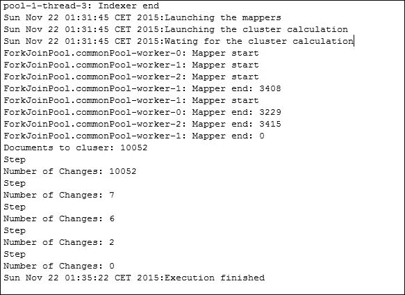

# 十、片段整合和备选方案实现

从[第 2 章](02.html#KVCC1-2fff3d3b99304faa8fa9b27f1b5053ba "Chapter 2. Managing Lots of Threads – Executors")*管理大量线程–执行器*，到[第 8 章](08.html#1GKCM1-2fff3d3b99304faa8fa9b27f1b5053ba "Chapter 8. Processing Massive Datasets with Parallel Streams – The Map and Collect Model")*使用并行流处理海量数据集–映射和收集模型*，您使用 Java 并发 API 的最重要部分实现了不同的示例。通常，这些示例是真实的，但大多数情况下，这些示例可能是更大系统的一部分。例如，在[第 4 章](04.html#VF2I1-2fff3d3b99304faa8fa9b27f1b5053ba "Chapter 4. Getting Data from the Tasks – The Callable and Future Interfaces")中*从任务获取数据–可调用和未来接口*中，您实现了一个应用来构建一个反向索引，用于信息检索系统。在[第 6 章](06.html#173722-2fff3d3b99304faa8fa9b27f1b5053ba "Chapter 6. Optimizing Divide and Conquer Solutions – The Fork/Join Framework")*优化分治的解决方案——Fork/Join 框架*中，您实现了 k-means 聚类算法对一组文档进行聚类。但是，您可以实现一个完整的信息检索应用，该应用读取一组文档，使用向量空间模型表示它们，并使用 K-NN 算法对它们进行聚类。在这些情况下，您有可能使用不同并发技术的不同部分（执行器、流等），但它们必须在它们之间进行同步和通信，以获得所需的结果。

此外，本书中介绍的所有示例都可以使用 Java 并发 API 的其他组件实现。我们也将讨论其中一些备选方案。

在本章中，我们将介绍以下主题：

*   大数据块同步机制
*   文档集群应用的一个示例
*   实现备选方案

# 大数据块同步机制

大型计算机应用由不同的组件组成，这些组件共同工作以获得所需的功能。这些组件必须在它们之间进行同步和通信。在[第 9 章](09.html#1LCVG2-2fff3d3b99304faa8fa9b27f1b5053ba "Chapter 9. Diving into Concurrent Data Structures and Synchronization Utilities")中*深入到并发数据结构和同步工具*中，您了解到可以使用不同的 Java 类来同步任务并在它们之间进行通信。但是，如果要同步的组件也是可以使用不同机制实现其并发性的并发系统，则此任务组织会更加复杂。对于示例，您在应用中有一个组件，该组件使用 Fork/Join 框架生成结果，这些结果由使用`Phaser`类同步的其他任务使用。

在这些情况下，您可以使用以下两种机制来同步和通信这些组件：

*   **共享内存**：系统共享一个数据结构，在之间传递信息。
*   **消息传递**：其中一个系统向一个或多个系统发送消息。有不同的方法来实现这一点。在 Java 等面向对象编程语言中，最基本的消息传递机制是当一个对象调用另一个对象的方法时。您还可以使用**Java 消息服务**（**JMS**）、缓冲区或其他数据结构。您可以使用以下两种消息传递技术：
    *   **同步**：在这种情况下，发送消息的类等待，直到接收方处理完其消息
    *   **异步**：在这种情况下，发送消息的类不会等待处理其消息的接收方

在本节中，您将实现一个应用来对文档进行集群，该应用由四个子系统组成，它们之间通过通信和同步来对文档进行集群。

# 文档集群应用示例

此应用将读取一组文档，并使用 k-均值聚类算法对其进行组织。为此，我们将使用四个组件：

*   **读卡器系统**：该系统将读取所有文档，并将每个文档转换为`String`对象列表。
*   **索引器系统**：该系统将处理文档并将其转换为单词列表。同时，它将生成文档集的全局词汇表，其中包含出现在文档集上的所有单词。
*   **映射器系统**：该系统将使用向量空间模型将每个单词列表转换为数学表示。每项的值将为**Tf Idf**（简称**术语频率-逆文档频率**度量。
*   **聚类系统**：该系统将使用 k 均值聚类算法对文档进行聚类。

所有这些系统都是并发的，并使用它们自己的任务来实现它们的功能。让我们看看如何实现这个示例。

## k-均值聚类的四个系统

让我们看看如何实现阅读器、索引器、映射器和集群系统。

### 读卡器系统

我们已经在`DocumentReader`类中实现了这个系统。此类实现`Runnable`接口，内部使用三个属性：

*   一个`ConcurrentLinkedDeque`类的`String`对象，包含您必须处理的所有文件的名称
*   用于存储文档的`ConcurrentLinkedQueue`类`TextFile`对象
*   控制任务执行结束的`CountDownLatch`对象

类的构造函数初始化这些属性（构造函数将这三个属性作为参数接收），此处给出的`run()`方法实现所有功能：

```java
        String route;
        System.out.println(Thread.currentThread().getName()+": Reader start");

        while ((route = files.pollFirst()) != null) {
            Path file = Paths.get(route);

            TextFile textFile;
            try {
                textFile = new TextFile(file);
                buffer.offer(textFile);
            } catch (IOException e) {
                e.printStackTrace();
            }
        }
        System.out.println(Thread.currentThread().getName()+": Reader end: "+buffer.size());
        readersCounter.countDown();
    }
}
```

首先，我们读取所有文件的内容。对于每个文件，我们创建一个`TextFile`类的对象。此类包含文本文件的名称和内容。它有一个构造函数，该构造函数接收具有文件路由的`Path`对象。最后，我们在控制台中编写一条消息，并使用`CountDownLatch`对象的`countDown()`方法来指示此任务的结束。

这是`TextFile`类的代码。在内部，它有两个属性来存储文件名及其内容。使用`Files`类的`readAllLines()`方法将文件内容转换为`List<String>`数据结构：

```java
public class TextFile {

    private String fileName;
    private List<String> content;

    public TextFile(String fileName, List<String> content) {
        this.fileName = fileName;
        this.content = content;
    }

    public TextFile(Path path) throws IOException {
        this(path.getFileName().toString(), Files.readAllLines(path));
    }

    public String getFileName() {
        return fileName;
    }

    public List<String> getContent() {
        return content;
    }
}
```

### 索引系统

该系统在`Indexer`类中实现，该类也实现了`Runnable`接口。在本例中，我们使用五个内部属性，如下所示：

*   包含所有文件内容的`TextFile`的`ConcurrentLinkedQueue`
*   `Document`对象的`ConcurrentLinkedDeque`用于存储构成每个文档的单词列表
*   控制`Reader`系统终结的`CountDownLatch`对象
*   一个`CountDownLatch`对象，用于指示此系统任务的完成
*   一个`Vocabulary`对象，用于存储构成文档集合的所有单词

类的构造函数初始化此属性（将所有属性作为参数接收）：

```java
public class Indexer implements Runnable {

    private ConcurrentLinkedQueue<TextFile> buffer;
    private ConcurrentLinkedDeque<Document> documents;
    private CountDownLatch readersCounter;
    private CountDownLatch indexersCounter;
    private Vocabulary voc;
```

`run()`方法实现了所有功能，如图所示：

```java
    @Override
    public void run() {
        System.out.println(Thread.currentThread().getName()+": Indexer start");
        do {
            TextFile textFile= buffer.poll();
            if (textFile!=null) {
                Document document= parseDoc(textFile);
```

首先，它从队列中获取`TextFile`，如果不是`null`，则使用`parseDoc()`方法将其转换为`Document`对象。然后，它处理文档中的所有单词以将它们存储在全局词汇表对象中，并将文档存储在文档列表中，如以下代码所示：

```java
                document.getVoc().values()
                    .forEach(voc::addWord);
                documents.offer(document);
            }
        } while ((readersCounter.getCount()>0) || (!buffer.isEmpty()));
```

当`Reader`系统正在运行或缓冲区中仍有文档时，重复此过程。最后，后面提到的代码片段中显示的`run()`方法在控制台中写入一条消息，并使用`CountDownLatch`对象的`countDown()`方法指示此任务已完成执行：

```java
        indexersCounter.countDown();
        System.out.println(Thread.currentThread().getName()+": Indexer end");
    }
```

`parseDoc()`方法接收带文档内容的`List<String>`并返回一个`Document`对象。它创建一个`Document`对象，使用`forEach()`方法处理所有行，如下所示：

```java
    private Document parseDoc(TextFile textFile) {
        Document doc=new Document();

        doc.setName(textFile.getFileName());
        textFile.getContent().forEach(line -> parseLine(line,doc));

        return doc;
    }
```

`parseLine()`方法将行拆分为字，并存储到`doc`对象中，如下所示：

```java
    private static void parseLine(String inputLine, Document doc) {

        // Clean string
        String line=new String(inputLine);
        line = Normalizer.normalize(line, Normalizer.Form.NFKD);
        line = line.replaceAll("[^\\p{ASCII}]", "");
        line = line.toLowerCase();

        // Tokenizer
        StringTokenizer tokenizer = new StringTokenizer(line,
                " ,.;:-{}[]¿?¡!|\\=*+/()\"@\t~#<>", false);
        while (tokenizer.hasMoreTokens()) {
            doc.addWord(tokenizer.nextToken());
        }
    }
```

在预编译`replaceAll()`方法中使用的正则表达式之前，您可以在提供的代码中包含优化：

```java
static final Pattern NON_ASCII = Pattern.compile("[^\\p{ASCII}]");
    line = NON_ASCII.matcher(line).replaceAll("");
    }
```

### 地图绘制系统

该系统在`Mapper`类中实现，该类也实现了`Runnable`接口。在内部，它使用以下两个属性：

*   包含所有文档信息的`Document`对象的`ConcurrentLinkedDeque`
*   包含整个集合中所有单词的`Vocabulary`对象

其代码如下：

```java
public class Mapper implements Runnable {

    private ConcurrentLinkedDeque<Document> documents;
    private Vocabulary voc;
```

类的构造函数初始化这些属性，`run()`方法实现该系统的功能：

```java
    public void run() {
        Document doc;
        int counter=0;
        System.out.println(Thread.currentThread().getName()+": Mapper start");
        while ((doc=documents.pollFirst())!=null) {
            counter++;
```

首先，它使用`pollFirst()`方法从文档的`Deque`对象获取文档。然后，它处理文档中的所有单词，计算`tfxidf`度量值，并创建一个新的`Attribute`对象来存储这些值。这些属性存储在一个列表中。

```java
            List<Attribute> attributes=new ArrayList<>();
            doc.getVoc().forEach((key, item)-> {
                Word word=voc.getWord(key);
                item.setTfxidf(item.getTfxidf()/word.getDf());
                Attribute attribute=new Attribute();
                attribute.setIndex(word.getIndex());
                attribute.setValue(item.getTfxidf());
                attributes.add(attribute);
            });
```

最后，我们将列表转换为一个`Attribute`对象数组，并将该数组存储在`Document`对象中：

```java
            Collections.sort(attributes);
            doc.setExample(attributes);
        }
        System.out.println(Thread.currentThread().getName()+": Mapper end: "+counter);

    }
```

### 集群系统

本系统实现了 k-均值聚类算法。您可以使用[第 5 章](05.html#1394Q1-2fff3d3b99304faa8fa9b27f1b5053ba "Chapter 5. Running Tasks Divided into Phases – The Phaser Class")*中介绍的元素，将运行任务分为阶段–相位器类*来实现此系统。这一实现具有以下要素：

*   **DistanceMeasurer 类**：该类利用文档信息和簇的质心计算一组`Attribute`对象之间的欧氏距离
*   **DocumentCluster 类**：存储关于集群的信息：该集群的质心和文档
*   **assignmentTask 类**：扩展`RecursiveAction`类（Fork/Join 框架），执行算法的赋值任务，计算每个文档与所有簇的距离，确定每个文档的簇
*   **UpdateTask 类**：这扩展了`RecursiveAction`类（Fork/Join 框架）并执行算法的更新任务，该算法将每个集群的质心重新计算为其上存储的文档的平均值
*   **ConcurrentKMeans 类**：该类具有静态方法`calculate()`，该方法执行聚类算法并返回一个包含所有生成的聚类的`DocumentCluster`对象数组

我们只添加了一个新类，`ClusterTask`类，它实现了`Runnable`接口，并将调用`ConcurrentKMeans`类的`calculate()`方法。在内部，它使用两个属性，如下所示：

*   包含所有文档信息的`Document`对象数组
*   包含集合中所有单词的`Vocabulary`对象

构造函数初始化这些属性，`run()`方法实现任务的逻辑。我们调用`ConcurrentKMeans`类的`calculate()`方法传递五个参数如下：

*   包含所有文档信息的`Document`对象数组。
*   包含集合中所有单词的`Vocabulary`对象。
*   我们要生成的群集数。在这种情况下，我们使用`10`作为集群的数量。
*   用于初始化簇质心的种子。在这种情况下，我们使用`991`作为种子。
*   用于在 Fork/Join 框架中使用的子任务中拆分任务的参考大小。在这种情况下，我们使用`10`作为最小尺寸。

此为该类代码：

```java
    @Override
    public void run() {
        System.out.println("Documents to cluster: "+documents.length);
        ConcurrentKMeans.calculate(documents, 10, voc.getVocabulary().size(), 991, 10);
    }
```

## 文档聚类应用的主类

一旦我们实现了应用中使用的所有元素，我们就必须实现系统的`main()`方法。在这种情况下，此方法至关重要，因为它负责启动系统并创建同步系统所需的元素。`Reader`和`Indexer`系统将同时执行。他们将使用缓冲区在他们之间共享信息。当读卡器读取一个文档时，它将写入缓冲区中的`String`对象列表，然后继续处理下一个文档。它不会等待处理`List`的任务。这是**异步消息传递**的一个示例。`Indexer`系统将从缓冲区中取出文档，对其进行处理，并生成包含文档所有单词的`Vocabulary`对象。`Indexer`系统执行的所有任务共享`Vocabulary`类的实例。这是**共享内存**的一个示例。

主类将使用`CountDownLatch`对象的`await()`方法以同步方式等待`Reader`和`Indexer`系统的终结。此方法阻止调用线程的执行，直到其内部计数器到达 0。

两个系统完成执行后，`Mapper`系统将使用`Vocabulary`对象和`Document`信息获取每个文档的向量空间模型表示。当`Mapper`执行完毕后，`Clustering`系统对所有单据进行集群处理。我们已经使用了`CompletableFuture`类来同步`Mapper`系统的结束和`Clustering`系统的开始。这是两个系统之间异步通信的另一个示例。

我们已经在`ClusteringDocs`类中实现了主类。

首先，我们创建一个`ThreadPoolExecutor`对象，使用`readFileNames()`方法获取包含文档的文件的`ConcurrentLinkedDeque`：

```java
public class ClusteringDocs {

    private static int NUM_READERS = 2;
    private static int NUM_WRITERS = 4;

    public static void main(String[] args) throws InterruptedException {

        ThreadPoolExecutor executor=(ThreadPoolExecutor) Executors.newCachedThreadPool();
        ConcurrentLinkedDeque<String> files=readFiles("data");
        System.out.println(new Date()+":"+files.size()+" files read.");
```

然后，我们创建文档缓冲区`ConcurrentLinkedDeque`，用于存储`Document`对象、`Vocabulary`对象和两个`CountDownLatch`对象，一个用于控制`Reader`系统任务的结束，另一个用于控制`Indexer`系统任务的结束。我们有以下代码：

```java
        ConcurrentLinkedQueue<List<String>> buffer=new ConcurrentLinkedQueue<>();
        CountDownLatch readersCounter=new CountDownLatch(2);
        ConcurrentLinkedDeque<Document> documents=new ConcurrentLinkedDeque<>();
        CountDownLatch indexersCounter=new CountDownLatch(4);
        Vocabulary voc=new Vocabulary();
```

然后，我们启动两个任务来执行`DocumentReader`类的`Reader`系统，另外四个任务来执行`Indexer`类的`Indexer`系统。所有这些任务都在我们前面创建的`Executor`对象中执行：

```java
        System.out.println(new Date()+":"+"Launching the tasks");
        for (int i=0; i<NUM_READERS; i++) {
            DocumentReader reader=new DocumentReader(files,buffer,readersCounter);
            executor.execute(reader);

        }

        for (int i=0; i<NUM_WRITERS; i++) {
            Indexer indexer=new Indexer(documents, buffer, readersCounter, indexersCounter, voc);
            executor.execute(indexer);
        }
```

然后，`main()`方法等待该任务的完成；首先，针对`DocumentReader`任务，然后针对`Indexer`任务，如下所示：

```java
        System.out.println(new Date()+":"+"Waiting for the readers");
        readersCounter.await();

        System.out.println(new Date()+":"+"Waiting for the indexers");
        indexersCounter.await();
```

然后，我们将`Document`对象的`ConcurrentLinkedDeque`类转换成一个数组：

```java
        Document[] documentsArray=new Document[documents.size()];
        documentsArray=documents.toArray(documentsArray);
```

我们使用`CompletableFuture`类的`runAsync()`方法启动`Indexer`系统，执行`Mapper`类的四个任务，如下所示：

```java
        System.out.println(new Date()+":"+"Launching the mappers");
        CompletableFuture<Void>[] completables = Stream.generate(() -> new Mapper(documents, voc))
                .limit(4)
                .map(CompletableFuture::runAsync)
                .toArray(CompletableFuture[]::new);
```

然后，我们启动`Clustering`系统来启动`ClusterTask`类的一个任务（记住这些任务将启动其他任务来执行算法）。`main()`方法使用`CompletableFuture`类的`allOf()`方法等待`Mapper`任务的完成，然后在`Mapper`系统完成后使用`thenRunAsync()`方法启动聚类算法：

```java
        System.out.println(new Date()+":"+"Launching the cluster calculation");

        CompletableFuture<Void> completableMappers= CompletableFuture.allOf(completables);
        ClusterTask clusterTask=new ClusterTask(documentsArray, voc);
        CompletableFuture<Void> completableClustering= completableMappers.thenRunAsync(clusterTask);
```

最后，我们使用`get()`方法等待`Clustering`系统的最终确定，并按如下方式完成程序的执行：

```java
        System.out.println(new Date()+":"+"Wating for the cluster calculation");
        try {
            completableClustering.get();
        } catch (InterruptedException | ExecutionException e) {
            e.printStackTrace();
        }

        System.out.println(new Date()+":"+"Execution finished");
        executor.shutdown();
    }
```

`readFileNames()`方法接收一个字符串作为参数，该字符串必须是存储文档集合的目录的路径，并使用该目录中包含的文件名生成一个`ConcurrentLinkedDeque`类的`String`对象。

## 测试我们的文档聚类应用

为了测试这个应用，我们使用了 100673 个文档中的 10052 个文档的子集，其中包含从维基百科获取的电影信息，作为文档集合。在下图中，您可以看到从执行开始到索引器执行结束的第一部分执行的结果：


下图显示了示例的其余执行过程：



您可以看到任务是如何同步的，如本章前面所述。首先，`Reader`和`Indexer`任务以并发方式执行。完成后，映射器对数据进行转换，最后，聚类算法组织示例。

# 通过并行编程实现备选方案

我们在本书各章中实现的大多数示例都可以使用 Java 并发 API 的其他组件实现。在本节中，我们将描述如何实现其中一些替代方案。

## k-最近邻算法

您已经在[第 2](02.html#KVCC1-2fff3d3b99304faa8fa9b27f1b5053ba "Chapter 2. Managing Lots of Threads – Executors")章*中实现了 k-最近邻算法，使用一个执行器管理大量线程–执行器*。这是一个用于监督分类的简单机器学习算法。您有一组以前分类的示例。要获得新示例的类，请计算从该示例到示例训练集的距离。最近示例中的大多数类都是为示例选择的类。您还可以使用并发 API 的以下组件之一实现该算法：

*   **线程**：您可以使用`Thread`对象实现此示例。您必须使用普通线程执行在执行器中执行的任务。每个线程将计算示例与训练集子集之间的距离，并将该距离保存在所有线程之间共享的数据结构中。完成所有线程后，可以使用距离对数据结构进行排序，并计算示例的类。
*   **Fork/Join framework**：与前面的解决方案一样，每个任务将计算示例与训练集子集之间的距离。在本例中，您定义了这些子集中示例的最大数量。如果一个任务必须处理更多的示例，则将该任务分为两个子任务。加入这两个任务后，必须使用这两个子任务的结果生成唯一的数据结构。最后，您将拥有一个数据结构，其中包含所有可以排序以获得示例类的距离。
*   **流**：您从训练数据创建一个流，并将每个训练示例映射到一个结构中，该结构包含您要分类的示例与该示例之间的距离。然后，对该结构进行排序，使用`limit()`获得最接近的结构，并计算最终的结果类。

## 建立文档集合的倒排索引

我们已经在[第 4 章](04.html#VF2I1-2fff3d3b99304faa8fa9b27f1b5053ba "Chapter 4. Getting Data from the Tasks – The Callable and Future Interfaces")中实现了这个示例，*使用执行器从任务中获取数据–可调用和未来接口*。倒排索引是一种用于信息检索领域的数据结构，用于加速信息搜索。它存储文档集合中显示的单词以及每个单词出现的文档。搜索信息时，不需要处理文档。您可以查看反向索引来提取您插入的单词出现的文档，并构建结果列表。您还可以使用并发 API 的以下组件之一实现此算法：

*   **线程**：每个线程将处理文档的一个子集。该过程包括获取文档的词汇表，并使用全局索引更新公共数据结构。当所有线程完成执行后，您可以按顺序创建文件。
*   **Fork/Join 框架**：定义任务可以处理的最大文档数。如果任务必须处理更多文档，则将该任务拆分为两个子任务。每个任务的结果将是一个数据结构，其中包含由这些任务或其子任务处理的文档的反向索引。连接两个子任务后，您可以从其子任务的反向索引构造一个唯一的反向索引。
*   **流**：您创建一个流来处理所有文件。将对象中的每个文件与其词汇表映射，然后减少词汇表流以获得反向索引。

## 一种词的最佳匹配算法

您已经在[第 4 章](04.html#VF2I1-2fff3d3b99304faa8fa9b27f1b5053ba "Chapter 4. Getting Data from the Tasks – The Callable and Future Interfaces")中实现了这个示例，*从任务获取数据–可调用和未来接口*。该算法的主要目标是找到最类似于作为参数传递的字符串的单词。您还可以使用并发 API 的以下组件之一实现此算法：

*   **线程**：每个线程将计算搜索到的单词与整个单词列表的子列表之间的距离。每个线程将生成一个部分结果，该结果将合并到所有线程之间共享类的最终结果中。
*   **Fork/Join framework**：每个任务将计算搜索到的单词与整个单词列表的子列表之间的距离。如果列表太大，则必须将任务拆分为两个子任务。每个任务将返回部分结果。加入两个子任务后，任务将把两个子列表集成为一个。原始任务将返回最终结果。
*   **流**：为整个单词列表创建一个流，用一个数据结构映射每个单词，该数据结构包括搜索单词和该单词之间的距离，对该列表进行排序，并获得结果。

## 一种遗传算法

您已经在[第 5 章](05.html#1394Q1-2fff3d3b99304faa8fa9b27f1b5053ba "Chapter 5. Running Tasks Divided into Phases – The Phaser Class")中实现了这个示例，*运行分为阶段的任务–相位器类*。**遗传算法**是一种基于自然选择原则的自适应启发式搜索算法，用于生成**优化**和**搜索问题**的良好解决方案。对于遗传算法，使用多线程有不同的方法。最经典的是创造*岛屿*。每个线程代表一个岛屿，其中一部分种群进化。有时，岛屿之间的迁移发生在将一些个体从一个岛屿转移到另一个岛屿的过程中。算法完成后，选择所有岛屿上的最佳物种。这种方法大大减少了争用，因为线程很少相互通信。

还有许多出版物和网站中详细描述的其他方法。例如，这个讲义集在[中非常好地总结了这些方法 https://cw.fel.cvut.cz/wiki/_media/courses/a0m33eoa/prednasky/08pgas-handouts.pdf](https://cw.fel.cvut.cz/wiki/_media/courses/a0m33eoa/prednasky/08pgas-handouts.pdf) 。

您还可以使用并发 API 的以下组件之一实现此算法：

*   **线程**：包含所有个体的种群必须是共享数据结构。您可以通过以下方式实现这三个阶段：以顺序方式实现选择阶段；具有线程的交叉阶段，其中每个线程将生成预定义数量的个体；还有评估阶段，还有线程。每个线程将评估预定义数量的个体。
*   **Executor**：您可以在 Executor 中执行类似于前一个执行器的任务，而不是独立线程。
*   **Fork/Join 框架**：主要思想是相同的，但在这种情况下，您的任务将被划分，直到它们处理预定义数量的个体。本例中的连接部分不做任何事情，因为任务的结果将存储在公共数据结构中。

## 一种关键词提取算法

您已经在[第 5 章](05.html#1394Q1-2fff3d3b99304faa8fa9b27f1b5053ba "Chapter 5. Running Tasks Divided into Phases – The Phaser Class")中实现了这个示例，*运行分为阶段的任务–相位器类*。我们使用这种算法来提取描述文档的一小部分单词。我们试图通过 Tf Idf 等方法找到信息量最大的单词。您还可以使用并发 API 的以下组件实现此示例：

*   **线程**：您需要两种线程。第一组的线程将处理文档集，以获取每个单词的文档频率。您需要一个存储集合词汇表的共享数据结构。第二组的线程将再次处理文档，以获取每个文档的关键字，并更新维护整个关键字列表的结构。
*   **Fork/Join 框架**：主要思想与上一版本类似。你需要两种任务。第一个获得全球词汇表的文件集合。每个任务将计算文档子集的词汇表。如果子集太大，任务将执行两个子任务。加入子任务后，它会将获得的两个词汇组合成一个。第二组任务将计算关键字列表。每个任务将计算文档子集的关键字列表。如果该子集太大，它将执行两个子任务。当这些任务完成时，父任务将生成一个关键字列表，其中包含子任务返回的列表。
*   **流**：您创建一个流来处理所有文档。将每个文档映射为包含文档词汇表的对象，并将其缩减以获得全局词汇表。生成另一个流以再次处理所有文档，将每个文档映射到包含其关键字的对象，并将其缩减以生成最终的关键字列表。

## 一种 k-均值聚类算法

您已经在[第 6 章](06.html#173722-2fff3d3b99304faa8fa9b27f1b5053ba "Chapter 6. Optimizing Divide and Conquer Solutions – The Fork/Join Framework")中*优化分治解决方案——Fork/Join 框架*中实现了该算法。该算法将一组元素分类为先前定义的数量的簇。您没有关于元素类的任何信息，因此这是一个无监督的学习算法，尝试查找类似的项。您还可以使用并发 API 的以下组件实现此示例：

*   **线程**：您将有两种线程。第一个将为示例分配一个集群。每个线程将处理示例集的一个子集。第二种线程将更新簇的质心。集群和示例必须是所有线程共享的数据结构。
*   **执行器**：您可以实现之前提出的想法，但在执行器中执行任务，而不是使用独立线程。

## 一种数据过滤算法

您已经在[第 6 章](06.html#173722-2fff3d3b99304faa8fa9b27f1b5053ba "Chapter 6. Optimizing Divide and Conquer Solutions – The Fork/Join Framework")中*优化分治解决方案——Fork/Join 框架*中实现了该算法。该算法的主要目标是从一组非常大的对象中选择满足特定条件的对象。您还可以使用并发 API 的以下组件实现此示例：

*   **线程**：每个线程将处理对象的子集。如果您正在寻找一个结果，当找到一个线程时，它必须暂停其余线程的执行。如果要查找元素列表，则该列表必须是共享数据结构。
*   **执行器**：与前面相同，只是在执行器中执行任务，而不是使用独立线程。
*   **Streams**：您可以使用`Stream`类的`filter()`方法对对象进行搜索。然后，您可以减少这些结果，以获得所需的格式。

## 查找倒排索引

您已经在[第 7 章](07.html#1CQAE2-2fff3d3b99304faa8fa9b27f1b5053ba "Chapter 7. Processing Massive Datasets with Parallel Streams – The Map and Reduce Model")*中使用并行流处理海量数据集实现了该算法——Map and Reduce 模型*。在前面的一个示例中，我们讨论了如何实现创建反向索引的算法以加快信息搜索。这就是搜索信息的算法。您还可以使用并发 API 的以下组件实现此示例：

*   **线程**：这是一个公共数据结构中的结果列表。每个线程处理反转索引的一部分。插入每个结果以生成排序数据结构。如果得到足够好的结果列表，可以返回该列表并取消任务的执行。
*   **执行器**：与前一个类似，只是在执行器中执行并发任务。
*   **Fork/Join 框架**：与前一个类似，但每个任务都将反转索引的部分划分为更小的块，直到它们足够小。

## 一种数字摘要算法

您已经在[第 7 章](07.html#1CQAE2-2fff3d3b99304faa8fa9b27f1b5053ba "Chapter 7. Processing Massive Datasets with Parallel Streams – The Map and Reduce Model")中*使用并行流处理海量数据集的过程中实现了这个示例—映射和简化模型*。这种算法希望获得关于一组非常大的数据的统计信息。您还可以使用并发 API 的以下组件实现此示例：

*   **线程**：我们将有一个对象来存储线程生成的数据。每个线程将处理数据的一个子集，并将该数据的结果存储在公共对象中。也许，我们将不得不对该对象进行后处理以生成最终结果。
*   **执行器**。这与前一个类似，但在执行器中执行并发任务。
*   **Fork/Join 框架**：与前一个类似，但每个任务都将反向索引的部分划分为更小的块进行处理，直到它们足够小为止。

## 一种无索引的搜索算法

您已经在[第 8 章](08.html#1GKCM1-2fff3d3b99304faa8fa9b27f1b5053ba "Chapter 8. Processing Massive Datasets with Parallel Streams – The Map and Collect Model")中实现了这个示例，*使用并行流处理海量数据集–映射和收集模型*。该算法在没有反向索引的情况下获取满足特定条件的对象，以加快搜索速度。在这些情况下，进行搜索时必须处理所有元素。您还可以使用并发 API 的以下组件实现此示例：

*   **线程**：每个线程将处理对象的一个子集（本例中为文件），以获得结果列表。结果列表将是一个共享数据结构。
*   **执行器**：与前一个类似，但并发任务将在执行器中执行。
*   **Fork/Join framework**：这与前一个类似，但是任务将反转索引的部分划分为更小的块，直到它们足够小为止。

## 基于地图采集模型的推荐系统

您已经在[第 8 章](08.html#1GKCM1-2fff3d3b99304faa8fa9b27f1b5053ba "Chapter 8. Processing Massive Datasets with Parallel Streams – The Map and Collect Model")中实现了这个示例，*使用并行流处理海量数据集–映射和收集模型*。**推荐系统**根据客户购买/使用的产品/服务以及购买/使用与其相同服务的用户购买/使用的产品/服务，向客户推荐产品或服务。您还可以使用并发 API 的 Phaser 组件实现此示例。该算法分为三个阶段：

*   **第一阶段**：我们需要将带评论的产品列表转换为带购买产品的买家列表。每个任务和每个过程的子集都将是一个共享的数据结构。
*   **第二阶段**：我们必须获得购买与参考用户相同产品的用户列表。每个任务将处理用户购买的产品中的一项，并将购买该产品的用户添加到一组公共用户中。
*   **第三阶段**：获得推荐产品。每个任务将处理上一个列表的用户，并将他购买的产品添加到一个通用数据结构中，该结构将生成推荐产品的最终列表。

# 总结

在本书中，您实现了许多实际示例。其中一些示例可以作为更大系统的一部分使用。这些较大的系统通常具有不同的并发部分，这些部分必须共享信息并在它们之间进行同步。为了实现同步，我们可以使用三种机制：共享内存，当两个或多个任务共享一个对象或数据结构时，异步消息传递，当一个任务向另一个任务发送消息而不等待其处理时，以及同步消息传递，当一个任务向另一个任务发送消息并等待其处理时。

在本章中，我们实现了一个由四个子系统组成的集群文档应用。我们使用前面介绍的机制在这四个子系统之间同步和共享信息。

我们还修改了书中介绍的一些示例，以讨论其实现的其他替代方案。

在下一章中，您将学习如何获取并发 API 组件的调试信息，以及如何监视和测试并发应用。